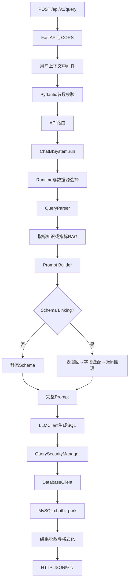
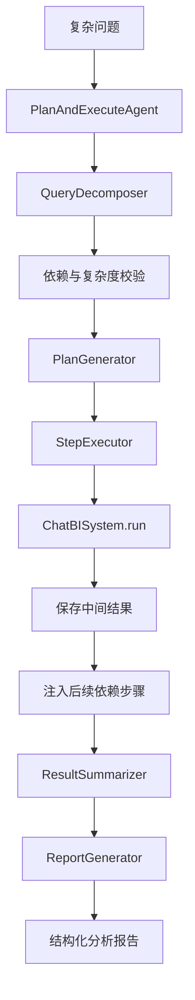

# ChatBI 项目架构

## 1. 学习目标

本文档记录 Day 1 对当前 ChatBI 项目的代码阅读结果，重点回答：

- 项目从哪里启动；
- 一次 HTTP 请求如何进入系统；
- 请求经过哪些模块；
- 每个模块为什么存在；
- 缺少该模块会产生什么问题；
- Text2SQL Pipeline 与 Agent 是什么关系。

本阶段只阅读和分析代码，不修改业务实现。

## 2. 整体架构结论

当前项目包含两条链路：

1. FastAPI 对外提供的单轮 Text2SQL Pipeline；
2. 通过 CLI 独立运行的 Plan-and-Execute Agent。

HTTP 默认进入第一条链路，并不会自动进入 Agent：

```text
HTTP → FastAPI → ChatBISystem → Text2SQL → MySQL → HTTP Response
```

Agent 将 `ChatBISystem` 当成基础查询工具，多次调用它完成复杂分析：

```text
复杂问题 → Agent规划 → 多次调用ChatBISystem → 汇总 → 分析报告
```

可以简单理解为：

```text
ChatBISystem = 单次自然语言查询工具
Agent        = 会规划并多次使用查询工具的分析系统
```

## 3. 目录结构

```text
chatbi-park/
├── agent/
│   ├── planner/                  # 复杂问题拆解
│   ├── executor/                 # 执行输出与报告
│   └── workflow/                 # Agent工作流
├── api/
│   ├── service.py                # FastAPI入口
│   └── static/                   # 静态页面
├── database/
│   ├── client.py                 # 数据库客户端
│   ├── 01_schema.sql             # 停车表DDL
│   └── 02_mock_data.sql          # 停车模拟数据
├── prompts/builder.py            # Prompt组装
├── rag/                          # 指标知识与向量检索
├── schema/                       # Schema Linking
├── text2sql/                     # 单轮Text2SQL主链
├── tools/                        # 配置、运行时与安全
└── tests/                        # 自动化测试
```

## 4. 服务启动入口

启动命令：

```bash
uv run uvicorn api.service:app --host 0.0.0.0 --port 8000
```

启动过程：

```text
Uvicorn
→ 导入api.service
→ 找到FastAPI对象app
→ 监听端口
→ 接收HTTP请求
```

`api/service.py` 被导入时会创建：

```python
app = FastAPI(...)
system = ChatBISystem(app_config=APP_CONFIG)
```

`app` 负责 HTTP 协议；`system` 负责 ChatBI 业务。`system` 在启动时创建，可以复用 LLM Client、数据库连接池和知识对象。如果每次请求都重新创建，可能导致重复初始化、连接数量增长和请求延迟增加。

## 5. Runtime Factory

`ChatBISystem` 初始化时通过 `tools/runtime_factory.py` 创建：

```text
AppRuntime
├── QueryParser
├── LLMClient
├── DatabaseClient
├── ResultFormatter
└── IndicatorKnowledge
```

### 职责

统一创建和装配运行一次 ChatBI 查询所需的组件。

### 为什么存在

对象创建和业务编排是不同职责。Runtime Factory 负责创建对象，ChatBISystem 负责让对象协作。这也方便测试时注入 Fake LLM、Fake Database，并为多数据源提供统一入口。

### 如果没有

- ChatBISystem 同时负责创建对象和编排流程；
- 测试难以替换依赖；
- 多数据源逻辑散落；
- 不同入口可能创建出不同配置的组件。

## 6. 配置模块

`tools/config.py` 管理：

```text
APP_CONFIG
├── environment
├── database
│   ├── default_source
│   ├── sources
│   └── runtime
├── llm
└── features
```

当前默认数据库是 `chatbi_park`，可以通过 `DB_NAME` 覆盖。功能开关包括 Few-shot、业务规则、错误防护、指标知识、Schema Linking 和指标 RAG。

### 为什么存在

数据库地址、模型、密钥和功能开关随环境变化，不应硬编码在业务流程中。

### 如果没有

- 开发、测试、生产环境难以隔离；
- 切换模型必须修改业务代码；
- 密钥容易写入代码；
- 新功能无法灰度启用或快速关闭。

## 7. 一次同步 HTTP 请求

示例请求：

```http
POST /api/v1/query
Content-Type: application/json

{
  "question": "最近3个月停车收入变化情况"
}
```

### 7.1 用户上下文中间件

`attach_user_context` 从请求头读取 `x-user-id`、`x-user-role`、`x-user-region`，创建 `UserContext` 并存入 `request.state`。

**职责：**建立当前请求的用户和数据权限上下文。

**为什么存在：**后续安全模块需要知道谁在查询、能看哪些数据。

**如果没有：**所有用户可能被当成管理员，无法实施行级权限、敏感字段脱敏和用户审计。

### 7.2 Pydantic 请求校验

请求体被转换为 `QueryRequest`，字段包括问题、功能开关、数据源和用户信息。

**职责：**把不可信 JSON 转换成类型明确的 Python 对象。

**为什么存在：**业务代码不应重复判断字段是否存在、类型是否正确。

**如果没有：**参数校验散落、错误格式不统一、业务函数可能收到不可预测的数据。

### 7.3 FastAPI 路由

同步请求进入 `query_chatbi()`：

```text
记录开始时间
→ 构造用户上下文
→ 合并功能开关
→ 调用ChatBISystem.run()
→ 映射业务错误为HTTP状态码
→ 返回响应
```

**职责：**把 HTTP 协议转换为 ChatBI 业务调用。

**为什么存在：**协议层和业务层分离后，CLI、Agent、定时任务和测试都能复用业务能力。

**如果没有：**LLM 和数据库逻辑会混在 API 中，难以复用和测试。

## 8. ChatBISystem 主流程

`text2sql/main.py` 中的 `ChatBISystem.run()` 是单轮 Text2SQL 编排器：

```text
选择Runtime
→ 合并功能开关
→ 解析问题
→ 获取指标知识
→ 构造Prompt
→ 生成SQL
→ 执行SQL
→ 格式化结果
```

### 为什么存在

Parser、Prompt Builder、LLMClient 和 DatabaseClient 都只负责局部能力，需要一个编排层组织完整流程。

### 如果没有

API、CLI 和 Agent 都要复制一套调用流程，最终出现多套行为不一致的实现。

## 9. 数据源选择与功能开关

`_get_runtime(source_id)` 选择本次请求的数据源；`_resolve_feature_options()` 合并请求参数和系统默认值：

```text
请求显式设置 > APP_CONFIG默认配置
```

### 为什么存在

企业 ChatBI 经常连接多个业务库或租户数据库，功能开关则用于灰度发布、A/B 测试和故障降级。

### 如果没有

系统只能连接固定数据库，新能力出现问题时也只能重新修改和部署代码。

## 10. QueryParser

`text2sql/query_parser.py` 当前只去除空格并校验问题是否为空。

### 为什么仍然单独成模块

它为未来的文本标准化、时间解析、停车场识别、意图分类和 Prompt Injection 检查预留了明确位置。

### 如果没有

输入处理会散落在 API、Prompt、Agent 和 SQL 生成模块中。

## 11. 指标知识与指标 RAG

### 11.1 关键词指标知识

`rag/indicator_knowledge.py` 读取 `indicators.json`，根据指标名称和别名进行匹配。

### 11.2 指标 RAG

`rag/indicator_retriever.py` 执行：

```text
问题Embedding
→ ChromaDB检索
→ 召回相关指标
→ 展开依赖指标
→ 生成指标知识块
```

### 为什么存在

Schema 只能描述字段，无法保证业务口径。例如停车收入可能是应收、实收或实收减退款。

### 如果没有

模型可能生成语法正确但口径错误的 SQL。

### 降级策略

```text
指标RAG成功 → 使用RAG
指标RAG失败 → 回退关键词知识
都未开启     → 不注入指标知识
```

## 12. Prompt Builder

`prompts/builder.py` 组装：

```text
System Message
+ Schema
+ 业务规则
+ Few-shot
+ 错误防护
+ 指标知识
+ 用户问题
+ 输出要求
```

### 为什么存在

Prompt 是系统行为的一部分，需要集中维护、测试和版本管理。

### 如果没有

Prompt 会散落在 API、Agent 和 LLMClient 中，不同入口可能产生不同 SQL。

### 当前现状

停车数据库已经创建，但当前 Prompt 的 Schema 和规则仍然描述旧的新能源销售业务。这是后续阶段的改造对象。

## 13. Schema Linking

开启 `use_schema_linking` 后，执行：

```text
Table Retriever
→ Field Matcher
→ Join Resolver
→ 动态精简Schema
```

### Table Retriever

负责从大量表中召回相关表。没有它时，全量 Schema 会增加 Token 成本并干扰模型。

### Field Matcher

负责在候选表中选择金额、时间、状态和维度字段。没有它时，即使表选对了，也可能选错字段。

### Join Resolver

负责选择锚表并推断 Join 路径。没有它时，容易出现错误 Join、漏 Join和数据膨胀。

### Schema Linker

负责统一编排上述三个子模块，使 Prompt Builder 不需要了解底层检索细节。

## 14. LLMClient

`text2sql/llm_client.py` 封装 OpenAI 兼容接口，管理模型名称、Base URL、temperature、max_tokens、同步输出、流式输出和 Embedding。

### 为什么存在

业务系统只需要表达“生成 SQL”，不应了解模型 SDK 细节。

### 如果没有

模型调用散落、供应商切换困难，超时、重试、Token和成本统计也无法统一。

当前实现仍缺少统一的重试、Token统计、成本和 Trace ID。

## 15. SQL 安全模块

`tools/security.py` 执行：

```text
清理SQL
→ 只允许SELECT/WITH
→ 拦截危险关键字
→ 禁止多语句
→ 注入行级过滤
→ 查询结果列级脱敏
```

### 为什么存在

LLM 输出是不可信输入。Prompt 中要求“只生成 SELECT”只是行为引导，不是安全边界。

### 如果没有

可能发生数据修改、Prompt Injection、越权查询和敏感信息泄露。

企业原则是：

> Prompt 不是安全边界，后端程序和数据库权限才是安全边界。

## 16. DatabaseClient

`database/client.py` 执行：

```text
SQL安全处理
→ 从连接池获取连接
→ 执行SQL
→ 获取列名和数据
→ 记录耗时
→ 慢查询EXPLAIN
→ 结果脱敏
→ 释放连接
```

### 为什么存在

它隔离 PyMySQL、连接管理、异常翻译和慢查询监控，使业务层不依赖数据库驱动细节。

### 如果没有

数据库代码会散落，安全检查可能被绕过，也无法统一处理连接和异常。

### 为什么需要连接池

重复建立数据库连接有网络和认证成本。连接池可以复用连接，并限制连接总量，避免高并发连接风暴。

## 17. ResultFormatter

`text2sql/result_formatter.py` 将列名和元组结果格式化为文本表格。

### 为什么存在

CLI 和调试场景需要可读输出，不同入口不应重复实现格式化。

### 如果没有

CLI 只能打印 Python 元组，展示格式也会不一致。HTTP 前端通常主要使用结构化 `rows`。

## 18. HTTP 响应与异常

正常结果包含：

```text
success、sql、columns、rows、formatted、metadata
```

异常分层处理：

```text
数据库层：理解MySQL错误
业务层：理解执行阶段
API层：映射HTTP状态码
```

常见映射：

```text
输入错误       → 400
安全拒绝       → 403
SQL语法错误    → 422
LLM失败        → 502
数据库连接失败 → 503
查询超时       → 504
```

分层异常处理可以避免数据库模块依赖 HTTP，也避免 API 直接依赖 MySQL 错误码。

## 19. SSE 流式链路

流式接口是 `POST /api/v1/query/stream`，调用 `ChatBISystem.run_stream()`：

```text
输入校验
→ 指标知识
→ Prompt
→ sql_chunk × N
→ sql_done
→ 执行SQL
→ result
```

当前只是 SQL 文本流式输出，不是 Agent 节点流，也不是最终自然语言答案流。

## 20. Agent 链路

`PlanAndExecuteAgent` 的流程：

```text
QueryDecomposer
→ PlanGenerator
→ StepExecutor
→ ResultSummarizer
→ ReportGenerator
```

- `QueryDecomposer`：把复杂问题拆成带依赖的子任务；
- `PlanGenerator`：把拆解结果转换成执行计划；
- `StepExecutor`：按顺序执行，每一步调用 `ChatBISystem.run()`；
- `ResultSummarizer`：统计完成、失败和跳过步骤；
- `ReportGenerator`：生成结构化分析报告，失败时模板回退。

当前 `api/service.py` 没有调用 `PlanAndExecuteAgent`，因此 Agent 尚未接入 HTTP。

## 21. 同步 HTTP 完整调用链



文字版本：

```text
HTTP请求
→ FastAPI
→ 用户上下文中间件
→ 参数校验
→ API路由
→ ChatBISystem
→ Runtime选择
→ QueryParser
→ 指标知识/RAG
→ Prompt Builder
→ 可选Schema Linking
→ LLMClient
→ SQL安全
→ DatabaseClient
→ MySQL
→ 结果脱敏和格式化
→ HTTP响应
```

## 22. Agent 完整调用链



## 23. Day 1 总结

### 学到了什么

1. HTTP 当前进入 Text2SQL Pipeline，不进入 Agent；
2. API 负责协议，ChatBISystem 负责业务编排；
3. Runtime Factory 负责对象创建；
4. Prompt Builder、LLMClient、DatabaseClient 职责独立；
5. Schema Linking 和指标 RAG 是可选增强；
6. LLM 输出必须经过程序化安全校验；
7. Agent 通过多次调用 ChatBISystem 完成复杂分析。

### 为什么这样设计

核心是职责分离、能力复用和可测试性。局部模块提供能力，编排层组织完整流程。

### 企业项目为什么这样做

企业系统需要面对多环境、多租户、多数据源、权限、灰度发布、故障降级、审计和测试。清晰的模块边界是持续演进的基础。

### 当前架构问题

- 停车数据库已创建，但 Prompt 和 Schema 知识仍是旧业务；
- Agent 尚未接入 HTTP；
- 用户上下文不是真实认证；
- SQL 安全主要依赖正则；
- 多数据源没有完整隔离 Schema、指标和权限；
- 普通 HTTP 接口返回数据表，不是自然语言经营报告。

# 24. 面试官问题与参考答案

## 24.1 请介绍当前项目的整体架构

当前项目有两条链路。FastAPI 对外提供单轮 Text2SQL Pipeline，请求经过参数校验、指标检索、Prompt构造、可选Schema Linking、LLM生成SQL、安全校验、数据库执行和结果格式化后返回。另一条是独立的 Plan-and-Execute Agent，它把复杂问题拆成多个子任务，多次调用单轮查询能力，最后汇总并生成报告。目前 HTTP 默认只接入第一条链路。

## 24.2 为什么 API 层不能直接调用 LLM 和数据库

API 属于协议适配层，只应处理 HTTP 参数、身份上下文、状态码和响应格式。LLM 与数据库属于业务能力。分离后 CLI、Agent 和测试都能复用同一业务链路，也避免更换接口框架影响核心逻辑。

## 24.3 Runtime Factory 解决什么问题

它统一创建 Parser、LLMClient、DatabaseClient、Formatter 和指标知识对象，将对象创建与业务编排分离，便于依赖注入、测试替换和多数据源扩展。

## 24.4 Pipeline、Workflow 和 Agent 有什么区别

Pipeline 是固定的线性步骤；Workflow 增加状态、条件分支、失败处理和依赖；Agent 在 Workflow 上增加模型驱动的任务理解、计划或工具选择。当前 ChatBISystem 是 Pipeline，PlanAndExecuteAgent 是初步 Agent。

## 24.5 ChatBISystem 和 Agent 是什么关系

ChatBISystem 提供一次自然语言到SQL结果的基础能力，Agent 负责拆分复杂问题并多次调用它。前者像查询工具，后者像会制定计划并使用工具的分析员。

## 24.6 为什么 Prompt 要求只生成 SELECT 还不够

LLM 输出不确定，也可能受 Prompt Injection 影响。Prompt 只是行为引导，不是安全边界。后端仍需校验只读语句、危险关键字、多语句、权限和敏感字段，并配合数据库只读账号。

## 24.7 为什么需要 Schema Linking

企业数据库可能有数百张表，完整 Schema 会增加 Token 并干扰模型。Schema Linking 只召回相关表、字段和 Join 路径，可以降低上下文长度并提高SQL准确率。

## 24.8 为什么 Schema Linking 分成表、字段和 Join 三步

三步分别解决“查哪些表”“用哪些字段”“如何关联”。分开后可以独立评测和定位错误，也便于针对金额字段、时间字段和事实粒度应用不同规则。

## 24.9 为什么 Schema 之外还需要指标知识库

Schema 只能描述字段，无法完整表达业务口径。比如停车收入可能是应收、实收或实收减退款。指标知识库定义公式、过滤条件、时间口径和适用维度，保证业务一致性。

## 24.10 关键词指标匹配和指标 RAG 有什么区别

关键词匹配简单、稳定、可解释，但只能识别维护过的别名。指标 RAG 能理解更多语义表达，但依赖向量模型、索引和阈值。当前采用 RAG 优先、关键词回退的降级策略。

## 24.11 为什么需要数据库连接池

建立连接需要网络握手和认证。每次请求新建连接会增加延迟并形成连接风暴。连接池通过复用连接降低成本，同时限制连接总数。

## 24.12 数据库异常为什么分层翻译

数据库层理解 MySQL 错误码，业务层理解查询阶段，API层理解HTTP状态码。分层可以避免API直接依赖数据库驱动，也避免数据库模块依赖HTTP。

## 24.13 同步接口和 SSE 如何复用业务能力

两者复用输入解析、指标检索、Prompt、安全和数据库模块。区别主要在LLM调用：同步接口一次获取完整SQL，SSE接口持续产生SQL片段。

## 24.14 当前 SSE 是 Agent 流式输出吗

不是。当前只流式返回SQL文本片段、完整SQL和查询结果，没有输出Planner、工具调用、步骤状态或报告节点。

## 24.15 多数据源应该在哪一层选择

请求可以携带数据源标识，但数据源解析和组件装配应由Runtime Factory或数据源管理层完成。生产系统还要将Schema、指标知识、权限和向量索引与数据源绑定。

## 24.16 当前项目有哪些企业化不足

Agent尚未接入HTTP；身份上下文不是真实认证；SQL安全主要依赖正则；缺少统一LLM超时、重试、Token和成本监控；多数据源未完整隔离；缺少任务持久化和Checkpoint；普通接口没有生成经营分析报告。

## 24.17 聚合表为什么不能完全替代事实表

聚合表适合趋势、排名和高频指标查询，但丢失明细。异常下钻、订单核对、新维度聚合和口径修正仍需事实表。事实表保证可追溯，聚合表保证性能。

## 24.18 如果继续演进，应该优先做什么

先统一停车业务的数据粒度和指标口径，再更新Schema和Prompt，保证基础Text2SQL正确；随后完善SQL安全和真实权限，最后把Agent接入API并增加状态持久化、错误修复和报告证据链。应先保证数据与查询正确，再扩展Agent自主性。
