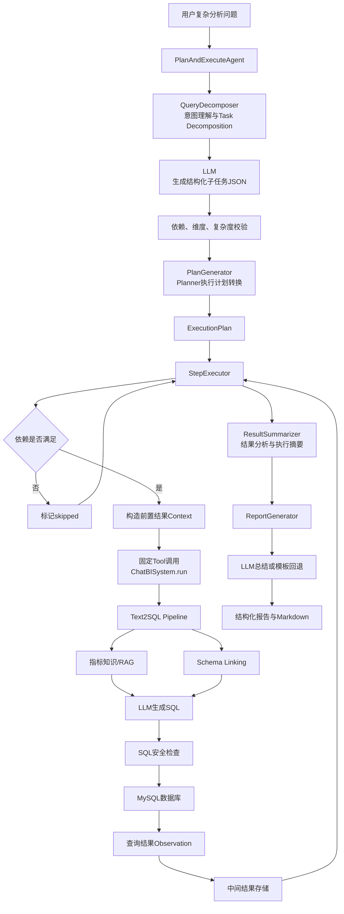
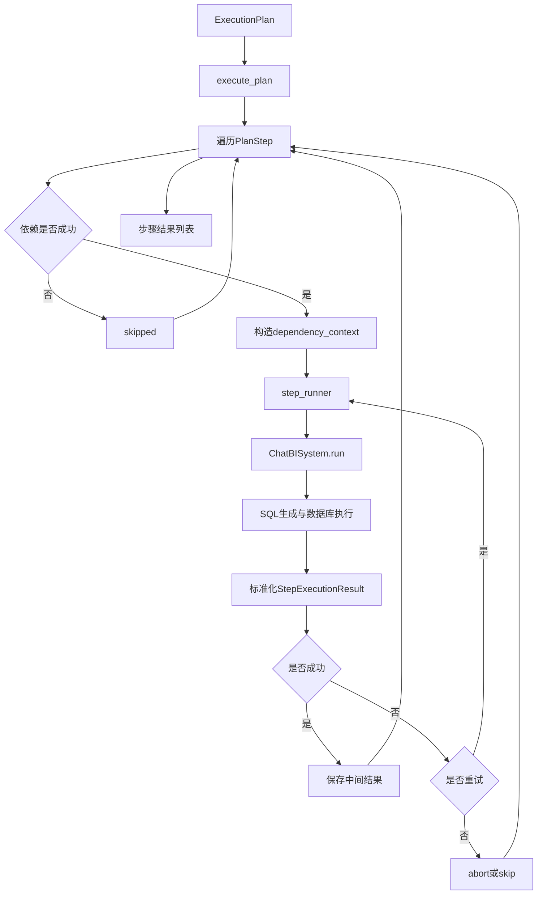

# ChatBI Agent 架构

## 文档说明

本文档基于当前项目代码，分析现有 ChatBI Agent 的设计与运行过程，帮助理解企业级 AI Agent 的核心组成，并为后续面试讲解建立结构化表达。

本文只描述当前代码已经存在的能力。对于 Router、Tool Registry、Session、Checkpoint 等尚未实现的能力，会明确标注为“不存在”或“待建设”。

关键代码：

```text
agent/planner/query_decomposer.py
agent/workflow/agent_planner.py
agent/executor/report_generator.py
text2sql/main.py
```

---

# 1. Agent 整体定位

## 1.1 当前项目是否属于 Agent 应用

当前项目包含一个可运行的 **Plan-and-Execute Agent 骨架**，因此可以认为项目已经具备 Agent 应用的基本形态，但还不是完整的企业级 Agent 平台。

它具备以下 Agent 要素：

| Agent要素 | 当前实现 |
|---|---|
| 目标 | 用户提交复杂分析问题 |
| 任务拆解 | `QueryDecomposer` 使用LLM拆分子任务 |
| 执行计划 | `PlanGenerator` 生成 `ExecutionPlan` |
| 工具调用 | `StepExecutor` 调用 `ChatBISystem.run()` |
| 外部环境 | Text2SQL、MySQL数据库、指标RAG、Schema Linking |
| 中间状态 | `StepExecutionResult` 和中间结果存储 |
| 依赖上下文 | 前置步骤结果注入后续步骤 |
| 失败处理 | 重试、abort、skip |
| 最终输出 | 执行摘要和分析报告 |

但它缺少以下企业级能力：

- 多工具动态路由；
- 运行中重新规划；
- Session与会话记忆；
- 任务状态持久化；
- Checkpoint与故障恢复；
- Human-in-the-loop；
- Agent HTTP任务接口；
- 节点级流式事件；
- Token、成本和链路追踪。

因此，更准确的定位是：

> 当前项目是一个具备任务拆解、多步执行、中间结果和报告生成能力的单工具 Plan-and-Execute Agent 原型。

## 1.2 为什么不是简单的 LLM 调用

简单 LLM 调用通常是：

```text
用户问题
→ Prompt
→ LLM
→ 文本回答
```

当前 Agent 则是：

```text
用户复杂问题
→ LLM拆解任务
→ 生成结构化计划
→ 多次执行Text2SQL
→ 查询真实数据库
→ 保存中间结果
→ 处理步骤依赖和失败
→ LLM或模板生成报告
```

两者的本质区别是，Agent 不只“生成文字”，还会围绕目标执行动作、读取真实结果并管理多步骤状态。

## 1.3 Agent 在 ChatBI 中的作用

`ChatBISystem` 适合完成一次相对明确的查询：

```text
最近3个月收入变化情况
```

Agent 适合处理需要多个证据才能回答的复杂问题：

```text
为什么最近3个月收入下降？
```

Agent 的作用是把复杂目标转成多个可执行查询，再把查询结果收敛为业务结论。

层级关系如下：

```text
Agent
└── 多次调用ChatBISystem
    └── Text2SQL
        └── SQL安全与数据库执行
```

## 1.4 用户、LLM、Agent、工具和数据库的关系

不能简单理解成：

```text
用户 → LLM → Agent → 数据库
```

更准确的关系是 Agent 负责控制流程，并在不同阶段调用 LLM 和工具：

```text
用户输入
   ↓
Agent编排器
   ├── 调用LLM进行任务拆解
   ├── 生成并管理执行计划
   ├── 调用Text2SQL工具
   │      ├── 调用LLM生成SQL
   │      └── 调用数据库执行SQL
   ├── 保存和传递步骤结果
   └── 调用LLM生成最终报告
```

其中：

- LLM 提供不确定的推理和生成能力；
- Agent 负责目标、流程、状态和控制；
- Tool 提供可执行能力；
- 数据库提供真实业务数据；
- 报告层将执行结果转成用户可读结论。

---

# 2. Agent 整体架构图

## 2.1 当前项目真实架构



## 2.2 逻辑角色视图

```text
用户请求
   ↓
意图理解 / Task Decomposition
   ↓
Planner
   ↓
ExecutionPlan
   ↓
Executor
   ↓
Tool调用
   ↓
Text2SQL
   ↓
数据库
   ↓
中间结果与Context
   ↓
结果分析
   ↓
LLM总结
   ↓
最终报告
```

## 2.3 当前架构需要特别注意的事实

1. 当前 FastAPI 没有调用 `PlanAndExecuteAgent`；
2. Agent 当前主要通过 CLI 启动；
3. 当前不存在独立 Router；
4. 当前不存在 Tool Registry；
5. 所有执行步骤默认固定调用 Text2SQL；
6. 当前不存在运行中动态 Re-plan。

---

# 3. Agent 核心模块分析

## 3.1 Agent总编排模块

### 文件路径

```text
agent/workflow/agent_planner.py
```

### 核心类

```text
PlanAndExecuteAgent
```

### 核心方法

```python
PlanAndExecuteAgent.run(
    user_question,
    decomposition_override=None,
    max_steps=None,
)
```

### 输入

- `user_question`：用户复杂问题；
- `decomposition_override`：可选的固定拆解结果，主要用于测试；
- `max_steps`：可选的最大执行步骤数。

### 输出

```json
{
  "original_question": "...",
  "decomposition": {},
  "plan": {},
  "step_results": [],
  "summary": {},
  "report": {}
}
```

### 作用

依次组织任务拆解、计划生成、步骤执行、结果摘要和报告生成，是 Agent 的总控制器。

## 3.2 Task Decomposition模块

### 文件路径

```text
agent/planner/query_decomposer.py
```

### 核心类

```text
DecomposedTask
DecompositionPlan
QueryDecomposer
```

### 核心方法

```text
build_decomposition_prompt()
QueryDecomposer.decompose()
QueryDecomposer._generate_response()
QueryDecomposer._parse_plan()
QueryDecomposer._validate_dependencies()
QueryDecomposer._validate_dimensions()
QueryDecomposer._validate_plan_complexity()
```

### 输入

```text
用户复杂自然语言问题
```

### 输出

```text
DecompositionPlan
├── question_type
├── analysis_goal
└── subtasks
```

### 作用

利用 LLM 将复杂问题转换成结构化业务子任务，并使用代码规则校验模型输出。

## 3.3 Planner转换模块

### 文件路径

```text
agent/workflow/agent_planner.py
```

### 核心类

```text
PlanGenerator
PlanStep
ExecutionPlan
```

### 核心方法

```text
PlanGenerator.build_plan()
PlanGenerator._build_step_question()
PlanGenerator._build_expected_output()
```

### 输入

```text
原始问题 + DecompositionPlan
```

### 输出

```text
ExecutionPlan
```

### 作用

把业务子任务转换成 Executor 可以执行的步骤，建立 `task_id` 到 `step_id` 的映射，并生成每一步的执行问题和预期输出。

## 3.4 Executor模块

### 文件路径

```text
agent/workflow/agent_planner.py
```

### 核心类

```text
StepExecutor
StepExecutionResult
```

### 核心方法

```text
StepExecutor.execute_plan()
StepExecutor._run_with_chatbi()
StepExecutor._execute_with_retry()
StepExecutor._build_dependency_context()
StepExecutor._normalize_result()
```

### 输入

```text
ExecutionPlan
```

### 输出

```text
list[StepExecutionResult]
```

### 作用

顺序执行步骤、判断依赖、构造上下文、调用 ChatBISystem、处理重试和失败策略，并保存中间结果。

## 3.5 中间结果存储模块

### 文件路径

```text
agent/workflow/agent_planner.py
```

### 核心类

```text
IntermediateResultStore
MemoryResultStore
TempTableResultStore
```

### 核心方法

```text
put()
get()
cleanup()
```

### 输入

- 步骤ID；
- 列名；
- 结构化数据行。

### 输出

结果引用：

```text
memory://step_1
temp_table://tmp_agent_step_1
```

### 作用

让后续步骤可以通过引用读取前置步骤结果，并为不同存储实现提供统一接口。

## 3.6 执行摘要模块

### 文件路径

```text
agent/workflow/agent_planner.py
```

### 核心类

```text
ResultSummarizer
ExecutionSummary
```

### 核心方法

```text
ResultSummarizer.summarize()
```

### 输入

- 原始问题；
- ExecutionPlan；
- 所有步骤结果。

### 输出

```text
ExecutionSummary
├── completed_steps
├── failed_steps
├── skipped_steps
├── key_findings
└── summary_text
```

### 作用

从执行角度汇总任务完成情况和每一步的简短结果。

## 3.7 Report模块

### 文件路径

```text
agent/executor/report_generator.py
```

### 核心类

```text
AnalysisReport
ReportGenerator
```

### 核心方法

```text
ReportGenerator.generate()
ReportGenerator._build_prompt()
ReportGenerator._parse_report_json()
ReportGenerator._build_fallback_report()
ReportGenerator._render_markdown()
```

### 输入

- 原始问题；
- 分析目标；
- 步骤结果；
- 执行摘要。

### 输出

```text
AnalysisReport
├── title
├── executive_summary
├── key_findings
├── root_causes
├── trend_judgment
├── action_suggestions
└── markdown
```

### 作用

把执行层结果转换为业务人员可读报告。模型不可用或输出不合法时，使用确定性模板回退。

## 3.8 Text2SQL工具能力

### 文件路径

```text
text2sql/main.py
```

### 核心类与方法

```text
ChatBISystem
ChatBISystem.run()
```

### 输入

一个具体、可执行的自然语言查询子任务。

### 输出

```text
success、sql、columns、results、formatted、metadata
```

### 作用

作为 Agent 当前唯一的真实业务工具，完成指标检索、Schema Linking、SQL生成、安全检查和数据库查询。

## 3.9 Router与Tool Registry

当前项目中：

- **不存在独立 Router**；
- **不存在 Tool Registry**；
- `tools/` 目录中的 `config.py`、`security.py`、`runtime_factory.py` 是共享基础模块，不是 Agent Tool Registry；
- `StepRunner` 只是一个函数类型抽象；
- `PlanStep.action` 默认固定为 `text2sql`，Executor没有根据它动态选择工具。

---

# 4. Planner 设计分析

## 4.1 Planner是否存在

存在，但需要区分两层：

```text
QueryDecomposer：LLM驱动的语义规划层
PlanGenerator：确定性的执行计划转换层
```

真正负责“思考应该拆成什么任务”的主要是 `QueryDecomposer`。`PlanGenerator` 更像将拆解结果标准化为可执行步骤的适配器。

## 4.2 Planner负责什么

当前 Planner 负责：

1. 识别问题类型；
2. 提取分析目标；
3. 拆解有序子任务；
4. 声明任务依赖；
5. 指定指标和维度；
6. 校验任务数量和依赖合法性；
7. 将业务任务转换为 `PlanStep`。

当前 Planner 不负责：

- 根据执行结果重新规划；
- 动态选择多种工具；
- 估算工具成本；
- 并行调度；
- 请求人工确认。

## 4.3 如何进行任务规划

`QueryDecomposer.decompose()` 的过程：

```text
用户问题
→ build_decomposition_prompt()
→ LLM输出JSON
→ Pydantic解析
→ 依赖校验
→ 维度校验
→ 复杂度校验
→ 校验失败时重试一次
→ 返回DecompositionPlan
```

模型调用使用：

```text
temperature = 0
response_format = json_object
```

这样可以降低输出波动，并提高结构化解析成功率。

## 4.4 如何生成执行计划

`PlanGenerator.build_plan()` 执行：

```text
校验并转换DecompositionPlan
→ 建立task_id到step_id映射
→ 为每个任务生成PlanStep
→ 将task依赖转换为step依赖
→ 构造步骤问题
→ 构造expected_output
→ 返回ExecutionPlan
```

当前基本是一项业务任务对应一个执行步骤。

## 4.5 Planner使用什么Prompt

Prompt在：

```text
agent/planner/query_decomposer.py
build_decomposition_prompt()
```

Prompt包含：

```text
数据库Schema
可用分析维度
可用指标目录
用户问题
输出JSON约束
任务依赖约束
常见分析类型拆解策略
```

拆解策略包括：

- 趋势分析：主指标趋势、驱动项趋势、异常月份和原因；
- 原因诊断：结果趋势、构成拆解、关键维度和结论；
- 维度对比：排名、贡献和总结。

当前 Prompt 仍然使用旧业务的 Schema、指标和维度，例如客户、产品线、技术路线。因此它尚不能正确规划智慧停车任务。

## 4.6 Planner输出的数据结构

### DecompositionPlan

```text
question_type: str
analysis_goal: str
subtasks: list[DecomposedTask]
```

### DecomposedTask

```text
task_id
task_name
task_type
description
depends_on
dimensions
metrics
```

### ExecutionPlan

```text
original_question
question_type
analysis_goal
steps: list[PlanStep]
```

### PlanStep

```text
step_id
task_id
step_name
task_type
action
question
description
depends_on
metrics
dimensions
expected_output
```

---

# 5. Task Decomposition 任务拆解分析

## 5.1 为什么要拆解复杂问题

“分析最近三个月收入下降原因”不是一个单一查询目标。它至少包含：

1. 收入是否真的下降；
2. 哪个周期开始下降；
3. 订单量是否下降；
4. 单均收入是否下降；
5. 哪些停车场贡献了下降；
6. 是否存在运营异常；
7. 如何总结证据。

如果直接要求一条SQL完成全部分析，SQL会复杂、难验证，也很难对失败部分单独重试。

## 5.2 结合当前数据模型的停车示例

用户问题：

```text
分析最近三个月收入下降原因
```

一个合理的拆解示例是：

```text
任务1：收入趋势分析
指标：停车净收入
维度：月份
依赖：无

任务2：订单量和单均收入变化
指标：订单量、单均收入
维度：月份
依赖：任务1

任务3：停车场收入排名与贡献
指标：停车净收入
维度：停车场
依赖：任务1

任务4：利用率和停车时长变化
指标：车位利用率、平均停车时长
维度：月份、停车场
依赖：任务1

任务5：异常事件分析
指标：异常数量、预估损失
维度：事件类型、停车场
依赖：任务1

任务6：原因总结
依赖：任务2、任务3、任务4、任务5
```

需要明确：以上是面向智慧停车目标的合理拆解示例，不是当前旧 Prompt 一定会产生的结果。当前代码的可用维度和指标仍是新能源销售语义。

## 5.3 当前代码如何保证拆解结果可执行

当前采用三类校验：

### 依赖校验

`depends_on` 只能引用前面已经出现的任务，避免循环依赖和不存在的任务。

### 维度校验

每个维度必须属于 `AVAILABLE_DIMENSIONS`。

### 复杂度校验

- 趋势分析最多6个任务；
- 原因诊断最多6个任务；
- 维度分析最多5个任务；
- 其他类型默认最多8个任务。

校验失败时，系统把错误原因附加到Prompt并让LLM重新生成一次。

## 5.4 当前拆解设计的局限

- 任务类型没有严格枚举；
- 维度白名单仍是旧业务；
- 没有工具可用性校验；
- 没有判断某任务是否真的能由一条SQL完成；
- 没有预估数据量和成本；
- 没有执行后重新拆解；
- “原因总结”仍可能被当成Text2SQL步骤执行。

---

# 6. Executor 执行流程分析

## 6.1 如何接收Planner结果

`StepExecutor.execute_plan(plan)` 接收 `ExecutionPlan`，按列表顺序执行 `plan.steps`。

内部维护：

```text
results              所有步骤结果
results_by_step      step_id到结果的映射
abort_triggered      是否触发全局终止
steps_to_run         实际执行步骤列表
```

## 6.2 如何执行任务

每个步骤依次经过：

```text
检查abort状态
→ 检查依赖步骤是否失败
→ 读取前置步骤结果
→ 构造dependency_context
→ 拼接当前步骤问题
→ 调用step_runner
→ 标准化结果
→ 成功则保存中间结果
→ 失败则按策略处理
```

## 6.3 如何调用工具

默认 `step_runner` 是：

```text
StepExecutor._run_with_chatbi()
```

它调用：

```python
ChatBISystem.run(user_question=question, ...)
```

默认开启：

```text
Schema Linking
指标RAG
关键词指标知识
```

因此一个步骤的内部链路是：

```text
PlanStep
→ ChatBISystem
→ 指标检索
→ Schema Linking
→ Prompt
→ LLM生成SQL
→ SQL安全
→ 数据库
→ 查询结果
```

## 6.4 如何传递前置结果

Executor把前置结果组织成结构化JSON：

```json
{
  "step_id": "step_1",
  "step_name": "收入趋势分析",
  "columns": ["month", "revenue"],
  "rows": [
    {"month": "2026-04", "revenue": 205}
  ],
  "result_reference": "memory://step_1"
}
```

然后拼入后续步骤的问题。当前实现避免把文本表格边框作为下游模型输入，这比传递展示文本更稳定。

## 6.5 如何保存中间结果

### MemoryResultStore

```text
存储位置：进程内字典
引用：memory://step_1
```

优点是简单、快速、适合测试；缺点是进程重启丢失且无法跨实例共享。

### TempTableResultStore

```text
存储位置：MySQL临时表
引用：temp_table://tmp_agent_step_1
```

优点是结构化且可由数据库读取；缺点是临时表绑定数据库连接，连接断开、进程重启或任务迁移后结果消失。

## 6.6 失败和重试

步骤状态：

```text
completed
failed
skipped
```

失败策略：

```text
abort：一个步骤失败后停止后续链路
skip：保留失败，继续执行不依赖该步骤的任务
```

`max_retries` 控制失败后的重新尝试次数。

当前重试只是重新执行相同问题，没有显式传入上次SQL和数据库错误，因此还不是完整的错误反思与SQL修复。

## 6.7 如何返回最终结果

Executor先返回 `list[StepExecutionResult]`，之后：

```text
ResultSummarizer
→ ExecutionSummary
→ ReportGenerator
→ AnalysisReport
```

最终由 `PlanAndExecuteAgent.run()` 一次返回拆解、计划、步骤、摘要和报告。

## 6.8 Executor核心调用链



---

# 7. Agent 状态管理

## 7.1 当前是否存在State

存在单次运行期状态，但没有统一的 `AgentState` 对象。

状态分散在：

```text
ExecutionPlan
results
results_by_step
StepExecutionResult
ExecutionSummary
MemoryResultStore或TempTableResultStore
```

这些状态只服务于当前进程中的一次执行。

## 7.2 当前是否存在Context

存在。

主要Context包括：

- 原始用户问题；
- analysis_goal；
- step.question；
- depends_on；
- context_used；
- 前置步骤结构化rows；
- ChatBISystem的指标和Schema上下文。

当前Context主要通过字符串和JSON拼接传递，没有统一上下文模型。

## 7.3 当前是否存在Session

不存在。

当前没有：

```text
session_id
conversation_id
历史消息
多轮问题关联
用户会话状态
```

每次Agent运行都被视为独立任务。

## 7.4 当前是否存在Memory

存在短期执行Memory：

```text
MemoryResultStore
```

但它不是长期会话记忆，也不是企业级持久化Memory。

## 7.5 企业级Agent通常如何设计状态

通常定义统一状态模型：

```text
AgentState
├── task_id
├── conversation_id
├── user_context
├── original_question
├── intent
├── plan
├── current_step
├── step_results
├── tool_calls
├── retries
├── errors
├── final_report
├── status
├── created_at
└── updated_at
```

并将状态写入持久化存储：

- 关系数据库保存任务和步骤；
- Redis保存短期运行状态；
- 对象存储保存大结果；
- Checkpoint保存节点执行位置；
- Event Log保存每次状态变化。

企业级状态机通常还包含：

```text
pending
planning
running
waiting
completed
failed
cancelled
timeout
```

这样才能实现任务查询、恢复、取消、重试、审计和多实例执行。

---

# 8. Tool Calling 分析

## 8.1 当前是否存在工具调用

存在，但属于固定工具调用。

Agent通过：

```text
StepExecutor
→ step_runner
→ ChatBISystem.run()
```

调用Text2SQL和数据库能力。

## 8.2 工具如何定义

当前工具抽象是：

```python
StepRunner = Callable[[str], dict[str, Any]]
```

这表示工具接收一个字符串问题，返回一个结果字典。

默认实现：

```text
StepExecutor._run_with_chatbi
```

当前没有：

- BaseTool接口；
- 工具名称和描述；
- 参数Schema；
- Tool Registry；
- 工具权限；
- 动态工具选择；
- 工具超时和审计。

## 8.3 参数如何传递

Planner生成 `PlanStep.question`，Executor将依赖结果附加到问题字符串中，最终调用：

```text
step_runner(composed_question)
```

参数没有使用独立Pydantic Tool Input，而是通过自然语言字符串传递。

优点是实现简单；缺点是参数不够结构化，难以校验和审计。

## 8.4 如何调用数据库能力

Agent不直接访问数据库，而是复用：

```text
ChatBISystem
→ LLM生成SQL
→ QuerySecurityManager
→ DatabaseClient
→ MySQL
```

这是合理的复用设计，因为Agent不应重新实现Text2SQL、安全和连接管理。

## 8.5 当前Tool Calling的局限

虽然 `PlanStep` 有 `action` 字段，但默认值固定为 `text2sql`，Executor也没有根据 `action` 路由工具。

因此当前是：

```text
每个步骤 → 固定调用Text2SQL
```

而不是：

```text
每个步骤
→ 根据action选择工具
   ├── text2sql
   ├── metric_search
   ├── contribution_analysis
   ├── anomaly_detection
   └── knowledge_search
```

---

# 9. 当前 Agent 架构评价

## 9.1 优点

### 1. 模块边界基本清楚

任务拆解、计划转换、执行、中间结果、摘要和报告分别有明确职责。

### 2. Text2SQL能力得到复用

Agent通过 `ChatBISystem.run()` 调用现有查询链，没有重复实现SQL生成、安全和数据库访问。

### 3. 使用结构化数据模型

`DecompositionPlan`、`ExecutionPlan`、`StepExecutionResult` 和 `AnalysisReport` 都使用Pydantic，降低了LLM输出和模块传递的不确定性。

### 4. 支持任务依赖

`depends_on` 可以表达步骤先后关系，前置步骤失败时依赖步骤会被跳过。

### 5. 支持失败策略与重试

具备 `abort`、`skip` 和 `max_retries`，比“任何失败直接崩溃”更健壮。

### 6. 中间结果具有抽象层

`IntermediateResultStore` 允许在内存和临时表实现之间切换，为未来替换持久化存储保留了接口。

### 7. 报告具有降级能力

LLM不可用或结构不合法时，系统可以生成模板报告，避免输出层完全失败。

### 8. 可测试性较好

支持 `decomposition_override`、自定义 `step_runner`、自定义 `result_store` 和自定义报告生成函数，方便隔离测试。

## 9.2 不足

### 1. Agent没有接入HTTP

当前只能通过CLI运行，没有任务创建、状态查询、取消和流式订阅接口。

### 2. 缺少统一状态管理

没有AgentState、task_id、Session、Checkpoint和持久化任务表，无法恢复长任务。

### 3. 缺少Tool Registry

所有步骤固定调用Text2SQL，无法动态选择异常检测、指标计算或知识检索工具。

### 4. 缺少Router

系统不会先判断简单问题是否应该直接走Text2SQL，所有进入Agent的问题都会执行完整拆解。

### 5. 没有运行中重新规划

计划生成后基本固定。例如第一步发现收入并未下降，Agent仍可能继续执行下降归因计划。

### 6. 重试缺少错误反思

失败后只是重新执行相同问题，没有把原SQL、数据库错误和修复建议交给专门修复器。

### 7. 上下文通过字符串拼接

前置结果虽然使用JSON，但最终仍拼进自然语言问题。数据量大时会导致Prompt膨胀，也难以控制敏感数据。

### 8. 临时表不是可靠持久化

MySQL临时表绑定连接，不能支持进程重启、任务迁移和多Worker恢复。

### 9. 缺少评估闭环

没有针对计划质量、步骤成功率、工具选择、报告事实一致性和整体任务成功率的系统评估。

### 10. 缺少可观测性

当前主要输出stderr进度日志，没有统一Trace、节点耗时、Token、成本和工具调用审计。

### 11. 当前Planner仍是旧业务

拆解Prompt、维度白名单、指标目录和报告模板尚未切换为智慧停车业务。

### 12. Agent和Planner代码边界不够干净

`agent/workflow/agent_planner.py` 同时包含数据模型、Planner转换、结果存储、Executor、Summarizer、Agent和CLI，文件职责较多。当前阶段不重构，但企业项目通常会进一步按职责拆分。

## 9.3 综合评价

当前实现适合学习Plan-and-Execute Agent的最小闭环：

```text
拆解
→ 计划
→ 执行
→ 状态
→ 汇总
→ 报告
```

它已经超过“LLM套壳”，但离企业级Agent平台还有明显距离。下一阶段的重点不是立即重写，而是先理解Planner、Schema Linking、Prompt和Text2SQL，再按学习路线逐步改造。

---

# 10. 面试总结

## 10.1 三分钟面试回答

> 我的项目是一个面向经营分析场景的 ChatBI Agent，目前采用 Plan-and-Execute 架构。系统分成单轮 Text2SQL 能力和多步骤 Agent 两层。底层的 ChatBISystem 负责完成一次自然语言查询，它会进行指标知识检索、Schema Linking、Prompt构造、LLM生成SQL、安全校验和数据库执行。上层 Agent 不重复实现这些能力，而是把 ChatBISystem 作为查询工具复用。
>
> 当用户提出“为什么最近三个月收入下降”这类复杂问题时，首先由 QueryDecomposer 调用LLM完成意图理解和任务拆解，输出结构化的 DecompositionPlan，里面包含问题类型、分析目标、子任务、指标、维度和依赖关系。然后 PlanGenerator 将业务子任务转换成 ExecutionPlan，为每个任务生成可执行的 PlanStep，并把 task 依赖映射成 step 依赖。
>
> 执行阶段由 StepExecutor 顺序处理计划。它会检查步骤依赖，将前置步骤的结构化结果作为Context传给后续步骤，并通过统一的 step_runner 调用 ChatBISystem。每一步都会记录SQL、结果、尝试次数、成功或失败状态。系统支持重试以及 abort、skip 两种失败策略，中间结果可以保存在进程内存或MySQL临时表中。全部步骤结束后，ResultSummarizer生成执行摘要，ReportGenerator再调用LLM生成关键发现、归因、趋势判断和行动建议；如果LLM不可用，则回退到模板报告。
>
> 这个项目已经具备Agent的目标、规划、工具调用、Observation、中间状态和最终总结闭环，但目前还是单工具Agent原型。它尚未实现独立Router、Tool Registry、Session、Checkpoint、动态Re-plan和任务持久化，Agent也还没有接入FastAPI。后续企业化演进会先建立统一AgentState和工具注册机制，再增加简单查询与复杂分析路由、错误反思与SQL修复、任务恢复、节点级流式事件以及Token和成本监控。

## 10.2 面试表达关键词

```text
Plan-and-Execute
Task Decomposition
ExecutionPlan
依赖图
Text2SQL Tool
Observation
Intermediate Result
Failure Policy
Fallback
State Persistence
Checkpoint
Tool Registry
Re-plan
Trace与成本治理
```

## 10.3 面试时需要主动说明的边界

不要把当前项目包装成已经完整实现的企业级Agent平台。应明确说明：

1. 当前是Plan-and-Execute最小闭环；
2. 当前只有Text2SQL一个固定工具；
3. 当前没有动态工具路由；
4. 当前没有长期Session和Checkpoint；
5. 当前Agent没有接入HTTP；
6. 当前停车业务改造尚未进入Agent阶段。

诚实说明现状、设计取舍和演进路径，比虚构不存在的能力更能体现工程判断。

---

## Day 2 学习结论

完成本阶段后，应能够说明：

- Agent与普通LLM调用、Text2SQL Pipeline的区别；
- 当前项目为什么采用Plan-and-Execute；
- QueryDecomposer、PlanGenerator、StepExecutor、Summarizer和ReportGenerator的职责；
- Agent如何把ChatBISystem当作工具调用；
- 中间结果、依赖、重试和失败策略如何工作；
- 当前State、Context、Session和Memory分别处于什么水平；
- 当前Agent的优点、边界与企业化演进方向。
