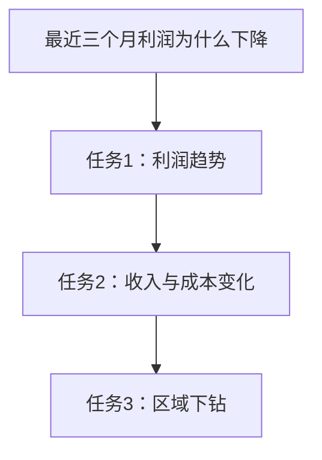
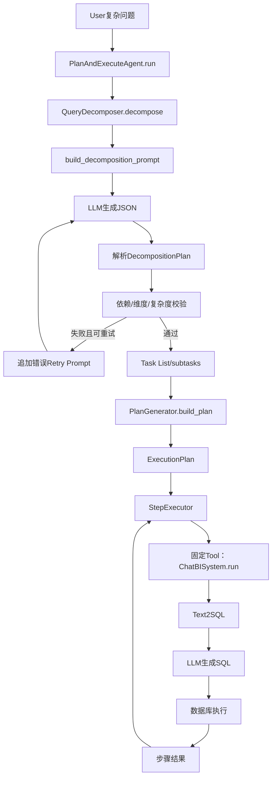

# Day3：Planner任务规划分析

## 文档说明

本文档完全基于当前项目源码，分析 Planner 的真实实现、数据结构、Prompt、调用链和能力边界。本阶段只阅读代码，不修改或优化任何业务实现。

主要源码：

```text
agent/planner/query_decomposer.py
agent/workflow/agent_planner.py
agent/workflow/agent_planner.py:723-779
tests/test_query_decomposer.py
tests/test_agent_planner.py
prompts/builder.py
rag/indicators_full.json
```

---

## 一、Planner是什么？

### 1. 当前项目是否真正存在Planner

存在，但它不是单一类，而是由两层共同构成：

```text
QueryDecomposer
负责LLM驱动的语义规划与Task Decomposition

PlanGenerator
负责把业务子任务确定性地转换成ExecutionPlan
```

因此，当前项目的 Planner 可以理解为：

```text
Planner = QueryDecomposer + PlanGenerator
```

其中真正回答“复杂问题应该拆成哪些任务”的是 `QueryDecomposer`；`PlanGenerator` 不调用LLM，它主要做结构转换和执行问题构造。

### 2. Planner位于哪里

#### 语义规划层

```text
文件：agent/planner/query_decomposer.py
类：QueryDecomposer
入口：QueryDecomposer.decompose()
Prompt：build_decomposition_prompt()
```

关键位置：

```text
数据模型：agent/planner/query_decomposer.py:18-35
维度白名单：agent/planner/query_decomposer.py:38-52
指标目录加载：agent/planner/query_decomposer.py:55-64
Prompt构造：agent/planner/query_decomposer.py:78-124
拆解主流程：agent/planner/query_decomposer.py:138-165
LLM调用：agent/planner/query_decomposer.py:167-181
结果解析：agent/planner/query_decomposer.py:183-203
计划校验：agent/planner/query_decomposer.py:205-242
```

#### 执行计划转换层

```text
文件：agent/workflow/agent_planner.py
类：PlanGenerator
入口：PlanGenerator.build_plan()
```

关键位置：

```text
PlanStep：agent/workflow/agent_planner.py:27-40
ExecutionPlan：agent/workflow/agent_planner.py:43-49
PlanGenerator：agent/workflow/agent_planner.py:85-153
Agent调用Planner：agent/workflow/agent_planner.py:740-759
```

### 3. 当前项目属于哪种模式

当前属于：

> Plan-and-Execute Agent，并由确定性的Workflow进行编排。

判断依据：

```text
先调用QueryDecomposer生成完整子任务列表
→ 再调用PlanGenerator生成完整ExecutionPlan
→ 然后StepExecutor按计划执行
```

#### 是否属于Workflow

包含Workflow特征。`PlanAndExecuteAgent.run()`固定编排：

```text
Decompose
→ Build Plan
→ Execute
→ Summarize
→ Report
```

但没有使用状态图框架，流程由普通Python代码串联。

#### 是否属于ReAct

不属于。

ReAct通常是：

```text
Thought
→ Action
→ Observation
→ 再次Thought
```

当前项目在执行前生成完整计划，执行中不会基于Observation重新决定下一步，因此不是ReAct。

#### 是否属于Router

不属于。

当前没有先判断简单问题走Text2SQL、复杂问题走Agent的路由器，也没有根据任务类型选择不同工具。

#### 是否属于Multi-Agent

不属于。

项目中没有多个独立Agent角色之间的通信、协作或仲裁。Planner、Executor、Summarizer是同一Agent内部组件，不是多个Agent。

#### 是否属于其它模式

可以描述为：

```text
单Agent
+ Plan-and-Execute
+ 固定Workflow
+ 单工具执行
```

---

## 二、Planner为什么存在？

### 1. 为什么不能只做“用户问题→LLM→答案”

简单链路：

```text
用户问题
→ LLM
→ 答案
```

对于复杂经营分析存在三个问题。

#### 问题一：LLM没有真实数据证据

用户问：

```text
为什么最近三个月利润下降？
```

LLM可能根据常识回答收入下降、成本上升或费用增加，但这只是语言推测，不是数据库证据。

#### 问题二：复杂问题往往不是一条SQL

利润下降至少涉及：

```text
利润趋势
收入趋势
成本趋势
费用趋势
区域或产品线贡献
异常时间定位
```

把所有内容塞入一条SQL会导致SQL复杂、难以验证和难以局部重试。

#### 问题三：无法管理依赖和失败

原因分析需要先确认“是否下降”，再决定如何下钻。没有Planner时，系统无法明确哪些任务依赖哪些结果。

### 2. 为什么需要Planner→Task→Executor

```text
用户
→ Planner理解目标
→ 拆成多个Task
→ Executor逐步执行
→ 汇总证据
→ 最终报告
```

这样可以获得：

- 每个步骤独立SQL；
- 每步结果可观察；
- 失败步骤可重试；
- 依赖关系可表达；
- 最终结论可追溯到步骤结果。

### 3. 结合当前源码的利润下降示例

测试源码 `tests/test_agent_planner.py:89-122` 给出了真实的 `sample_decomposition()`：

```text
任务1：查看最近三个月利润趋势
类型：trend_analysis
维度：月份
指标：利润
依赖：无

任务2：拆解收入与成本变化
类型：metric_decomposition
维度：月份
指标：收入、成本、利润
依赖：task_1

任务3：定位利润下滑最严重的区域
类型：dimension_drilldown
维度：区域
指标：利润、收入、成本
依赖：task_2
```

这不是凭经验构造的示例，而是当前测试用于验证Planner和Executor的真实输入。

拆解后的执行逻辑是：

```text
先确认利润趋势
→ 再拆解收入和成本
→ 最后按区域定位问题
```

---

## 三、找到Planner源码

### 1. QueryDecomposer

#### 文件路径

```text
agent/planner/query_decomposer.py
```

#### 类名

```text
QueryDecomposer
```

#### 入口函数

```python
decompose(self, user_question: str) -> dict
```

#### 输入参数

```text
user_question：复杂自然语言问题
```

构造函数还允许注入：

```text
llm_client
response_generator
```

`response_generator`使测试可以绕过真实LLM，返回固定JSON。

#### 返回值

`DecompositionPlan.model_dump()`得到的字典：

```text
question_type
analysis_goal
subtasks
```

### 2. PlanGenerator

#### 文件路径

```text
agent/workflow/agent_planner.py
```

#### 类名

```text
PlanGenerator
```

#### 入口函数

```python
build_plan(
    original_question: str,
    decomposition: dict | DecompositionPlan,
) -> ExecutionPlan
```

#### 输入

- 原始用户问题；
- QueryDecomposer输出的字典或Pydantic对象。

#### 输出

```text
ExecutionPlan
```

### 3. 调用关系

调用发生在 `PlanAndExecuteAgent.run()`：

```python
decomposition = self.decomposer.decompose(user_question)
plan = self.planner.build_plan(user_question, decomposition)
step_results = self.executor.execute_plan(plan)
```

源码位置：

```text
agent/workflow/agent_planner.py:740-759
```

### 4. CLI调用

CLI支持只生成计划：

```bash
python -m agent.workflow.agent_planner "问题" --plan-only
```

`--plan-only`只执行：

```text
QueryDecomposer
→ PlanGenerator
```

不会执行后续数据库查询。

---

## 四、Planner执行流程

用户输入：

```text
分析最近三个月收入下降原因
```

下面严格按照当前代码说明。

### ① 输入清洗

`QueryDecomposer.decompose()`执行：

```python
question = user_question.strip()
```

空字符串会抛出：

```text
ValueError("输入问题不能为空")
```

当前没有更深入的实体、时间或指标解析器。

### ② 加载Planner上下文

`build_decomposition_prompt()`加载：

```text
prompts.builder.SCHEMA
AVAILABLE_DIMENSIONS
rag/indicators_full.json中的指标名和别名
```

当前真实指标目录共有13个标准指标：

```text
收入、销售成本、毛利、毛利率、期间费用、利润、客单价、订单量、
研发费用率、销售费用率、产品线收入、区域收入、销量
```

当前真实维度包括：

```text
月份、客户、客户类型、行业、国家、区域、产品、产品线、品类、
技术路线、部门、费用项目、原因类型
```

这些仍然是旧新能源销售业务，不是停车维度。

### ③ LLM理解问题并生成子任务

系统调用：

```python
self.llm.client.chat.completions.create(...)
```

参数包括：

```text
temperature=0
response_format={"type": "json_object"}
```

当前代码把以下工作一起交给LLM：

- 判断 `question_type`；
- 生成 `analysis_goal`；
- 决定子任务数量；
- 给出任务名称和类型；
- 声明任务依赖；
- 选择指标和维度。

### ④ 是否判断需要哪些工具

没有。

这是当前代码必须明确说明的边界。`QueryDecomposer`输出中没有工具字段，`PlanGenerator`创建的 `PlanStep.action`默认固定为：

```text
text2sql
```

Planner不会在Text2SQL、RAG、异常检测工具之间做选择。

### ⑤ 解析LLM输出

`_extract_json()`支持：

- 纯JSON；
- Markdown `json`代码块。

`_parse_plan()`使用：

```python
DecompositionPlan.model_validate_json()
```

检查字段类型和结构。

### ⑥ 校验任务计划

当前有三种业务校验。

#### 依赖校验

`depends_on`只能引用之前已出现的任务。

这保证：

- 不依赖未来任务；
- 不引用不存在任务；
- 当前顺序下不会形成循环依赖。

#### 维度校验

所有维度必须属于 `AVAILABLE_DIMENSIONS`。

测试 `tests/test_query_decomposer.py:21-69`验证了未注册的“渠道”会被拒绝。

#### 复杂度校验

任务数量限制：

```text
trend/趋势：最多6个
diagnosis/原因/下降：最多6个
dimension/维度：最多5个
其它类型：最多8个
```

测试 `tests/test_query_decomposer.py:72-127`验证趋势计划返回7个任务时会重新生成。

### ⑦ 校验失败重试

校验失败后 `_build_retry_prompt()`将错误信息追加到原Prompt：

```text
上一次拆解结果不合法
存在的问题：...
请重新拆解并修正
```

最多执行两轮，即首次生成加一次重试。

需要注意一个真实细节：

```text
_parse_plan()发生在try校验块之前
```

因此当前重试主要覆盖依赖、维度和复杂度校验错误；JSON解析或Pydantic解析错误不会进入该校验重试分支，而是直接抛出。

### ⑧ 生成执行计划

通过校验后，`PlanGenerator.build_plan()`：

```text
DecomposedTask
→ PlanStep
```

并把：

```text
task_1 → step_1
task_2 → step_2
```

任务依赖也同步转换成步骤依赖。

### ⑨ 构造步骤执行问题

`_build_step_question()`生成：

```text
请执行子任务：...
任务说明：...
关注指标：...
分析维度：...
执行约束：本步骤只回答当前子任务...
```

目的是将Planner中的结构化任务转换成Text2SQL可以接收的自然语言问题。

### ⑩ 返回ExecutionPlan

Planner最终返回的不是简单Task List，而是：

```text
ExecutionPlan
```

然后交给 `StepExecutor.execute_plan()`。

---

## 五、Planner的数据结构

### 1. LLM拆解输出

当前不是：

```json
{"tasks": []}
```

真实结构由 `DecompositionPlan`定义：

```json
{
  "question_type": "profit_decline_analysis",
  "analysis_goal": "定位最近三个月利润下降的主要驱动因素",
  "subtasks": [
    {
      "task_id": "task_1",
      "task_name": "查看最近三个月利润趋势",
      "task_type": "trend_analysis",
      "description": "先找出利润下降最明显的月份",
      "depends_on": [],
      "dimensions": ["月份"],
      "metrics": ["利润"]
    }
  ]
}
```

该示例字段和值来自 `tests/test_agent_planner.py` 的真实测试数据。

### 2. DecomposedTask

源码：`agent/planner/query_decomposer.py:18-27`

```text
task_id: str
task_name: str
task_type: str
description: str
depends_on: list[str]
dimensions: list[str]
metrics: list[str]
```

### 3. DecompositionPlan

源码：`agent/planner/query_decomposer.py:30-35`

```text
question_type: str
analysis_goal: str
subtasks: list[DecomposedTask]
```

### 4. PlanStep

源码：`agent/workflow/agent_planner.py:27-40`

```text
step_id: str
task_id: str
step_name: str
task_type: str
action: str = "text2sql"
question: str
description: str
depends_on: list[str]
metrics: list[str]
dimensions: list[str]
expected_output: str
```

### 5. ExecutionPlan

源码：`agent/workflow/agent_planner.py:43-49`

```text
original_question: str
question_type: str
analysis_goal: str
steps: list[PlanStep]
```

### 6. 为什么分成两套结构

```text
DecompositionPlan偏业务语义
ExecutionPlan偏执行语义
```

当前是一对一转换，但未来一个业务任务可能展开成多个工具步骤。保留两层可以避免把LLM业务输出直接当作执行指令。

---

## 六、Task Decomposition

### 1. 当前是否存在任务拆解

存在，由 `QueryDecomposer`完成。

Prompt明确要求：

- 子任务有序；
- 依赖只能指向前置任务；
- 每个任务尽量对应一条简单SQL或一个单独动作；
- 多维度或多驱动因素要进一步拆分；
- 趋势、诊断和维度对比使用不同策略。

### 2. 当前利润下降拆解

基于测试源码，当前项目验证过的拆解是：



这体现了：

```text
先确认现象
→ 再拆核心驱动
→ 最后定位业务维度
```

### 3. 收入下降任务示例的边界

对于“分析最近三个月收入下降原因”，当前LLM可能根据旧Prompt生成收入趋势、产品线或区域分析，但具体输出是不确定的，源码没有固定规则保证一定拆成哪几个任务。

因此不能声称当前必然输出：

```text
订单变化
停车场排名
停车异常
```

这些停车任务尚未写入当前Planner Prompt。

### 4. 智慧停车的合理目标拆解

后续迁移后，可以设计为：

```text
任务1：停车净收入趋势
任务2：订单量与单均收入变化
任务3：停车场收入贡献排名
任务4：利用率与平均停车时长变化
任务5：异常事件与预估损失
任务6：原因总结
```

这部分属于后续目标设计，不代表当前代码已经实现。

### 5. 企业一般如何设计Task Decomposition

企业Planner通常还会为任务定义：

```text
task_id
goal
tool_name
tool_args
depends_on
expected_output_schema
timeout
retry_policy
permission_scope
cost_budget
```

当前项目只覆盖其中任务语义、依赖、指标、维度和预期输出描述。

---

## 七、Planner Prompt

### 1. Prompt位置

```text
agent/planner/query_decomposer.py:78-124
build_decomposition_prompt()
```

### 2. System Prompt

当前System Prompt表达：

```text
角色：企业级ChatBI任务拆解器
目标：把复杂问题拆成可执行子任务
格式：只输出JSON，不输出额外解释
```

#### 为什么这样写

- 明确角色，减少模型回答业务结论；
- 明确任务，避免模型直接生成SQL；
- 强制JSON，便于程序解析。

### 3. User Prompt

User Prompt包含：

```text
数据库Schema
可用维度
可用指标
用户问题
输出字段约束
依赖约束
粒度约束
常见分析类型策略
```

#### Schema的作用

限制Planner只规划数据库可以支持的任务，避免提出完全无数据来源的分析。

#### 维度白名单的作用

降低模型生成不存在维度的概率，并允许代码进行确定性校验。

#### 指标目录的作用

鼓励模型复用标准指标名和别名，减少同义指标漂移。

#### 拆解策略的作用

为趋势、原因诊断和维度对比提供Few-shot之外的结构性指导。

### 4. 输出为什么使用JSON

Executor需要稳定读取：

```text
任务ID
依赖
指标
维度
```

自然语言列表难以稳定解析，也无法直接通过Pydantic校验。

### 5. 值得学习的Prompt技巧

1. **角色约束**：模型是任务拆解器，不是回答者；
2. **上下文约束**：注入Schema、指标和维度；
3. **输出契约**：明确顶层和子任务字段；
4. **依赖约束**：只能引用前置任务；
5. **单一职责**：每步对应简单SQL或单独动作；
6. **复杂度限制**：不同问题类型限制任务数；
7. **纠错Prompt**：校验失败后把具体错误反馈给模型；
8. **结构化响应模式**：使用 `json_object`；
9. **低温度**：使用 `temperature=0`降低波动。

### 6. 当前Prompt的不足

1. Schema仍是新能源销售业务；
2. 维度白名单仍是客户、产品、区域等旧维度；
3. 指标目录仍是收入、利润、成本等旧指标；
4. 没有可用工具列表；
5. 没有工具参数Schema；
6. 没有数据权限和成本约束；
7. task_type没有枚举；
8. 没有要求总结任务使用非SQL工具；
9. JSON解析错误未纳入当前重试分支。

---

## 八、Planner调用链

### 当前真实调用链



需要注意：

```text
Planner阶段的LLM：生成任务计划
Text2SQL阶段的LLM：生成SQL
```

这是两次不同目的的LLM调用。

---

## 九、企业级优化

以下能力当前不存在，本节只说明企业项目可如何演进。

### 1. Planning Cache

#### 当前状态

不存在。相同问题每次都会重新调用LLM拆解。

#### 企业设计

可以按以下内容计算缓存键：

```text
规范化问题
+ Schema版本
+ 指标版本
+ 用户权限范围
+ Planner Prompt版本
+ 模型版本
```

#### 价值

- 降低延迟和成本；
- 提高相同问题计划稳定性。

#### 风险

Schema、指标或权限变化后必须失效，不能只按问题文本缓存。

### 2. Retry

#### 当前状态

存在一次基于校验错误的重新生成，但覆盖范围有限。

#### 企业设计

按错误分类：

```text
网络错误：指数退避重试
JSON解析错误：附带格式错误重试
维度错误：附带合法维度重试
工具不可用：重新规划
权限错误：禁止重试并返回限制说明
```

### 3. Self Reflection

#### 当前状态

不存在。

#### 企业设计

在执行前增加Plan Critic：

```text
是否覆盖原问题？
是否存在重复任务？
依赖是否合理？
每步是否可由可用工具完成？
是否超出成本预算？
```

也可以在执行后检查计划是否需要补充任务。但反思会增加模型调用和延迟，应只用于复杂高价值问题。

### 4. Parallel Planning与并行执行

#### 当前状态

不存在。步骤按列表顺序执行。

#### 企业设计

Planner输出依赖DAG后，对无依赖任务并行执行：

```text
收入趋势 ─┐
订单趋势 ─┼→ 原因总结
异常分析 ─┘
```

并行执行需要处理：

- 数据库并发限制；
- 任务超时；
- 结果汇合；
- 部分失败；
- 共享状态一致性。

### 5. Multi-Agent Planning

#### 当前状态

不存在。

#### 企业设计

可拆分为：

```text
Planning Agent
SQL Agent
Data Quality Agent
Analysis Agent
Report Agent
```

但Multi-Agent会增加通信、状态、成本和调试复杂度。当前项目规模不需要优先采用，单Agent加明确工具边界更合适。

### 6. Tool-aware Planning

当前 `action`固定为 `text2sql`。企业Planner应该读取工具清单并输出：

```text
tool_name
tool_args
expected_output_schema
```

同时由程序校验工具是否存在、用户是否有权限、参数是否合法。

### 7. Plan Version与审计

企业系统需要记录：

```text
plan_id
plan_version
planner_model
prompt_version
schema_version
metric_version
created_at
```

这样才能解释一次任务为什么产生某个计划。

### 8. 预算和成本控制

Planner应考虑：

- 最大步骤数；
- 最大LLM调用次数；
- 最大数据库扫描量；
- 总超时；
- Token预算；
- 高风险工具是否需要人工确认。

当前项目只实现了基于问题类型的最大任务数。

---

## 十、停车业务迁移

### 1. Planner需要修改吗

需要。

当前Planner依赖旧业务的Schema、维度和指标，不能直接用于智慧停车。

### 2. 哪些地方需要修改

#### Schema来源

当前使用：

```text
prompts.builder.SCHEMA
```

其中是客户、产品、销售订单、汇率和费用表。后续需要替换为停车Schema，或使用独立Planner元数据。

#### AVAILABLE_DIMENSIONS

需要从旧维度：

```text
客户、产品线、技术路线、部门
```

迁移到停车维度，例如：

```text
日期、月份、小时、停车场、城市、停车场类型、订单类型、支付方式、异常类型
```

#### 指标目录

需要将旧指标替换为：

```text
停车净收入
订单量
单均收入
平均停车时长
车位利用率
人工抬杆次数
免费放行次数
异常事件数
预估损失
```

#### 拆解策略

“收入下降原因”应引导Planner考虑：

```text
收入趋势
订单量
单均收入
停车场贡献
利用率与停车时长
异常事件
```

#### Task Type

后续应明确停车任务类型，例如：

```text
metric_trend
dimension_ranking
metric_decomposition
anomaly_analysis
evidence_summary
```

#### 工具意识

原因总结不应固定走Text2SQL，后续需要区分：

```text
数据库查询任务
计算任务
总结任务
```

### 3. 哪些地方可以复用

以下设计可以保留：

- `DecomposedTask`结构；
- `DecompositionPlan`结构；
- 任务ID和依赖机制；
- Pydantic结构校验；
- 维度白名单校验思想；
- 问题类型任务数限制；
- 校验失败反馈重试；
- `PlanGenerator`的task到step映射；
- `_build_step_question()`的构造模式；
- `decomposition_override`测试能力。

### 4. 当前阶段不应该做什么

Day3只理解Planner，不应现在直接：

- 修改停车维度；
- 重写Prompt；
- 增加Tool Registry；
- 接入并行执行；
- 引入Multi-Agent。

这些改造应在理解Schema、Prompt、SQL和停车数据库后分阶段进行。

---

## 十一、面试总结

### 3至5分钟面试回答

> 我项目中的Planner采用两层设计，整体属于Plan-and-Execute模式。第一层是QueryDecomposer，负责真正的语义规划；第二层是PlanGenerator，负责把业务子任务转换成Executor可以执行的ExecutionPlan。
>
> 当用户提出“为什么最近三个月利润下降”这样的复杂问题时，QueryDecomposer会构造一个任务拆解Prompt。这个Prompt不是只包含用户问题，还会注入数据库Schema、可用分析维度和指标目录，并要求模型输出严格JSON。模型需要返回question_type、analysis_goal和有序subtasks，每个子任务包含task_id、task_name、task_type、description、depends_on、dimensions和metrics。模型调用使用temperature为0，并要求json_object格式，以降低计划波动。
>
> LLM输出后，代码不会直接交给Executor，而是先通过Pydantic解析，再进行三类确定性校验。第一是依赖校验，任务只能依赖前面已出现的任务；第二是维度白名单校验，避免模型规划数据库不支持的维度；第三是复杂度校验，不同问题类型有最大任务数，例如趋势和原因分析最多六步。如果校验失败，系统会把具体错误反馈给模型并重试一次。这里体现了LLM负责语义推理、程序负责边界校验的设计思路。
>
> 通过校验后，PlanGenerator建立task_id到step_id的映射，把DecomposedTask转换为PlanStep，并生成每一步传给Text2SQL的自然语言问题和预期输出，最终形成ExecutionPlan。PlanAndExecuteAgent再把该计划交给StepExecutor执行。当前Planner不会在执行中重新规划，也不会动态选择工具，因为每个PlanStep的action默认固定为text2sql，所以它是一个单工具Plan-and-Execute Planner，而不是ReAct、Router或Multi-Agent。
>
> 当前设计的优点是结构清晰、计划可校验、依赖可表达、执行可测试，并且业务任务和执行步骤做了分层。它的不足是仍使用旧业务Schema和指标，没有Tool Registry、Plan Cache、Self Reflection、动态Re-plan、并行DAG调度和计划持久化。后续迁移智慧停车时，我会保留Pydantic计划结构、依赖校验和计划转换机制，替换停车Schema、指标、维度和拆解策略，再逐步让Planner具备工具感知和执行后重规划能力。

---

## 十二、今日学习总结

### 1. 今天应该真正掌握什么

1. 当前项目真正存在Planner，而不是只有硬编码Workflow；
2. Planner由QueryDecomposer和PlanGenerator两层组成；
3. QueryDecomposer负责LLM语义拆解；
4. PlanGenerator负责确定性执行计划转换；
5. 当前模式是Plan-and-Execute，不是ReAct、Router或Multi-Agent；
6. Planner Prompt包含Schema、维度、指标和输出契约；
7. LLM计划必须经过Pydantic和业务规则校验；
8. 当前Planner不会选择工具，action固定为text2sql；
9. 当前只在规划前生成一次计划，没有动态Re-plan；
10. 停车迁移要替换业务知识，但可以复用结构和校验机制。

### 2. 建议继续阅读的源码

按顺序阅读：

```text
1. agent/planner/query_decomposer.py:18-35
   理解DecomposedTask和DecompositionPlan

2. agent/planner/query_decomposer.py:78-124
   逐句阅读Planner Prompt

3. agent/planner/query_decomposer.py:138-165
   理解拆解、校验和重试

4. agent/planner/query_decomposer.py:183-250
   理解解析、校验和Retry Prompt

5. agent/workflow/agent_planner.py:27-49
   理解执行计划数据结构

6. agent/workflow/agent_planner.py:85-153
   理解业务任务如何转换成执行步骤

7. agent/workflow/agent_planner.py:740-779
   理解Planner在Agent总流程中的位置

8. tests/test_query_decomposer.py
   理解维度和复杂度校验

9. tests/test_agent_planner.py:89-138
   理解真实测试中的计划转换
```

### 3. 一个重要设计原则

```text
LLM负责提出计划
程序负责验证计划
Executor只执行通过验证的计划
```

不能因为模型输出了JSON，就认为计划一定安全、正确或可执行。

---

# 我的思考题

## 题目1

为什么当前项目不能只把 `QueryDecomposer` 称为完整Planner？请结合 `PlanGenerator` 的作用说明两层设计的差异。

## 题目2

当前项目为什么属于Plan-and-Execute，而不属于ReAct？请结合计划生成时机和执行阶段是否重新规划回答。

## 题目3

`QueryDecomposer` 已经要求LLM输出JSON，为什么还需要Pydantic解析、依赖校验、维度校验和任务数量校验？

## 题目4

当前 `PlanStep` 已经有 `action` 字段，为什么仍不能认为项目实现了动态Tool Calling？请结合Executor真实调用链说明。

## 题目5

如果把Planner迁移到智慧停车业务，哪些设计可以复用，哪些业务上下文必须替换？请至少分别列出三项，并说明原因。

请先自行回答。后续点评将以当前项目源码为依据，不以抽象理论答案代替代码事实。
