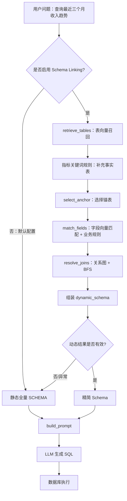

# Day4：Schema Linking 实现分析

> 学习目标：不是记住 Schema Linking 的定义，而是能沿着当前项目源码解释：用户问题如何被映射到候选表、字段和 Join 关系，以及这些结果如何进入 Text2SQL。
>
> 分析边界：本文只分析当前仓库代码，不代表理想化的企业实现。当前停车数据库 DDL 已经存在，但 Schema Linking 元数据仍然是原销售分析业务，两者尚未迁移对齐。

## 一、什么是 Schema Linking？

### 1. 当前项目是否存在 Schema Linking？

存在，而且不是只把全量表结构塞进 Prompt 后让 LLM 自己判断。

当前项目实现了一条明确的动态链路：

```text
用户问题
  → 表级向量召回
  → 指标类问题的事实表规则兜底
  → 锚表选择
  → 候选表内的字段级向量匹配 + 业务规则
  → 基于关系图的 Join 路径推导
  → 动态精简 Schema 文本
  → Text2SQL Prompt
```

总编排入口是 `schema/schema_linker.py` 的 `schema_link()`。源码注释也明确把输入定义为自然语言问题，把输出定义为“表 + 字段 + Join 条件”的动态 Schema。

但是必须区分三个事实：

1. 项目**具备** Schema Linking 能力；
2. 它是可选能力，`FEATURE_SCHEMA_LINKING` 默认值为 `false`，普通 API 请求未显式开启时仍注入静态全量 Schema；
3. 它不是从目标数据库实时发现 Schema，而是检索代码中人工维护的元数据。

因此，准确表述应是：**当前项目实现了可选的、Embedding 与规则结合的 Schema Linking Pipeline，但默认配置仍使用静态全量 Schema。**

### 2. 它在 ChatBI 中承担什么职责？

它负责把用户的业务语言，收敛成 SQL 生成模型可以使用的数据库上下文：

- “问题可能涉及哪些表”；
- “这些表中哪些字段最相关”；
- “哪张表是 SQL 的主表”；
- “候选表如何关联”；
- “哪些业务字段必须包含或排除”。

它不负责直接生成 SQL，也不负责执行 SQL。SQL 由 `text2sql/llm_client.py` 所封装的模型生成，执行由数据库客户端完成。

### 3. 如果去掉会出现什么问题？

当前项目还有静态 `SCHEMA` 兜底，所以去掉动态 Schema Linking 后系统不一定立刻不可用，但会退化为“每次都把全量 Schema 交给 LLM”。当表和字段增多时，容易出现：

- Prompt 变长，Token 成本和模型注意力负担增加；
- 同名或近义字段更容易选错；
- 无关表干扰 SQL 生成；
- 多表 Join 更依赖 LLM 临场推断；
- Schema 扩展后准确率更难稳定。

以原项目中的“查询最近三个月收入趋势”为例：

```text
“收入”
  → 表级描述与规则指向 sales_orders
  → 字段规则强制包含 net_amount、order_status
  → 时间语义可能召回 order_date
  → 若需要人民币汇总，则业务规则/Prompt要求关联 exchange_rates
```

这里需要特别注意：当前 Schema Linking **没有一个独立的结构化指标解析器**把“收入”解析成指标对象，也没有单独的时间解析器把“最近三个月”转换成日期区间。它主要通过向量相似度、关键词规则和字段描述完成关联；最终 SQL 中的时间表达式仍由 Prompt 规则和 LLM 生成。

## 二、找到源码

当前实现以函数为主，没有专门的 `SchemaLinker` 类。

| 文件路径 | 核心对象 | 关键方法 | 调用位置 | 为什么属于 Schema Linking |
|---|---|---|---|---|
| `schema/schema_linker.py` | Pipeline 编排模块 | `schema_link()`、`build_dynamic_prompt_schema()`、`ensure_indexes()` | `prompts/builder.py::build_prompt()` | 串联表召回、字段匹配、锚表和 Join 推理，并输出 Prompt Schema |
| `schema/table_retriever.py` | `TABLE_METADATA`、Chroma 表索引 | `build_index()`、`retrieve_tables()` | `schema_linker.py::schema_link()` | 将问题映射到候选表 |
| `schema/field_matcher.py` | `FIELD_METADATA`、`BUSINESS_RULES`、Chroma 字段索引 | `build_field_index()`、`evaluate_rules()`、`match_fields()` | `schema_linker.py::schema_link()` | 在候选表内把业务词映射到字段 |
| `schema/join_resolver.py` | `TABLE_RELATIONSHIPS`、表类型和关键词 | `select_anchor()`、`resolve_joins()` | `schema_linker.py::schema_link()` | 确定 FROM 主表并推导 Join 路径与条件 |
| `prompts/builder.py` | 静态 `SCHEMA` 与 Prompt 构造器 | `build_prompt()` | `text2sql/main.py::run()` / `run_stream()` | 决定动态 Schema 是否替换静态 Schema |
| `text2sql/main.py` | Text2SQL 主流程 | `Text2SQL.run()`、`run_stream()` | API 或 Agent Executor | 把 Schema Linking 结果间接交给 LLM，再执行 SQL |
| `api/service.py` | 请求参数和功能开关解析 | `QueryRequest`、`_resolve_query_options()` | HTTP 查询接口 | 允许请求级开启或关闭 Schema Linking |
| `tools/config.py` | 全局功能配置 | `APP_CONFIG["features"]["schema_linking"]` | API/Text2SQL 配置解析 | 定义默认是否启用，当前默认 `false` |

关键源码位置：

- `schema/schema_linker.py:84`：完整 Pipeline 入口；
- `schema/schema_linker.py:119-160`：五个执行步骤；
- `schema/schema_linker.py:239`：供 Prompt 调用的简化接口；
- `schema/table_retriever.py:21`：表级元数据；
- `schema/field_matcher.py`：字段元数据、规则与混合评分；
- `schema/join_resolver.py`：关系图、锚表选择与 BFS；
- `prompts/builder.py:152-161`：动态 Schema 替换及静态回退；
- `text2sql/main.py:161-177`：指标上下文与 Prompt 构建顺序；
- `api/service.py:90-100`、`148-169`：HTTP 参数及默认值解析；
- `tools/config.py:71-73`：Schema Linking 默认关闭。

## 三、执行流程

以“查询最近三个月收入趋势”为例，真实执行过程如下。

### 第 0 步：决定是否启用

API 请求体可传 `use_schema_linking`。`api/service.py::_resolve_query_options()` 的优先级是：

```text
请求显式值
  优先于
APP_CONFIG 中的功能默认值
```

`tools/config.py` 中环境变量 `FEATURE_SCHEMA_LINKING` 的默认值为 `false`。因此未显式配置时，下面的动态流程不会运行，而是使用 `prompts/builder.py` 中的静态 `SCHEMA`。

### 第 1 步：表级召回

启用后，`build_prompt()` 调用 `build_dynamic_prompt_schema(user_question)`，继而进入 `schema_link(query)`。

`schema_link()` 首先调用：

```python
retrieve_tables(query, top_k=3, score_threshold=0.3)
```

`retrieve_tables()` 使用 OpenAI-compatible Embedding 和 Chroma 的余弦相似度，从 `TABLE_METADATA` 的自然语言描述中召回表。当前元数据把 `sales_orders` 描述为收入分析、订单统计的核心事实表，所以“收入趋势”应当与它具有较高语义相关性。

注意：源码没有先调用一个函数输出类似 `entities=[...]`、`metrics=[...]`、`time_range=...` 的结构化结果。原始问题直接进入检索器。

### 第 2 步：指标型问题的事实表兜底

`_ensure_fact_table_for_metric()` 检查问题是否包含 `STRONG_METRIC_WORDS`，如“收入、销售额、费用、毛利、利润、金额、数量”。

命中后，它会把阈值放宽为 `0.0`、最多召回 10 张表，再根据 `TABLE_TYPES` 与 `TABLE_KEYWORDS` 选出最相关事实表。如果向量召回漏掉了最相关事实表，就把它补入候选集合。

这是对纯向量召回不稳定性的业务规则修正，不是 LLM 推理。

### 第 3 步：选择锚表

`select_anchor()` 使用轻量规则判断查询是：

- `metric`：指标型；
- `entity`：实体型；
- `ambiguous`：模糊型。

“收入”属于强指标词，指标型查询优先从 `TABLE_TYPES == "fact"` 的候选表中，按关键词得分选择锚表。原业务下通常应选择 `sales_orders`。

锚表是 SQL `FROM` 的起点。若它无法到达全部目标表，代码会尝试改选能连通所有目标的候选表。

### 第 4 步：字段匹配

`match_fields()` 只在候选表内检索字段：

```text
原始问题
  → 字段 Chroma 向量召回
  → evaluate_rules() 评估白名单/黑名单/条件规则
  → 混合评分
  → 补充未被向量召回但被规则强制包含的字段
  → 阈值过滤与 Top-K
```

实际评分公式写在源码中：

```text
final_score = (1 - rule_weight) × embedding_score
              + rule_weight × rule_score
```

默认 `rule_weight=0.3`。强制包含的 `rule_score=1.0`，强制排除为 `-1.0`，无规则为 `0.0`。

当前销售业务规则中，“收入”会强制包含 `sales_orders.order_status`；收入默认口径倾向 `sales_orders.net_amount`，并排除 `gross_amount`，除非用户明确说“含税”。时间字段 `order_date` 是否召回主要取决于字段描述与问题的向量相似度，并没有独立的时间槽位解析保证。

### 第 5 步：Join 路径推理

`resolve_joins(anchor, candidate_tables)` 在手工维护的 `TABLE_RELATIONSHIPS` 图上运行 BFS，为每张目标表寻找从锚表出发的最短路径，再生成：

- `JOIN` 或 `LEFT JOIN`；
- `ON` 条件；
- 无法连通的表；
- `FROM/JOIN` SQL 片段。

例如订单与汇率表的关系被显式配置为复合条件：订单日期对应汇率日期，同时币种相等。

这里的 Join 关系不是数据库外键自动读取的，也不是 LLM 临时生成的。

### 第 6 步：构建动态上下文

`_assemble_dynamic_schema()` 按表组织命中的字段，添加：

- 表名与领域；
- `[锚表]` 标记；
- 字段名和字段说明首句；
- 规则命中标记；
- Join 关系；
- 不可达表告警。

`build_dynamic_prompt_schema()` 返回该文本。若没有召回任何表或出现异常，它返回空字符串。

### 第 7 步：进入 Text2SQL

`prompts/builder.py::build_prompt()` 初始令 `schema_text = SCHEMA`。只有动态 Schema 非空时才替换静态值，然后把它放入 `【数据库Schema】` 区块。

`text2sql/main.py::run()` 再调用 LLM 生成 SQL，最后交给数据库客户端执行。

### 关于指标 RAG 的真实顺序

`text2sql/main.py` 先执行 `_resolve_indicator_context()`，再调用 `build_prompt()`；Schema Linking 则在 `build_prompt()` 内部执行。所以时间顺序是：

```text
指标知识检索
  → Schema Linking
  → 合并到同一个 Prompt
  → LLM 生成 SQL
```

但指标 RAG 的结果没有作为参数传入 `schema_link()`。Schema Linking 只收到原始用户问题。因此二者当前是**先后执行但相互独立的两路上下文**，不是“指标识别结果指导 Schema Linking”。



## 四、Schema 是如何组织的？

当前项目不是单一 Schema 来源，而是几套人工配置共同服务不同环节。

| Schema 信息 | 来源 | 用途 |
|---|---|---|
| 静态全量表字段 | `prompts/builder.py::SCHEMA` | Schema Linking 关闭或失败时直接注入 Prompt |
| 表级自然语言元数据 | `schema/table_retriever.py::TABLE_METADATA` | 建表级向量索引并召回候选表 |
| 字段级自然语言元数据 | `schema/field_matcher.py::FIELD_METADATA` | 建字段级向量索引并匹配候选字段 |
| 字段口径规则 | `schema/field_matcher.py::BUSINESS_RULES` | 强制包含/排除字段，纠正纯语义召回 |
| 表类型与关键词 | `schema/join_resolver.py::TABLE_TYPES`、`TABLE_KEYWORDS` | 指标/实体查询的锚表选择和事实表兜底 |
| 表关系 | `schema/join_resolver.py::TABLE_RELATIONSHIPS` | Join 类型、连接键与 BFS 路径推导 |
| 持久化向量索引 | `schema/chroma_db/tables`、`schema/chroma_db/fields` | 保存上述表/字段描述的 Embedding |
| 数据库建表文件 | `database/01_schema.sql` | 定义当前停车数据库物理结构，但尚未被 Schema Linking 自动读取 |

明确不存在的能力：

- 没有通过 `information_schema` 实时扫描数据库；
- 没有从 DDL 自动生成 `TABLE_METADATA`、`FIELD_METADATA` 和关系图；
- 没有 JSON/YAML Schema 配置作为统一事实来源；
- 没有 Schema 版本、数据源 ID 或租户维度的索引隔离；
- 没有证明 HTTP 服务启动时会自动调用 `ensure_indexes()`。

这也带来一个现实问题：项目当前停车 DDL 与 Schema Linking 里的销售业务元数据已经不一致。若现在开启 Schema Linking，它仍会召回 `sales_orders`、`dim_customers` 等旧表，而不是停车表。

## 五、匹配策略

当前 Schema Linking 是**混合策略**，但不同层使用的手段不同。

### 1. 表级：Embedding + 阈值 + 规则兜底

- OpenAI-compatible Embedding；
- Chroma 持久化向量库；
- cosine 距离，转换为 `1 - distance` 的相关度；
- `top_k` 与相似度阈值过滤；
- 强指标词命中时，用表类型和业务关键词补充事实表。

### 2. 字段级：Embedding + 白黑名单规则

- 先将检索范围限制在候选表内；
- 向量检索数量放大到最多 30 条；
- 计算字段向量得分；
- 叠加强制包含、强制排除或条件规则；
- 对未出现在向量结果中的强制字段进行补充；
- 最后按混合得分排序、阈值过滤和截断。

### 3. 锚表：关键词意图规则

- 用指标信号、实体信号和强指标词分类；
- 指标型优先事实表；
- 实体型优先维度/参考表；
- 模糊型用图中心性兜底；
- 再检查连通性。

### 4. Join：确定性图算法

- 表关系人工维护；
- BFS 找最短路径；
- 根据关系配置生成 Join 类型与 ON 条件；
- 不可连接时返回 `unreachable`，不会虚构连接。

### 5. 当前没有使用的策略

- Schema Linking 阶段没有调用聊天 LLM 做表字段判断；
- 没有 Cross-Encoder 或 LLM Reranker；
- 没有同义词词典的独立召回层；
- 没有基于字段值样本的 value linking，例如把“德国”匹配到 `country`；
- 没有数据库约束/SQL 试执行反向验证召回结果。

## 六、上下文构建

`schema_link()` 返回的是结构化字典，而 `build_dynamic_prompt_schema()` 只暴露其中的动态文本。

结构与源码定义一致：

```python
{
    "tables": [...],
    "fields": [...],
    "anchor": "sales_orders",
    "join_path": {
        "anchor": "sales_orders",
        "joins": [...],
        "sql_fragment": "...",
        "unreachable": [...]
    },
    "dynamic_schema": "...",
    "metadata": {
        "table_count": 0,
        "field_count": 0,
        "join_count": 0,
        "has_unreachable": False
    }
}
```

最终注入 Prompt 的 `dynamic_schema` 大致包含：

```text
表：sales_orders（事实表） [锚表]
  - order_date ...
  - net_amount ... ★强制包含
  - order_status ... ★强制包含

表间关联：
  LEFT JOIN exchange_rates ON ...
```

它会输出相关表、字段说明、规则标记和 Join 条件，但不会输出：

- 结构化指标对象；
- 解析后的时间起止日期；
- 字段真实样例值；
- 候选 Schema 的置信度解释；
- 锚表选择原因。`anchor_reason` 虽传入 `_assemble_dynamic_schema()`，当前函数并未真正写入最终文本。

## 七、与 Text2SQL 的关系

两者的边界是：

```text
Schema Linking：决定“SQL 可以看哪些表字段、如何关联”
Text2SQL：基于问题、Schema、指标知识、规则和示例生成 SQL
```

真实调用链：

```text
api/service.py
  → Text2SQL.run(..., use_schema_linking=...)
  → text2sql/main.py 解析功能开关
  → prompts/builder.py::build_prompt()
  → schema/schema_linker.py::build_dynamic_prompt_schema()
  → schema_link()
  → 动态 Schema 回到 build_prompt()
  → LLMClient.generate_sql(system_msg, prompt)
  → DatabaseClient.execute(sql)
```

不能简单依赖“用户问题 → LLM → SQL”的主要原因，不是 LLM 不会写 SQL，而是 LLM 不知道企业数据库中：

- 业务词对应哪个物理字段；
- 指标采用哪个口径；
- 哪些订单状态才参与统计；
- 多表通过哪些键连接；
- 哪些表根本无关。

但当前项目仍保留直接给 LLM 静态全量 Schema 的路径，说明它处于从基础 Text2SQL 向动态 Schema Linking 演进的阶段，而不是完全依赖 Schema Linking 的成熟形态。

## 八、当前实现评价

### 优点

1. **职责拆分清晰**：表召回、字段匹配、Join 推理和总编排分别位于不同文件，便于单独理解和替换。
2. **不是纯 Embedding**：对收入、含税金额、订单状态、成本和费用层级加入业务规则，能弥补语义相似不等于业务正确的问题。
3. **两级收敛节省上下文**：先选表，再在候选表内选字段，比始终注入全库 Schema 更适合扩展。
4. **Join 可解释**：关系图和 BFS 是确定性逻辑，Join 键、Join 类型以及不可达表都能检查。
5. **有降级机制**：召回为空或发生异常时回退静态 Schema，不会因动态能力故障直接中断 SQL 生成。
6. **支持请求级开关**：API 可针对请求启用，方便灰度验证和对比效果。

### 不足

1. **元数据与数据库不一致**：停车 DDL 已存在，但静态 Prompt、表/字段元数据和 Join 图仍是销售业务，这是当前最直接的迁移风险。
2. **多处重复维护**：同一 Schema 分散在静态 Prompt、表元数据、字段元数据、规则和关系图，字段变更容易漏改。
3. **不自动感知数据库**：没有元数据扫描、DDL 解析或 Schema 版本校验，代码配置可能引用不存在的表字段。
4. **默认未开启**：普通配置下动态链路不会执行，实际收益必须显式启用后才存在。
5. **索引生命周期不完整**：`ensure_indexes()` 主要出现在模块演示入口，没有看到服务启动阶段自动建索引和版本检测。
6. **缺少 value linking**：无法用字段真实取值增强“德国”“A停车场”“新能源车”等实体值到字段的映射。
7. **缺少显式槽位解析**：指标、维度、筛选条件和时间范围没有结构化输出，不利于审计与后续规划。
8. **缺少重排序与联合约束**：没有专门 Reranker，也没有结合指标定义对候选表字段进行二次约束。
9. **错误被静默降级**：`build_prompt()` 捕获异常后直接 `pass`，`build_dynamic_prompt_schema()` 只用 `print`，线上可观测性不足。
10. **召回质量评估不足**：仓库没有看到针对表召回、字段召回、Join 路径的系统化测试集和 Recall@K、MRR、字段准确率等指标。
11. **安全边界不在本模块内**：Schema Linking 只缩小上下文，不等于权限控制；数据源、角色和行级权限仍必须由运行时和数据库执行层保证。

需要纠正一个可能的误判：当前项目**并不缺少 Embedding 召回**。它已经在表级和字段级使用 Embedding；真正缺少的是自动元数据同步、value linking、重排序、评估与索引治理。

## 九、迁移到智慧停车

### 1. 必须替换或重建的 Schema 内容

后续迁移至少涉及：

- `prompts/builder.py::SCHEMA`：改成停车表字段描述；
- `schema/table_retriever.py::TABLE_METADATA`：改成停车场、车位、订单、收入或日聚合等表的业务描述；
- `schema/field_matcher.py::FIELD_METADATA`：改成停车字段说明与同义表达；
- `schema/field_matcher.py::BUSINESS_RULES`：改成停车收入、订单状态、免费时长、退款、利用率等口径规则；
- `schema/join_resolver.py::TABLE_RELATIONSHIPS`：改成六张停车表的真实逻辑关联；
- `TABLE_TYPES`、`TABLE_KEYWORDS`、指标和实体信号词：改成停车领域；
- Chroma 表、字段索引：元数据变化后强制重建，不能沿用旧向量。

注意：这里是 Day4 的迁移分析，不是今天要执行的代码修改。

### 2. 可以复用的能力

- `schema_link()` 的总体编排顺序；
- Chroma + Embedding 的表级、字段级召回框架；
- 候选表限定字段检索的方式；
- 规则分数与向量分数组合的思路；
- 锚表选择接口；
- BFS Join 路径算法；
- 动态 Schema 文本组装与静态回退机制；
- API 请求级功能开关。

### 3. 停车领域应重点补充的语义映射

| 用户表达 | 目标语义 |
|---|---|
| 收入、停车费、实收 | 支付成功且扣除退款后的收入字段/聚合口径 |
| 利用率、车位利用率 | 已占用车位时长与可供给车位时长的比值，而不是简单订单数/车位数 |
| 平均停车时长 | 有效离场订单的停车时长平均值 |
| 订单量 | 明确是否排除取消、异常、未支付订单 |
| 某停车场 | 停车场维表的名称值，需要 value linking |
| 最近三个月 | 统一时间粒度、闭开区间与自然月/滚动月口径 |

### 4. 推荐的迁移次序

```text
确认六张物理表与字段
  → 建立唯一 Schema 元数据源
  → 生成表/字段检索文档
  → 配置停车 Join 图
  → 重建向量索引
  → 增加停车 Schema Linking 测试集
  → 小流量开启功能开关
  → 评估召回与 SQL 准确率
```

不要只把旧表名替换为新表名。停车业务的关键难点是指标口径和事实粒度，例如“利用率”可能应优先使用日聚合事实，也可能需要用车位状态明细重算；这必须先由业务定义决定，Schema Linking 才能正确选表。

## 十、源码阅读建议

建议按调用链而不是按目录字母顺序阅读。

1. **`prompts/builder.py`**
   
   先看静态 `SCHEMA` 和 `build_prompt()`。目的：明确 Schema Linking 最终不是直接产出 SQL，而是替换 Prompt 中的 Schema 区块。

2. **`schema/schema_linker.py`**
   
   重点看 `schema_link()` 的五步流程、`_assemble_dynamic_schema()` 的输出，以及 `build_dynamic_prompt_schema()` 的降级策略。

3. **`schema/table_retriever.py`**
   
   对照 `TABLE_METADATA`、`build_index()`、`retrieve_tables()`，理解“检索的是表描述，不是直接查询数据库”。

4. **`schema/field_matcher.py`**
   
   先看 `FIELD_METADATA` 和 `BUSINESS_RULES`，再看 `evaluate_rules()` 与 `match_fields()` 的评分公式。这里最能体现业务规则如何修正向量召回。

5. **`schema/join_resolver.py`**
   
   先画出 `TABLE_RELATIONSHIPS`，再跟踪 `_classify_intent()`、`select_anchor()`、`_bfs_shortest_path()`、`resolve_joins()`。

6. **`text2sql/main.py`**
   
   查看 `run()` 中指标知识、Prompt、LLM 与数据库执行的顺序，理解 Schema Linking 的系统边界。

7. **`api/service.py` 与 `tools/config.py`**
   
   最后确认请求级参数如何覆盖默认功能开关，尤其记住当前默认关闭。

8. **`database/01_schema.sql`**
   
   将停车物理表与上述旧业务元数据逐项对比。这个差异正是 Day8 改 Schema 时要解决的问题。

阅读时建议每个文件回答三个问题：输入是什么、输出是什么、失败后系统怎样处理。这样比只记函数名更接近企业排障和面试表达。

## 十一、面试总结

如果面试官问“请介绍一下你们项目里的 Schema Linking”，可以这样回答：

> 我们这个 ChatBI 项目不是直接把用户问题交给大模型生成 SQL，而是在 Prompt 构造前提供了一条可选的 Schema Linking 链路。它的入口是 `schema/schema_linker.py` 的 `schema_link()`，主要分为表召回、事实表兜底、锚表选择、字段匹配、Join 推理和动态上下文组装几个步骤。
>
> 表召回方面，我们没有直接让聊天模型判断，而是把人工维护的表级业务描述通过 Embedding 写入 Chroma，查询时按余弦相关度召回 Top-K 表。为了避免纯向量召回把“毛利”之类的问题召回到错误事实表，代码还会结合强指标词、表类型和业务关键词补充最相关事实表。
>
> 字段层也是混合方案。系统先把检索范围限制在候选表内，然后做字段描述的向量检索，同时应用业务白名单和黑名单。例如收入默认对应不含税的 `net_amount`，并需要 `order_status` 过滤已完成订单；只有用户明确问含税金额时才选择 `gross_amount`。最终分数由 Embedding 分和规则分加权得到，还会补入规则强制要求但向量召回遗漏的字段。
>
> 多表查询方面，项目在 `join_resolver.py` 中人工维护表关系图。系统先根据指标型或实体型意图选择 SQL 的锚表，再用 BFS 找到连接候选表的最短路径，生成 Join 类型和 ON 条件；无法连接的表会明确标记，不会随意拼接。最后，系统把相关表、字段说明、锚表和 Join 条件组装成精简 Schema，注入 Text2SQL Prompt，由 LLM 生成 SQL，再进入安全检查和数据库执行。
>
> 这个方案的优点是比全量 Schema 更节省上下文，表字段选择更可控，Join 也更可解释，同时保留了失败后回退静态 Schema 的能力。不过我也会如实说明当前项目还处于演进阶段：Schema 元数据是代码中人工维护的，没有从数据库自动同步，没有 value linking 和 reranker，向量索引也缺少服务启动时的版本治理。另外功能开关默认是关闭的，所以并不是所有 API 请求默认走动态链路。
>
> 在迁移智慧停车业务时，算法框架可以复用，但表描述、字段描述、指标规则、表类型、关键词、Join 图和向量索引都必须按停车数据库重建。尤其像停车收入、车位利用率和平均停车时长，必须先明确业务口径和事实粒度，再让 Schema Linking 决定使用订单事实还是日聚合事实。这样能避免只换表名却把旧业务语义带进新系统。

这段回答的重点不是夸大项目能力，而是同时讲清楚：实现位置、核心算法、调用边界、可解释性、真实不足和迁移方案。

## 十二、今日学习总结

今天应真正掌握以下内容：

1. Schema Linking 不是 SQL 生成，而是为 SQL 生成选择正确的数据库上下文。
2. 当前项目有严格意义上的动态 Schema Linking，但它是可选能力，默认仍走静态全量 Schema。
3. 当前方案由表级 Embedding、事实表规则兜底、字段级混合匹配、锚表规则和 BFS Join 推理组成。
4. 项目没有显式的指标/实体/时间结构化抽取，不能把语义检索描述成完整槽位解析。
5. Chroma 中的内容来自代码元数据，不来自目标数据库实时扫描。
6. 指标 RAG 先执行，但没有把结果传给 Schema Linking；两者当前只是并列注入 Prompt 的上下文。
7. Schema Linking 的工程价值包括减少无关上下文、提升字段选择稳定性和让 Join 可解释，但它不能替代权限控制、指标治理和 SQL 校验。
8. 停车 DDL 与旧销售 Schema 元数据尚未对齐，是后续迁移必须优先解决的问题。

最容易成为面试考点的地方：

- 表召回和字段召回为什么分两级；
- Embedding 与业务规则如何组合；
- 锚表怎样选择，BFS 为什么适合 Join 路径；
- 动态 Schema 失败如何降级；
- 指标 RAG 与 Schema Linking 的边界；
- 如何处理数据库变更和索引版本；
- 如何评估 Schema Linking，而不是只评估最终 SQL；
- 为什么 Schema Linking 不等于数据权限控制。

# 我的思考题

1. 当前项目已经在字段匹配中使用 Embedding，为什么还需要 `BUSINESS_RULES`？请结合“收入”和“含税收入”说明纯向量召回可能造成的问题。

2. 如果用户问“查询没有订单的客户”，当前项目为什么可能选择 `dim_customers` 作为锚表，并使用 `LEFT JOIN`？如果反过来从 `sales_orders` 出发会有什么语义风险？

3. 当前项目的指标 RAG 在 Schema Linking 之前执行，但为什么不能说“指标 RAG 的结果指导了 Schema Linking”？请沿真实参数传递链路解释。

4. 停车数据库已经建好六张表，但为什么不能只修改 `prompts/builder.py::SCHEMA` 就认为 Schema Linking 迁移完成？至少列出还需要同步的四类元数据。

5. 如果上线后发现“车位利用率”问题经常召回订单事实表，却没有召回停车场日聚合表，你会如何判断问题发生在表描述、Embedding 召回、规则兜底、指标口径还是索引版本？请给出你的排查顺序和依据。

> 请先独立作答。后续点评应以当前项目源码为准，重点检查结论是否有代码证据，而不是只看理论表述是否完整。
