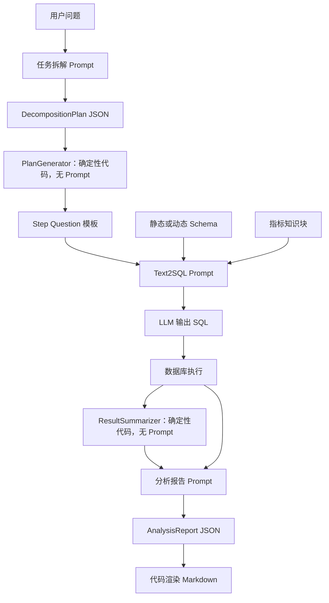
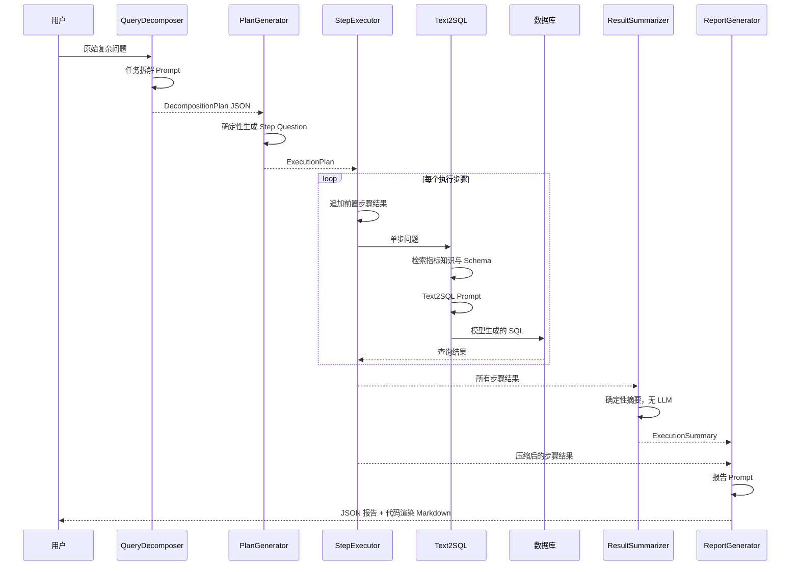

# Day5：Prompt 设计分析

> 本文只依据当前仓库源码分析。今天只新增学习文档，不修改现有 Prompt、代码或配置。
>
> 先给结论：当前运行链路中有三类主要 LLM Prompt——任务拆解 Prompt、Text2SQL Prompt、分析报告 Prompt。任务拆解还有一次校验失败重试 Prompt。`PlanGenerator`、Schema Linking、`ResultSummarizer` 都没有调用 LLM，因此不存在独立的 Planner 生成 Prompt、Schema Linking Prompt 或 Summary Prompt；项目也没有 SQL 自动修正 Prompt。

## 一、Prompt 在当前项目中的作用

### 1. 当前项目有哪些 Prompt？

按实际运行用途，可分为：

1. **Query Decomposition Prompt**：把复杂问题拆成结构化子任务；
2. **Query Decomposition Retry Prompt**：首次拆解通过 JSON 解析但未通过业务校验时，携带错误信息再拆一次；
3. **Text2SQL Prompt**：把单个问题或 Agent 子任务转换成 MySQL；
4. **Report Prompt**：把多步 SQL 结果整理成结构化经营分析报告；
5. **Zero-shot 教学 Prompt**：早期版本演示“没有 Schema 时直接生成 SQL”的能力边界，不是当前主链路；
6. **Agent Step Question 模板**：不是独立模型调用，而是 Planner 用确定性代码拼出的子问题，随后作为 `user_question` 进入 Text2SQL Prompt。

此外还有三类容易被误认为 Prompt 的内容：

- Schema Linking 输出的是动态 Schema 上下文，本身不调用聊天模型；
- 指标知识模块输出的是 Prompt 知识块，本身不调用聊天模型；
- `ResultSummarizer` 使用 Python 模板汇总执行结果，不存在 Summary Prompt。

### 2. 每个 Prompt 负责什么？

| Prompt | 任务 |
|---|---|
| 任务拆解 | 决定需要分析哪些子任务、顺序和依赖 |
| 拆解重试 | 把程序校验错误反馈给模型，要求修正计划 |
| Text2SQL | 决定具体表、字段、过滤、聚合和 Join，输出 SQL |
| 报告生成 | 基于已执行数据生成发现、归因、趋势和建议 |
| Zero-shot | 教学对照，展示一句 Prompt 的不足 |
| Step Question | 将结构化任务转成 Text2SQL 可以消费的自然语言问题 |

### 3. 为什么不能只用一句 Prompt？

因为当前 Agent 的三个模型任务具有不同输入、输出和约束：

- 拆解阶段要输出带依赖关系的 JSON；
- SQL 阶段要输出一条可执行 MySQL；
- 报告阶段要输出六字段 JSON，且只能依据执行结果。

如果用一句 Prompt 同时完成规划、查询和总结，模型需要一次性承担任务拆解、数据库理解、SQL 生成、数据执行后的推理和报告格式控制。但模型在生成 SQL 时还没有数据库执行结果，也无法可靠完成基于结果的归因。因此当前项目把不同阶段拆开，并在阶段间传递结构化结果。

### 4. Prompt 在 Agent 流程中的位置



## 二、找到所有 Prompt

### Prompt 清单

| 文件路径 | Prompt 名称 | 构造方法/位置 | 调用位置 | 调用者 |
|---|---|---|---|---|
| `agent/planner/query_decomposer.py` | 任务拆解 System/User Prompt | `build_decomposition_prompt()`，约 78-124 行 | `QueryDecomposer.decompose()`，约 144 行 | `QueryDecomposer` |
| `agent/planner/query_decomposer.py` | 拆解重试 Prompt | `_build_retry_prompt()`，约 245-251 行 | `decompose()` 校验失败分支，约 158-162 行 | `QueryDecomposer` |
| `prompts/builder.py` | Text2SQL System/User Prompt | `build_prompt()`，约 124-207 行 | `text2sql/main.py::run()` 与 `run_stream()` | `ChatBISystem`/Text2SQL 主流程 |
| `agent/executor/report_generator.py` | 报告 System/User Prompt | `_build_system_message()`、`_build_prompt()`，约 80-116 行 | `ReportGenerator.generate()` | `ReportGenerator` |
| `text2sql/text2sql_v0.py` | Zero-shot SQL Prompt | `generate_sql()`，约 23-41 行 | 文件演示入口 `run()` | 教学演示脚本 |
| `agent/workflow/agent_planner.py` | Agent Step Question 模板 | `PlanGenerator._build_step_question()`，约 132-142 行 | `StepExecutor` 将其传给 `ChatBISystem.run()` | `PlanGenerator`/`StepExecutor` |

### 明确不存在的 Prompt

| 名称 | 当前真实实现 |
|---|---|
| 独立 Planner Prompt | `PlanGenerator.build_plan()` 用 Python 将 `DecompositionPlan` 映射成 `ExecutionPlan`，没有 LLM 调用 |
| Schema Linking Prompt | Embedding、关键词规则、字段混合评分和 BFS Join，不调用聊天 LLM |
| SQL 修正 Prompt | 没有把 SQL 错误反馈给 LLM 并要求改写的链路；Executor 重试只是重复同一问题 |
| Summary Prompt | `ResultSummarizer.summarize()` 使用确定性模板和首行结果摘要 |
| ReAct Prompt | 没有 Thought/Action/Observation 循环模板 |
| Self-reflection Prompt | 没有模型自检或反思 Prompt |

## 三、逐个分析 Prompt

### 1. 任务拆解 Prompt

**源码**：`agent/planner/query_decomposer.py::build_decomposition_prompt()`。

#### 设计目标

把复杂经营问题转换成 `DecompositionPlan`，使后续确定性 Planner 能建立执行步骤。

#### 输入

- 用户原始问题；
- `prompts/builder.py::SCHEMA` 静态全量 Schema；
- `AVAILABLE_DIMENSIONS` 白名单；
- 从 `rag/indicators_full.json` 加载的指标名称和别名。

注意：这里直接使用静态 `SCHEMA`，没有调用动态 Schema Linking。

#### 输出

要求 JSON 顶层包含：

```json
{
  "question_type": "...",
  "analysis_goal": "...",
  "subtasks": []
}
```

每个子任务必须包含 `task_id`、`task_name`、`task_type`、`description`、`depends_on`、`dimensions`、`metrics`。

#### 组织方式

Prompt 按以下区块组织：

```text
数据库 Schema
→ 可用分析维度
→ 可用指标
→ 用户问题
→ 输出字段约束
→ 常见分析类型拆解策略
```

这种组织让模型先知道可用业务空间，再进行拆解，减少生成不存在维度和指标的概率。

#### JSON、Few-shot 和格式约束

- 要求 JSON；
- API 调用还设置 `response_format={"type": "json_object"}`；
- 没有提供完整输入输出 Few-shot 示例；
- 有字段清单、任务 ID 格式、依赖顺序、最大复杂度倾向和“不要 Markdown”等约束；
- 温度显式设置为 `0`。

#### 最关键语句

- “输出必须是 JSON，不要输出额外解释”；
- “depends_on 只能引用前面已经出现的 task_id”；
- “每个子任务都应尽量对应一条简单 SQL 或一个单独分析动作”；
- “维度只能从可用分析维度中选择”；
- 针对趋势、原因诊断和维度对比提供拆解策略。

#### Prompt 之外的稳定性措施

模型输出会经过：

1. JSON 提取；
2. Pydantic `DecompositionPlan` 校验；
3. 依赖合法性校验；
4. 维度白名单校验；
5. 不同问题类型的最大任务数校验。

因此稳定性并不只靠 Prompt。

### 2. 任务拆解重试 Prompt

**源码**：`agent/planner/query_decomposer.py::_build_retry_prompt()`。

#### 设计目标与输入输出

当首次结果能解析但未通过依赖、维度或复杂度校验时，把具体错误追加到原 Prompt，要求模型重新输出合法 JSON。

输入是原 Prompt 和程序产生的 `error_message`，输出仍是 `DecompositionPlan` JSON。

#### 关键设计

它属于“外部校验反馈”，不是让模型自己反思。最多执行两次模型调用，即首次加一次重试。

当前代码有一个边界：`_parse_plan()` 位于校验的 `try` 之外，所以非法 JSON或 Pydantic 结构错误会直接抛出，不会进入这次业务校验重试。重试主要覆盖依赖、维度和任务数量错误。

### 3. Text2SQL Prompt

**源码**：`prompts/builder.py::build_prompt()`。

#### 设计目标

将用户问题、数据库 Schema、业务规则、Few-shot、错误防护和指标知识组合成生成 MySQL 的上下文。

#### 输入

- `user_question`；
- `use_few_shot`；
- `use_rules`；
- `use_guards`；
- `indicator_knowledge`；
- `use_schema_linking`。

在 Agent 中，`user_question` 通常不是原始复杂问题，而是 `PlanGenerator` 生成的单步问题，并可能由 `StepExecutor._compose_question()`追加前置步骤结果。

#### 输出

返回 `(system_message, user_message)`，模型应只输出 SQL 字符串，不要求 JSON。

#### Prompt 结构

```text
System：专业 SQL 生成助手

User：
数据库 Schema（静态或动态）
→ 可选业务规则
→ 可选 Few-shot
→ 可选错误防护
→ 可选指标知识
→ 用户问题
→ SQL 输出要求
```

#### Schema 如何进入

默认先使用 `SCHEMA`。当 `use_schema_linking=True` 时，调用 `build_dynamic_prompt_schema(user_question)`；只有返回非空时才替换静态 Schema，异常或空结果会回退。

#### JSON、Few-shot 和格式约束

- 不要求 JSON；
- 有 4 个 SQL Few-shot 示例；
- 使用中文区块标签作为分隔符；
- 明确要求只输出 SQL、使用 MySQL、表字段必须存在、多表使用 Join、SQL 完整闭合；
- 没有使用 API 的结构化输出模式；
- 没有 SQL AST 作为模型输出格式。

#### 最关键语句

- “只输出 SQL 语句，不需要解释”；
- “确保字段名和表名与 Schema 一致”；
- 收入、成本与汇率口径约束；
- “SQL 必须完整闭合……不要输出截断的半句 SQL”；
- 启用规则/防护后要求优先遵循相应区块。

#### 一个需要识别的重复

收入、成本、汇率等约束同时出现在：

- `RULES`；
- `ERROR_GUARDS`；
- 固定的 `【要求】`；
- 部分 Few-shot；
- 指标知识中也可能再次出现。

这能强化约束，但也会增加 Token 和规则冲突风险。

### 4. Agent Step Question 模板

**源码**：`agent/workflow/agent_planner.py::PlanGenerator._build_step_question()`。

它拼接：

- 子任务名称；
- 任务说明；
- 关注指标；
- 分析维度；
- “只回答当前子任务”；
- “优先生成一条结构清晰、易执行的 SQL”；
- “不要直接跳到最终归因结论”。

这段文本没有直接调用模型，所以严格来说是 Prompt 输入片段。`StepExecutor` 还会追加依赖步骤的 JSON 结果，然后整体进入 Text2SQL Prompt。

它的价值是把复杂问题拆成更聚焦的 SQL 请求，并让依赖结果参与后续步骤。它不要求 JSON，因为最终仍由 Text2SQL Prompt 要求输出 SQL。

### 5. 分析报告 Prompt

**源码**：`agent/executor/report_generator.py::_build_system_message()` 与 `_build_prompt()`。

#### 设计目标

把多步执行结果转为面向业务人员的结构化报告，同时限制模型不能编造数据。

#### 输入

- 原始问题；
- 分析目标；
- 确定性执行摘要；
- 每个步骤的压缩结果。

`_compress_step_result()` 只保留步骤身份、状态、格式化结果、引用、错误，以及最多前三行 `rows_preview`，避免把全部查询结果放入 Prompt。

#### 输出

要求 JSON 包含六个字段：

- `title`；
- `executive_summary`；
- `key_findings`；
- `root_causes`；
- `trend_judgment`；
- `action_suggestions`。

解析后由 Python 代码生成 Markdown，模型被明确要求不要输出 Markdown。

#### JSON、Few-shot 和格式约束

- 要求 JSON；
- 没有 Few-shot；
- 明确六字段名称；
- 强调只使用上下文信息、数据不足时保守；
- 没有在模型 API 调用层设置 `response_format=json_object`，因为它通过通用 `LLMClient.generate_text()` 调用；
- 通过 `json.loads()` 和 Pydantic `AnalysisReport` 做后置校验；
- 失败时不重试，而是回退确定性模板报告。

#### 最关键语句

- “只基于提供的数据和执行结果写结论，不要编造未出现的事实”；
- “如果数据不足，结论要保守”；
- “只返回 JSON，不要额外输出 Markdown”；
- 六个必填字段约束。

### 6. Zero-shot 教学 Prompt

**源码**：`text2sql/text2sql_v0.py::generate_sql()`。

内容只有角色、问题和“请直接输出 SQL”，没有 Schema、规则、Few-shot 或指标知识，也没有独立 System Message。文件注释明确说明它用于展示无 Schema 时的准确性边界。

它不能代表当前主链路，但能说明项目 Prompt 是如何从一句话逐步演进成分层上下文的。

### 7. 不属于独立 LLM Prompt 的上下文生成器

#### Schema Linking 上下文

`schema/schema_linker.py::_assemble_dynamic_schema()` 生成相关表、字段、锚表和 Join 文本，之后由 `build_prompt()` 注入 Text2SQL Prompt。这个过程使用 Embedding、规则和图算法，不存在 Schema Linking System/User Prompt。

#### 指标知识上下文

`rag/indicator_knowledge.py` 或 `rag/indicator_retriever.py` 生成 `【指标知识】`文本块，内容可能包括定义、公式、数据来源、依赖指标、过滤条件、注意事项和 SQL 参考。它是检索增强上下文，不是单独的 LLM 调用。

#### 执行摘要

`agent/workflow/agent_planner.py::ResultSummarizer.summarize()` 通过 Python 统计成功、失败、跳过步骤，并抽取格式化结果或第一行数据，没有 Summary Prompt。

## 四、Prompt 与 Agent 的关系



这条链路不是“Planner Prompt → Schema Prompt → SQL Prompt → Summary Prompt”的四次 LLM 串行调用。真实情况是：拆解调用 LLM；Planner 用代码；Schema/RAG 提供 SQL Prompt 上下文；SQL 调用 LLM；摘要用代码；最终报告再调用 LLM。

## 五、Prompt Engineering 技巧

### 1. Role Prompt

存在三种明确角色：

- 企业级 ChatBI 任务拆解器；
- 专业 SQL 生成助手；
- 企业经营分析师。

角色定义与阶段职责一一对应，没有让同一角色承担所有工作。

### 2. System 与 User Message 分离

三个主要模型任务都把稳定角色与具体上下文分开。`LLMClient` 按 `system`、`user` 两个角色发送消息。

### 3. Output Format

- 拆解：固定 JSON 字段和子任务结构；
- SQL：只输出 SQL，不解释；
- 报告：固定六字段 JSON，不输出 Markdown。

### 4. JSON Constraint

任务拆解同时用了语言约束、API `response_format`、JSON 解析和 Pydantic 校验。报告用了语言约束、JSON 解析和 Pydantic，但没有 API `response_format`。

### 5. Few-shot

只有 Text2SQL 主 Prompt 包含 Few-shot，共四个示例，覆盖计数、维度聚合、费用统计、月度收入与汇率 Join。拆解和报告 Prompt 没有 Few-shot。

### 6. Delimiter / 分区标签

项目使用 `【数据库Schema】`、`【关键业务规则】`、`【示例】`、`【常见错误防护】`、`【指标知识】`、`【用户问题】`、`【要求】` 等标签分隔上下文。

### 7. 约束白名单

拆解 Prompt 明确限定可用维度，指标优先使用知识库名称或别名；代码还会再次校验维度。

### 8. Task Decomposition Guidance

拆解 Prompt 为趋势、原因诊断、维度对比提供步骤策略，并要求每步对应简单 SQL 或单独分析动作。

### 9. Grounding

SQL Prompt 以 Schema、指标公式和业务规则约束模型；报告 Prompt 以真实步骤结果约束模型，并明确禁止编造。

### 10. Context Compression

报告 Prompt 不传全部数据，只传每步最多三行预览和格式化摘要。

### 11. Retry with Feedback

拆解校验失败后将明确错误反馈给模型一次。

### 12. Chain of Thought

当前项目**没有要求模型输出 Chain of Thought**，没有“展示思考过程”或隐藏推理字段。拆解步骤是结构化任务计划，不等于 Chain of Thought。

### 13. Step-by-Step

拆解 Prompt 提供分析类型的分步策略，但 Text2SQL Prompt 没有要求模型先逐步推理再输出 SQL。由于最终要求只输出 SQL，所以不能宣称项目使用了显式 Step-by-Step 推理输出。

## 六、Prompt 如何保证输出稳定？

### 1. SQL 格式稳定性

当前措施：

- System Message 限定 SQL 专家角色；
- 指定标准 MySQL；
- 注入 Schema、规则、指标知识和 Few-shot；
- 要求只输出 SQL且完整闭合；
- `LLMClient.generate_sql()` 去掉 ```sql 代码围栏；
- 默认温度配置为 `0.1`；
- 后续数据库安全层和实际执行能够暴露非法 SQL。

但它没有：

- SQL 输出的 JSON Schema；
- AST 约束解码；
- 生成后语法解析器修复；
- 数据库错误驱动的 SQL 修正 Prompt；
- 模型自检 Prompt。

Executor 的 `max_retries` 只是再次执行相同单步问题，没有把上一次 SQL 或数据库错误写入一个修正 Prompt，因此不能称为 SQL self-correction。

### 2. 拆解 JSON 稳定性

这是当前约束最完整的一层：

```text
Prompt 字段约束
  + temperature=0
  + response_format=json_object
  + JSON 提取
  + Pydantic 类型校验
  + 依赖/维度/复杂度业务校验
  + 一次错误反馈重试
```

不过非法 JSON 与 Pydantic 结构错误目前不会进入业务校验重试分支。

### 3. 报告 JSON 稳定性

当前使用六字段约束、`json.loads()`、Pydantic 和确定性 fallback。即使 LLM 返回非法 JSON，Agent 仍能产出模板报告。

不足是通用 `generate_text()` 没有启用 `response_format=json_object`，也没有修复重试，所以“保证可用”主要依靠 fallback，而不是确保模型每次输出正确 JSON。

### 4. 输出一致性

- 拆解温度为 0；
- 通用 LLM 温度来自配置，默认 0.1；
- 固定字段、固定区块和固定格式提高一致性；
- Pydantic 将模型结果收敛到稳定数据结构；
- Markdown 报告由代码渲染，而不是让模型自由排版。

这些措施只能“尽量稳定”，不能保证语义结果完全一致。

## 七、Prompt 与 Schema Linking、Text2SQL 的关系

### 1. Schema 信息

`build_prompt()` 默认注入 `prompts/builder.py::SCHEMA`。开启 Schema Linking 后，用当前问题召回相关表、字段和 Join，动态结果非空才替换静态 Schema。

Schema 告诉模型物理表字段和关系，解决“从哪里查”的问题。

### 2. 指标信息

`text2sql/main.py::_resolve_indicator_context()` 先选择：

- 指标 RAG；或
- 关键词指标知识兜底。

然后把 `indicator_block` 传给 `build_prompt()`。指标知识告诉模型定义、计算公式、数据来源、依赖和过滤条件，解决“怎么算”的问题。

### 3. 数据库信息

Prompt 中明确指定 MySQL 语法。物理数据库配置不会直接暴露给模型，数据库连接由 Runtime/Database Client 管理。模型看到的是 Schema 和业务上下文，不会看到密码等连接信息。

### 4. 实际拼装顺序

```text
用户问题
  → 指标知识检索
  → build_prompt 内部执行可选 Schema Linking
  → Schema
  → 业务规则
  → Few-shot
  → 错误防护
  → 指标知识
  → 用户问题
  → 输出要求
  → LLM
  → SQL
```

指标 RAG 虽先执行，但指标结果没有传入 Schema Linking；二者分别成为同一个 SQL Prompt 的上下文。

## 八、当前 Prompt 的优缺点

### 优点

1. **按任务拆分角色**：规划、SQL、报告分别设计，职责清晰。
2. **Prompt 构造集中**：Text2SQL 主要模板集中在 `prompts/builder.py`，功能块可按开关组合。
3. **Schema 与指标双重 Grounding**：同时说明“在哪查”和“怎么算”。
4. **有实际 Few-shot**：SQL 示例覆盖项目核心业务场景。
5. **结构化输出与代码校验结合**：尤其任务拆解层使用 API JSON 模式、Pydantic 和业务校验。
6. **动态 Schema 有降级路径**：召回失败时仍可使用静态 Schema。
7. **报告防幻觉意识明确**：要求只基于执行结果，数据不足时保守。
8. **报告上下文压缩**：只传前三行预览，控制输入规模。
9. **Markdown 由代码渲染**：避免模型格式漂移。

### 不足

1. **业务仍是旧销售场景**：Schema、Few-shot、规则、维度和指标目录尚未迁移停车业务。
2. **Text2SQL 规则重复**：同一口径出现在多个区块，增加 Token 与冲突风险。
3. **拆解 Prompt 使用静态全量 Schema**：没有复用动态 Schema Linking，数据库扩大后会变长。
4. **Few-shot 是固定全量注入**：没有按问题检索最相关示例。
5. **SQL 输出约束偏软**：主要依赖自然语言要求和代码围栏清理，没有结构化/语法级约束。
6. **没有 SQL 修正闭环**：数据库执行错误不会形成包含错误信息的修正 Prompt。
7. **报告 JSON 未使用 API JSON 模式**：依赖解析失败后的模板降级。
8. **拆解重试覆盖不完整**：非法 JSON或模型结构错误不会走当前业务校验重试。
9. **没有 Prompt 版本管理**：源码中没有 prompt version、实验 ID 或灰度版本记录。
10. **缺少系统化 Prompt 评估**：有单元测试和 Text2SQL 执行评估，但没有按 Prompt 版本记录准确率、Token、延迟和回归结果。
11. **动态上下文间未联动**：指标检索结果没有约束 Schema Linking。
12. **报告只看结果预览**：前三行压缩节省 Token，但可能遗漏长结果尾部的重要异常。
13. **System Message 较简短**：大多数规则仍位于 User Prompt，层级优先级不够强。

需要避免两个不符合源码的评价：当前项目并不“缺少 Few-shot”，Text2SQL 已有四个；也不能笼统说所有 Prompt 都要求 JSON，SQL Prompt 明确要求纯 SQL。

## 九、迁移到智慧停车

### 1. 可以复用的 Prompt 架构

- System/User Message 分层；
- 任务拆解的 JSON 数据结构；
- 维度和指标目录注入方式；
- Text2SQL 的分区拼装方式；
- 功能开关控制 Schema、规则、Few-shot、指标知识；
- 报告的六字段结构；
- Pydantic 校验与模板 fallback；
- 单步问题只聚焦一个查询的约束。

### 2. 必须修改的业务内容

- `prompts/builder.py::SCHEMA`：销售表改为六张停车表；
- `FEW_SHOT_EXAMPLES`：改为停车收入趋势、停车场排名、利用率、平均停车时长和异常分析；
- `RULES`：定义实收、退款、订单有效状态、时间和利用率口径；
- `ERROR_GUARDS`：防止收入重复、错误订单状态、除零、聚合粒度和 Join 放大；
- `AVAILABLE_DIMENSIONS`：改为月份、停车场、区域、车位类型、支付方式等真实维度；
- `rag/indicators_full.json`：改成停车指标目录，任务拆解 Prompt 会读取它；
- 报告 fallback 中的“产品线、区域或费用项”等旧业务措辞。

### 3. 可以继续优化的 Prompt 能力

以下是迁移设计方向，不代表当前已经实现：

- 按问题动态检索 Few-shot；
- 让指标识别结果参与 Schema Linking；
- SQL 执行失败后构造专门修正 Prompt；
- 为报告调用启用结构化输出；
- 为 Prompt 增加版本号、实验记录和回归集；
- 对长结果生成统计摘要，而不只截前三行；
- 将硬业务口径从重复文本收敛为统一指标配置生成的上下文。

### 4. 一个停车问题的未来 Prompt 流程

对于“为什么 A 停车场最近三个月收入下降”，理想迁移后应形成：

```text
拆解 Prompt
  → 收入趋势、订单量、平均停车时长、利用率等子任务
  → 每个子任务进入 Text2SQL Prompt
  → 动态注入停车相关表字段
  → 注入停车收入/利用率指标定义
  → SQL 执行
  → 报告 Prompt 只根据真实结果归因
```

今天不修改这些内容。Day5 需要先理解 Prompt 的边界和数据流，后续改造时再逐个模块推进。

## 十、源码阅读建议

推荐顺序：

1. **`text2sql/text2sql_v0.py`**：先看一句 Zero-shot Prompt，理解项目的起点和局限。
2. **`prompts/builder.py`**：重点阅读 `SCHEMA`、`FEW_SHOT_EXAMPLES`、`RULES`、`ERROR_GUARDS` 和 `build_prompt()` 的拼装顺序。
3. **`text2sql/main.py`**：跟踪指标知识、Prompt、LLM、数据库执行的真实调用链。
4. **`text2sql/llm_client.py`**：确认消息角色、temperature、max_tokens、流式方式和 SQL 代码围栏清理。
5. **`agent/planner/query_decomposer.py`**：阅读拆解 System/User Prompt、JSON 模式、Pydantic 校验和重试边界。
6. **`agent/workflow/agent_planner.py::PlanGenerator`**：确认 Planner 本身没有 LLM Prompt，并理解 Step Question 如何进入 Text2SQL。
7. **`agent/workflow/agent_planner.py::ResultSummarizer`**：确认执行摘要没有 Prompt。
8. **`agent/executor/report_generator.py`**：阅读报告输入压缩、六字段 JSON、解析和 fallback。
9. **`schema/schema_linker.py` 与 `rag/indicator_retriever.py`**：理解它们提供 Prompt Context，但不是独立 Prompt。
10. **相关测试**：`tests/test_query_decomposer.py`、`tests/test_prompt_and_config.py`、`tests/test_report_generator.py`，看哪些约束已经被自动验证。

阅读每个 Prompt 时建议固定回答五个问题：谁调用、输入从哪来、要求模型输出什么、代码如何校验、失败如何降级。

## 十一、面试总结

如果面试官问“请介绍一下你们项目中的 Prompt 是怎么设计的”，可以这样回答：

> 我们的 ChatBI 不是用一个大 Prompt 完成所有任务，而是根据 Agent 阶段拆成三类主要 Prompt：任务拆解、Text2SQL 和分析报告。每一类的输入、输出与稳定性策略不同。
>
> 第一类在 `agent/planner/query_decomposer.py`，负责把复杂问题拆成结构化子任务。System Message 把模型定义为企业级 ChatBI 任务拆解器，User Prompt 会注入数据库 Schema、允许的分析维度和指标目录，然后要求输出包含问题类型、分析目标和子任务的 JSON。每个子任务还要有依赖、指标和维度。这里不只依赖文字约束，模型调用使用 temperature 0 和 JSON Object 模式，返回后还经过 Pydantic、依赖顺序、维度白名单和任务数量校验。如果业务校验失败，会把错误信息追加到原 Prompt 再重试一次。
>
> 需要说明的是，后面的 `PlanGenerator` 不再调用 LLM，它用确定性代码把拆解结果映射成执行步骤，并生成单步问题。所以项目中真正的 Planner Prompt 更准确地说是 Query Decomposition Prompt，而不是再调用一次模型生成计划。
>
> 第二类是 `prompts/builder.py` 中的 Text2SQL Prompt。它采用模块化拼装，包括数据库 Schema、可选业务规则、Few-shot、错误防护、指标知识、用户问题和输出要求。Schema 默认是静态全量结构，开启 Schema Linking 后会替换成动态召回的相关表字段和 Join，失败则回退。指标 RAG 提供定义、公式、来源和过滤条件。因此 Schema 主要回答从哪里查，指标知识主要回答怎么算。Prompt 明确要求只输出完整 MySQL，LLM Client 还会清理 Markdown 代码围栏。Agent 执行复杂问题时，每个子任务都会单独进入这套 Text2SQL Prompt，并可附带前置步骤结果。
>
> 第三类在 `agent/executor/report_generator.py`。它把原始问题、分析目标、执行摘要和压缩后的步骤结果交给企业经营分析师角色，要求只基于已有数据输出六字段 JSON，包括摘要、关键发现、归因、趋势和建议。代码使用 JSON 解析和 Pydantic 校验，再由程序统一渲染 Markdown。如果模型不可用或格式错误，就回退到确定性的模板报告，保证输出层可用。
>
> 我们没有要求模型输出 Chain of Thought，也没有 ReAct Prompt。Schema Linking 和指标检索只是为 SQL Prompt 构造上下文，不是独立聊天 Prompt；执行摘要也是代码生成。目前比较明显的不足是业务内容仍是旧销售领域，规则在多个区块重复，拆解使用静态全量 Schema，报告调用没有 JSON Object 模式，而且数据库错误尚未形成 SQL 修正 Prompt。后续迁移智慧停车时会保留三阶段 Prompt 架构和结构化校验，重点替换 Schema、指标、规则、维度与 Few-shot，并建立 Prompt 版本和回归评估。

这段回答的关键，是既讲 Prompt 内容，也讲模型调用参数、结构校验、失败降级以及明确不存在的能力。

## 十二、今日学习总结

今天应真正掌握：

1. Prompt 是 Agent 某个认知步骤的接口契约，不是越长越好，也不是一个 Prompt 包办全部流程。
2. 当前项目的主要 LLM Prompt 是拆解、SQL 和报告；Planner 映射、Schema Linking、结果摘要均有确定性代码参与。
3. System Message 定义长期角色，User Prompt承载本次任务、上下文和输出约束。
4. Text2SQL Prompt 的 Schema 解决“从哪里查”，指标知识解决“怎么算”，规则与防护处理高风险口径。
5. Few-shot 只存在于 Text2SQL，不应虚构拆解或报告示例。
6. JSON 稳定性来自 Prompt、API 模式、解析、Pydantic、业务校验和 fallback 的组合，而不是一句“只输出 JSON”。
7. 任务拆解的重试是程序校验反馈，不是 Chain of Thought 或 Self-reflection。
8. SQL 当前没有基于执行错误的修正 Prompt，Executor 重试也不等于自动纠错。
9. 报告由模型产出结构数据，再由代码渲染 Markdown，这种职责分离值得复用。
10. 企业 Prompt 设计还必须考虑版本、评估、Token、延迟、可观测性和业务配置一致性。

值得以后复用的技巧：

- 按阶段设置专门角色；
- 用明确区块分隔不同上下文；
- 用白名单限制模型选择空间；
- 结构化输出配合 Pydantic 校验；
- 校验错误反馈重试；
- 动态上下文失败时保留降级路径；
- 对长执行结果先压缩；
- 模型输出内容，代码负责最终展示格式；
- 对关键业务口径同时使用配置、规则和测试，而不只依赖自然语言提示。

# 我的思考题

1. 当前任务拆解 Prompt 为什么比报告 Prompt 的 JSON 稳定性更强？请从模型调用参数、解析、业务校验和失败处理四个角度比较。

2. `PlanGenerator` 会生成带任务说明、指标和维度的 Step Question。为什么这段文本不能被称为独立 Planner Prompt？它最终在哪一次 LLM 调用中生效？

3. Text2SQL Prompt 中 `RULES`、`ERROR_GUARDS`、固定要求、Few-shot 和指标知识可能表达重复口径。重复在什么情况下能增强稳定性，又在什么情况下会造成冲突？请结合收入字段举例。

4. 为什么当前 `StepExecutor` 的重试不能称为 SQL 自动修正？如果要形成真正的 SQL 修正 Prompt，至少需要向模型反馈哪些信息？

5. 迁移到智慧停车后，对于“为什么 A 停车场收入下降”，拆解 Prompt、Text2SQL Prompt 和报告 Prompt 分别应该承担什么职责？哪些事实绝对不能由报告 Prompt 自行推测？

> 请先独立回答。后续点评会以当前源码的真实调用关系和数据结构为依据，不以通用 Prompt 理论代替项目证据。
