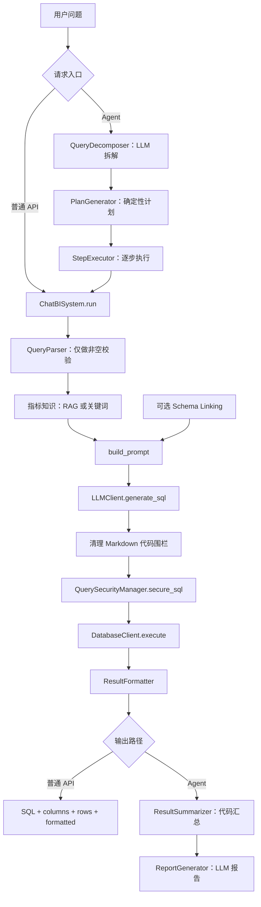

# Day6：SQL 生成实现分析

> 本文完全基于当前仓库源码。今天只新增学习文档，不修改 SQL 生成、Prompt、安全、数据库或 Agent 代码。
>
> 核心结论：当前项目存在一条完整的“自然语言 → Prompt → LLM SQL → 安全拦截 → MySQL 执行 → 结果格式化”基础 Text2SQL 链路，并同时支持同步和 SSE 流式生成。但它还没有数据库错误驱动的 SQL 自动修正闭环，也没有 SQL AST 级语法校验、表字段白名单或强制 LIMIT。

## 一、SQL 生成在整个项目中的位置

### 1. SQL 生成位于哪里？

SQL 生成处于业务问题理解之后、数据库执行之前，是自然语言分析意图与结构化数据库之间的转换层。

在完整 Agent 路径中，顺序是：

```text
用户复杂问题
  → QueryDecomposer 使用 LLM 拆解任务
  → PlanGenerator 用代码生成执行计划
  → StepExecutor 逐个执行子任务
  → 每个子任务进入 Text2SQL
  → 指标知识检索 + 可选 Schema Linking
  → Prompt 构造
  → LLM 生成 SQL
  → SQL 安全处理
  → MySQL 执行
  → 多步结果汇总
  → LLM 生成分析报告
```

但普通 API 路径更短：

```text
用户问题
  → Text2SQL
  → 数据库执行
  → 格式化结果
```

普通 `POST /api/v1/query` **不经过 Planner，也没有 LLM 总结**。它返回 SQL、列名、数据行和格式化表格。只有 `PlanAndExecuteAgent` 才在多步执行结束后调用 `ReportGenerator` 生成 LLM 报告。

### 2. 为什么必须有 SQL 生成？

当前项目的数据事实保存在 MySQL 中，LLM 本身不知道真实订单、收入和费用结果。SQL 生成承担三个转换：

1. 把自然语言指标转换成聚合表达式；
2. 把业务维度转换成字段、过滤条件和 `GROUP BY`；
3. 把多表分析转换成 `JOIN` 与时间条件。

没有 SQL 生成，模型只能依据 Prompt 常识回答，无法查询当前数据库中的真实数据；直接要求业务用户写 SQL，又失去 ChatBI 的自然语言入口价值。

### 3. 整体流程图



需要注意，图中的 Schema Linking 是在 `build_prompt()` 内部按功能开关执行，不是一个独立 LLM 步骤。

## 二、找到 SQL 生成源码

### 1. 核心源码清单

| 文件路径 | 类/对象 | 核心方法 | 输入 | 返回值 | 调用位置 |
|---|---|---|---|---|---|
| `text2sql/main.py` | `ChatBISystem` | `run()` | 用户问题、功能开关、数据源、权限上下文 | 成功或失败字典 | API、Agent `StepExecutor`、CLI |
| `text2sql/main.py` | `ChatBISystem` | `run_stream()` | 同上 | SSE 字符串生成器 | `/api/v1/query/stream` |
| `prompts/builder.py` | Prompt 构造模块 | `build_prompt()` | 问题、Schema/RAG/规则开关 | `(system_msg, prompt)` | `ChatBISystem.run()`、`run_stream()` |
| `text2sql/llm_client.py` | `LLMClient` | `generate_sql()` | System Message、User Prompt | 清理后的 SQL 字符串 | `ChatBISystem.run()` |
| `text2sql/llm_client.py` | `LLMClient` | `generate_sql_stream()` | System Message、User Prompt | SQL 文本增量 Generator | `ChatBISystem.run_stream()` |
| `database/client.py` | `DatabaseClient` | `execute()` | SQL、`UserContext` | `(columns, rows)` | `ChatBISystem.run()`、`run_stream()` |
| `tools/security.py` | `QuerySecurityManager` | `secure_sql()` | 模型 SQL、用户上下文 | 规范化并注入权限后的 SQL | `DatabaseClient.execute()` |
| `text2sql/result_formatter.py` | `ResultFormatter` | `format()` | 列名、结果元组 | 文本表格或“查询结果为空” | `ChatBISystem` |
| `tools/runtime_factory.py` | `AppRuntime` | `build_runtime()` | 应用配置、数据源 ID | Parser/LLM/DB/Formatter/指标组件集合 | `ChatBISystem.__init__()` |

### 2. 真正调用模型生成 SQL 的位置

同步链路：

```python
# text2sql/main.py::ChatBISystem.run
sql = runtime.llm.generate_sql(system_msg, prompt)
```

`LLMClient.generate_sql()` 又调用：

```python
raw_output = self.generate_text(system_msg=system_msg, prompt=prompt)
sql = re.sub(r'```sql|```', '', raw_output).strip()
return sql
```

而 `generate_text()` 使用 OpenAI-compatible Chat Completions：

```python
messages=[
    {"role": "system", "content": system_msg},
    {"role": "user", "content": prompt}
]
```

因此，SQL 不是规则模板直接拼接的，而是 LLM 根据 Prompt 自由生成，再经过轻量文本清理。

### 3. Agent 中的调用位置

`agent/workflow/agent_planner.py::StepExecutor._run_with_chatbi()` 调用：

```python
self.system.run(user_question=question, **self.chatbi_run_options)
```

默认 Agent 单步选项开启：

- `use_schema_linking=True`；
- `use_indicator_rag=True`；
- `use_indicator_knowledge=True`。

所以复杂问题不是生成一条总 SQL，而是每个 `PlanStep` 分别进入同一套 Text2SQL 链路。

## 三、SQL 生成执行流程

下面以“最近三个月收入趋势”为例说明。由于 SQL 是模型生成的，源码只能确定输入上下文和处理流程，不能保证每次生成完全相同的 SQL。本文不会把某条示例 SQL 当作实际固定输出。

### 第 1 步：接收问题

普通 HTTP 请求由 `api/service.py` 的 `/api/v1/query` 路由接收，`QueryRequest.question` 要求至少一个字符。路由解析请求级功能开关和用户权限上下文后调用：

```python
system.run(
    user_question=payload.question,
    source_id=payload.source_id,
    security_context=user_context,
    **query_options,
)
```

Agent 场景中，输入可能已经变成类似“请执行子任务：分析月度收入趋势……”，并可能附带前置步骤的 JSON 结果。

### 第 2 步：问题解析

`text2sql/query_parser.py::QueryParser.parse()` 只执行 `strip()` 并记录是否为空；`validate()` 只读取 `is_valid`。

当前并没有在这里抽取：

- 指标；
- 维度；
- 时间范围；
- 筛选实体；
- 查询意图。

所以它更准确地说是输入清洗与非空校验，而不是完整语义解析器。

### 第 3 步：指标上下文

`ChatBISystem._resolve_indicator_context()` 根据开关选择：

1. 优先使用 `rag/indicator_retriever.py::retrieve_indicator_context()`；
2. RAG 失败或无结果且启用了关键词知识时，回退 `IndicatorKnowledge.get_indicator_context()`；
3. 两者都关闭则不注入指标知识。

返回 `detected_indicators` 和 `indicator_block`。指标块可包含定义、公式、数据来源、依赖、过滤条件或 SQL 参考。

### 第 4 步：Schema Context

`prompts/builder.py::build_prompt()` 默认使用静态 `SCHEMA`。如果 `use_schema_linking=True`，会调用 `schema/schema_linker.py::build_dynamic_prompt_schema()`：

```text
问题
  → 表召回
  → 事实表规则兜底
  → 锚表选择
  → 字段匹配
  → Join 推理
  → 动态 Schema
```

动态结果为空或异常时回退静态全量 Schema。

当前必须警惕：静态 Prompt 和动态 Schema Linking 元数据仍然描述旧销售业务；虽然数据库默认名已经是 `chatbi_park`，Schema 上下文尚未迁移为停车表。

### 第 5 步：构造 Prompt

`build_prompt()` 按顺序拼装：

```text
数据库 Schema
→ 可选业务规则
→ 可选 Few-shot 示例
→ 可选错误防护
→ 可选指标知识
→ 用户问题
→ SQL 输出要求
```

对于“最近三个月收入趋势”，旧业务规则会引导模型使用 `net_amount`、过滤已完成订单、按日期汇率换算人民币，并使用最近 N 个月时间边界。

### 第 6 步：调用 LLM

`LLMClient` 从 `tools/config.py` 读取 OpenAI-compatible API 地址、模型、温度和最大输出 Token。通用配置中温度固定为 `0.1`，模型默认是 `qwen3-max`。

同步模式使用 `generate_sql()`；流式模式使用 `generate_sql_stream()`，逐个返回模型的 delta 文本。

### 第 7 步：清理模型输出

同步模式用正则删除 ```sql 和 ```。流式模式先拼接全部 chunk，再执行相同清理。

这一步只是文本清洗，不是 SQL 语法解析或语义校验。

### 第 8 步：SQL 安全处理

`DatabaseClient.execute()` 在获取连接和执行之前调用：

```python
secured_sql = self.security.secure_sql(sql, user_context)
```

`QuerySecurityManager` 会：

- 去掉首尾空白、代码围栏和末尾分号；
- 禁止剩余分号，降低多语句风险；
- 拒绝危险关键字；
- 只允许以 `SELECT` 或 `WITH` 开头；
- 根据角色尝试注入行级区域过滤条件。

这属于安全校验与 SQL 改写，不是完整 SQL Validation。

### 第 9 步：数据库执行

安全 SQL 通过 PyMySQL Cursor 执行：

```python
cursor.execute(secured_sql)
columns = [desc[0] for desc in cursor.description]
results = cursor.fetchall()
```

执行完成后记录耗时；若达到慢查询阈值，才额外执行 `EXPLAIN {sql}` 收集计划。随后按角色对敏感结果列脱敏。

注意：当前 `EXPLAIN` 是**查询已经执行完成后的慢查询诊断**，不是执行前的成本门禁。

### 第 10 步：返回结果

`ResultFormatter.format()` 将列与元组结果渲染为纯文本表格。`ChatBISystem.run()` 返回：

- `success`；
- 模型原始清理后的 `sql`；
- `columns`；
- `results`；
- `formatted`；
- 模型、功能开关、数据源、权限、行数、数据库耗时和 EXPLAIN 等 metadata。

这里返回的 `sql` 是 LLM 清理后的 SQL；数据库实际执行的可能是安全层追加过区域条件的 `secured_sql`，后者记录在 `DatabaseClient.last_query_info["sql"]`，但成功响应没有单独返回这个字段。

## 四、SQL Prompt

### 1. 源码位置

SQL Prompt 位于 `prompts/builder.py`：

- `SCHEMA`：静态表字段；
- `FEW_SHOT_EXAMPLES`：四个 SQL 示例；
- `RULES`：业务口径；
- `ERROR_GUARDS`：常见错误防护；
- `build_prompt()`：组合 System Message 和 User Prompt。

### 2. 为什么这样写？

项目把不同类型的信息分层：

- Schema 约束合法表字段；
- 规则约束业务口径；
- Few-shot 展示 MySQL 写法；
- Guard 强调历史易错点；
- 指标知识提供公式和来源；
- 最后把当前问题与输出要求放在一起。

这些区块均可通过功能开关控制，便于课程实验和能力灰度。

### 3. 输出要求

源码明确要求：

- 只输出 SQL；
- 不需要解释；
- 使用标准 MySQL；
- 表字段与 Schema 一致；
- 多表查询使用 JOIN；
- SQL 完整闭合；
- 最后再次强调“请直接输出 SQL”。

它**不要求 JSON**。它也没有要求模型输出 Markdown；相反，意图是纯 SQL。考虑到模型仍可能返回 Markdown 代码块，`LLMClient` 会删除围栏。

### 4. 关键业务约束

旧销售业务中最重要的规则包括：

- 默认收入使用 `net_amount`；
- 成本使用 `material_cost + labor_cost`；
- 收入和订单量过滤 `order_status='completed'`；
- 多币种收入按订单日期和币种关联汇率；
- 最近 N 个月使用 `DATE_SUB(CURDATE(), INTERVAL N MONTH)`；
- 销售费用总项与子项不得重复汇总；
- 毛利按既定公式计算。

### 5. Prompt 的边界

Prompt 能指导模型，但不能严格证明：

- SQL 一定语法正确；
- 表字段一定存在；
- Join 不会导致数据放大；
- 聚合粒度一定符合指标定义；
- 查询成本一定可接受。

这些问题仍需要程序校验和数据库执行验证。

## 五、SQL 校验

### 1. 当前已有的 SQL Validation

当前存在一层以安全为主的正则检查，位于 `tools/security.py::QuerySecurityManager`。

| 能力 | 是否存在 | 当前实现 |
|---|---|---|
| 非空检查 | 有 | 空 SQL 抛出 `SecurityError` |
| 只读语句 | 有 | 必须以 `SELECT` 或 `WITH` 开头 |
| 禁止 UPDATE | 有 | 危险关键词正则 |
| 禁止 DELETE | 有 | 危险关键词正则 |
| 禁止 DROP | 有 | 危险关键词正则 |
| 禁止 INSERT/ALTER/CREATE/TRUNCATE 等 | 有 | 危险关键词正则 |
| 禁止多语句 | 有 | 规范化末尾分号后，拒绝剩余分号 |
| 行级权限过滤 | 有限支持 | 销售角色针对 `dim_customers.region` 注入谓词 |
| 结果列脱敏 | 有 | 根据角色和返回列名替换为 `***` |

### 2. 当前不存在的校验

| 能力 | 当前情况 |
|---|---|
| SQL AST 语法解析 | 不存在，依赖 MySQL 执行时报错 |
| 表白名单 | 不存在 |
| 字段白名单 | 不存在 |
| Schema 一致性预检 | 不存在 |
| 强制 LIMIT | 不存在 |
| 最大扫描行数/成本门禁 | 不存在 |
| 执行前 EXPLAIN | 不存在 |
| Join 笛卡尔积检测 | 不存在 |
| 聚合口径校验 | 不存在 |
| 参数化查询 | 模型 SQL 作为完整字符串执行，不是参数化构造 |
| 多租户 Schema 隔离校验 | 没有专门实现 |

### 3. 正则安全检查的边界

当前安全层比“完全没有校验”更可靠，但它不是完整 SQL Parser。复杂 CTE、注释、字符串字面量、嵌套语句和方言边界仅靠正则难以完全准确处理。

行级权限注入也是基于字符串和正则定位 `FROM/JOIN` 与子句边界，面对复杂嵌套查询时需要谨慎评估。迁移停车业务后，现有规则仍指向 `dim_customers.region`，不能自动保护停车场或运营区域数据。

## 六、SQL 执行

### 1. 数据库连接在哪里？

配置位于 `tools/config.py`。默认数据库参数包括：

- MySQL；
- 主机和端口来自环境变量；
- 默认数据库名 `chatbi_park`；
- `utf8mb4`；
- 自动提交；
- 连接、读、写超时；
- 连接池大小和慢查询阈值。

`tools/runtime_factory.py::build_runtime()` 创建 `DatabaseClient`，并将它和 Parser、LLM、Formatter、指标知识模块放进 `AppRuntime`。

### 2. 如何建立连接？

`DatabaseClient` 默认创建轻量 `DatabaseConnectionPool`，底层连接由：

```python
pymysql.connect(**self._connection_kwargs())
```

建立。连接池使用 LIFO 队列复用空闲连接，获取时会 `ping(reconnect=True)`，并支持 `pool_size`、`max_overflow` 和等待超时。

### 3. SQL 如何传入数据库？

```text
LLM SQL
  → QuerySecurityManager.secure_sql()
  → secured_sql
  → conn.cursor()
  → cursor.execute(secured_sql)
  → cursor.fetchall()
```

### 4. 查询结果如何返回？

Cursor 的 `description` 提取列名，`fetchall()` 返回元组列表。安全层先按角色脱敏，然后：

- `ChatBISystem` 返回列、元组、格式化文本；
- API 用 `_rows_to_dicts()` 将元组转换为 JSON 行对象；
- Agent 把结果标准化成 `StepExecutionResult` 并存入内存或 MySQL 临时表。

### 5. 慢查询信息

执行耗时超过阈值时，`DatabaseClient._explain()` 对 `SELECT/WITH` 执行 EXPLAIN，并写入 `last_query_info`：

- `duration_ms`；
- `slow_query`；
- `explain_plan`；
- 实际安全 SQL。

该信息会进入成功响应 metadata，但当前没有自动根据 EXPLAIN 结果拒绝或重写 SQL。

## 七、异常处理

### 1. SQL 生成失败

`ChatBISystem.run()` 捕获 LLM 调用异常并返回：

```text
success=false
error_type="llm"
```

API 将其映射为 HTTP 502。没有模型重试、备用模型或降级 SQL 模板。

### 2. 安全校验失败

空 SQL、多语句、危险关键字或非 `SELECT/WITH` 会抛出 `SecurityError`。主流程返回 `error_type="security"`，API 映射 HTTP 403。

### 3. SQL 语法错误

项目没有执行前 SQL Parser。MySQL 返回 `ProgrammingError` 或错误码 1064 后，`DatabaseClient._translate_db_error()` 转换为：

```text
QueryExecutionError(error_type="sql_syntax")
```

`ChatBISystem` 再返回 `database_sql_syntax`，API 映射 HTTP 422。

### 4. 字段或表不存在

当前没有为 MySQL “unknown column”或“table doesn't exist”单独分类。除非异常类型碰巧进入已有语法判断，否则会落入通用 `execution_error`，最终表现为 `database_execution_error`。它不会触发 Schema 重新召回或 SQL 再生成。

### 5. 权限、超时和连接错误

数据库错误会按错误码转换：

- `permission_denied`；
- `query_timeout`；
- `connection_error`；
- `execution_error`。

API 分别对部分类型映射 503/504 等状态；数据库权限拒绝当前没有专门 HTTP 映射，通常落到默认 500。

### 6. Retry 的真实情况

单次 `ChatBISystem.run()` 没有 Retry。

Agent 的 `StepExecutor` 有 `max_retries` 参数，但 `_execute_with_retry()` 每次仍调用相同 `question`，没有把：

- 上次生成的 SQL；
- 数据库错误码；
- 错误位置；
- Schema 修正信息

反馈给模型。因此它属于“重复执行整步”，不是 SQL Self-Correction。默认 `max_retries=0`，即只尝试一次。

### 7. Agent 失败策略

`StepExecutor` 支持：

- `failure_policy="abort"`：失败后停止，后续步骤标记 skipped；
- `failure_policy="skip"`：记录失败并继续无依赖或可执行步骤；
- 有失败依赖的步骤会跳过。

最终报告会收到失败状态；报告模型异常或 JSON 失败时会回退模板报告。

## 八、SQL 生成质量

### 优点

1. **主链路完整**：问题、上下文、模型、清理、安全、执行和格式化职责清楚。
2. **Prompt 信息丰富**：Schema、规则、Few-shot、错误防护和指标知识共同 Grounding。
3. **支持动态 Schema**：可减少无关表字段，并推导 Join。
4. **指标知识双路径**：RAG 优先、关键词知识兜底。
5. **同步与流式统一**：两条路径使用相同 Prompt，流式只改变输出传输方式。
6. **LLM 客户端独立封装**：便于替换模型或扩展调用逻辑。
7. **具备基础只读安全**：危险 DML/DDL、多语句和非查询语句会被拦截。
8. **有权限与脱敏意识**：支持最小角色上下文、有限行级过滤和结果脱敏。
9. **数据库工程化较完整**：连接池、超时、慢查询记录、EXPLAIN 和错误分类均已出现。
10. **Agent 可复用同一 Text2SQL 内核**：每个计划步骤不需要另写 SQL 生成器。
11. **有执行准确率评估入口**：`text2sql/evaluator.py` 可用真实执行结果评估测试用例，而不只比较 SQL 字符串。

### 不足

1. **业务 Schema 尚未迁移**：数据库名是 `chatbi_park`，但 Prompt、Schema Linking、指标和安全策略仍主要是旧销售业务。
2. **QueryParser 过于简单**：只校验非空，没有结构化指标、维度、时间和实体解析。
3. **SQL 主要靠自由文本生成**：只清理代码围栏，没有 AST 或结构化生成约束。
4. **没有 SQL 修正闭环**：执行错误不会反馈模型。
5. **没有表字段预校验**：幻觉表或字段只能等数据库报错。
6. **没有强制 LIMIT 或成本门禁**：明细查询可能返回过多数据。
7. **EXPLAIN 时机偏后**：慢 SQL 已经执行完才采集计划。
8. **正则安全边界有限**：不能代替成熟 SQL Parser 和数据库只读账号。
9. **安全策略仍是旧业务**：销售角色规则依赖 `dim_customers.region`，迁移后不会自然适配停车表。
10. **生成 SQL 与实际执行 SQL可不一致**：行级过滤后的 SQL没有直接作为响应 SQL 返回，审计展示可能产生理解差异。
11. **错误分类不够细**：未知字段、未知表等没有独立类型。
12. **没有结果语义校验**：SQL 能执行不代表指标正确，当前没有检查粒度、重复 Join、空结果异常或数值合理性。
13. **无查询缓存和 SQL 去重**：相同问题会重复调用模型和数据库。
14. **无模型 fallback**：生成失败直接返回错误。
15. **没有自我反思或多模型审核**：不能宣称存在 Self-Reflection 或 Reviewer Agent。

## 九、迁移到智慧停车

### 1. 可以复用的模块

- `ChatBISystem.run()` / `run_stream()` 的总体编排；
- `LLMClient` 的同步与流式模型调用；
- `build_prompt()` 的分层拼装形式；
- Schema Linking 的表、字段、Join Pipeline 框架；
- 指标 RAG 的检索与上下文注入框架；
- `DatabaseClient`、连接池、错误转换和结果格式化；
- `QuerySecurityManager` 的只读拦截框架；
- Agent 按步骤调用 Text2SQL 的机制；
- Execution Accuracy 评估思路。

### 2. 必须修改的业务内容

#### Schema

- 静态 `prompts/builder.py::SCHEMA`；
- `schema/table_retriever.py::TABLE_METADATA`；
- `schema/field_matcher.py::FIELD_METADATA`；
- `schema/join_resolver.py::TABLE_RELATIONSHIPS`、表类型和关键词；
- 重建表级和字段级 Chroma 索引。

#### 指标与维度

- 停车收入；
- 有效订单量；
- 平均停车时长；
- 车位利用率；
- 收入/订单环比或同比；
- 停车场、区域、日期、车位类型、支付方式等维度。

#### 业务规则

- 哪些订单状态计入收入和订单量；
- 实收、应收、优惠、退款如何计算；
- 跨日停车时长如何计算；
- 利用率的分子、分母和时间粒度；
- 空值、零车位和除零处理；
- 日聚合表与订单事实表的优先级；
- 收入下降归因需要哪些可验证驱动项。

#### Prompt 与 Few-shot

把旧销售订单、产品、汇率示例替换为：

- 最近三个月停车收入趋势；
- 停车场收入排名；
- 利用率最低停车场；
- 平均停车时长；
- 订单量变化；
- 收入下降的多步骤诊断。

#### 安全

- 将旧 `dim_customers.region` 行级过滤迁移到停车场/运营区域字段；
- 重新定义车牌号、手机号等敏感列；
- 配置真实数据库只读账号；
- 明确不同运营角色能访问哪些停车场。

### 3. 不能只改数据库名

`tools/config.py` 已默认连接 `chatbi_park`，但这只改变连接目标。LLM 仍依据旧 Schema 生成 `sales_orders` 等 SQL，所以还必须同步 Prompt、Schema Linking、指标知识、规则、测试和安全策略。

### 4. 迁移后的验证重点

- 每个自然语言问题是否召回正确停车表；
- 指标 SQL 是否符合口径；
- Join 后是否产生订单重复；
- 聚合表和明细表的结果是否一致；
- 时间边界是否正确；
- 权限过滤是否覆盖所有查询路径；
- 失败 SQL 能否分类并修正。

## 十、源码阅读建议

推荐沿执行链阅读：

1. **`text2sql/main.py::ChatBISystem.run()`**：先掌握统一入口和八类输入输出。
2. **`text2sql/query_parser.py`**：确认所谓“解析”当前只做非空校验。
3. **`prompts/builder.py`**：理解 SQL 的 Schema、规则、Few-shot、指标和输出约束。
4. **`rag/indicator_knowledge.py`、`rag/indicator_retriever.py`**：理解指标上下文来源。
5. **`schema/schema_linker.py`**：理解动态 Schema 如何进入 Prompt。
6. **`text2sql/llm_client.py`**：确认真实模型调用、temperature、max_tokens、同步/流式和清理逻辑。
7. **`tools/security.py`**：逐条验证允许、拒绝、改写和脱敏逻辑。
8. **`database/client.py`**：跟踪连接池、`cursor.execute()`、错误转换和 EXPLAIN。
9. **`text2sql/result_formatter.py`**：查看查询结果如何转为展示文本。
10. **`api/service.py`**：查看业务错误如何映射成 HTTP 状态。
11. **`agent/workflow/agent_planner.py::StepExecutor`**：理解 Agent 如何复用 Text2SQL、怎样处理依赖和重试。
12. **测试文件**：重点读 `tests/test_security.py`、`tests/test_database_runtime.py`、`tests/test_prompt_and_config.py` 和 `text2sql/evaluator.py`。

阅读时建议拿一条问题，在纸上记录每一步的数据类型：字符串问题、Prompt 字符串、SQL 字符串、列列表、元组列表、字典响应。这样能快速建立真实调用链。

## 十一、企业级优化

以下是基于当前缺口的演进建议，不代表项目已经实现。

### 1. SQL Retry 与 Self-Correction

当前只会重复相同步骤。可设计：

```text
SQL 执行失败
  → 分类错误
  → 收集原 SQL + 数据库错误 + 相关 Schema
  → SQL 修正 Prompt
  → 重新做安全/语法/成本校验
  → 限次执行
```

只对可修复错误重试，例如未知字段、语法、聚合错误；权限拒绝和危险 SQL 不应交给模型绕过。

### 2. SQL AST 校验

在安全正则之前或之后增加 MySQL 方言解析，检查：

- 仅允许单条查询；
- 表字段白名单；
- 禁止危险函数；
- Join 条件是否存在；
- 明细查询是否有 LIMIT；
- 聚合与 GROUP BY 是否一致。

### 3. 执行前 EXPLAIN

对高风险或大表查询先 EXPLAIN，根据扫描行数、全表扫描和成本阈值决定：

- 允许执行；
- 自动加限制；
- 请求模型重写；
- 要求用户缩小范围。

当前慢查询 EXPLAIN 是执行后观察，不能阻止昂贵查询。

### 4. Query Rewrite

在 Text2SQL 前把问题规范化成结构化语义：指标、维度、时间、过滤、排序、Top-N。这样 Schema Linking、Prompt 和结果校验可共享同一语义对象。

### 5. 指标编译而非自由生成

对收入、利用率等核心指标，把公式、状态过滤和粒度定义为可执行语义层。LLM 只选择指标与维度，代码编译关键 SQL 片段，降低口径漂移。

### 6. 多模型协作

可采用生成模型 + 审核模型，但只应在高价值复杂查询启用。审核输入应包括用户问题、结构化意图、Schema、候选 SQL 和校验结果，避免简单重复调用增加成本却没有新证据。

### 7. SQL 缓存

可以缓存“规范化问题 + Schema 版本 + 指标版本 + 权限范围 → SQL 模板”。结果缓存还需加入数据更新时间与用户权限，不能跨权限复用敏感结果。

### 8. Schema 和 Prompt 版本治理

把物理 Schema、检索元数据、指标定义、Few-shot 和安全策略绑定版本。数据库变更时自动重建索引并跑回归集，防止旧 Prompt 生成不存在的表字段。

### 9. 结果校验

在“SQL 执行成功”之后增加：

- 空结果是否符合预期；
- 数值范围；
- 分母为零；
- Join 前后行数变化；
- 聚合表与明细重算抽样对账；
- 单位、币种和时间粒度一致性。

### 10. 评估与可观测性

除 Execution Accuracy 外，记录：

- Schema Recall@K；
- 字段与 Join 准确率；
- SQL 首次成功率；
- 修正成功率；
- 指标口径正确率；
- 延迟、Token、扫描行数；
- 安全拦截和空结果比例。

## 十二、面试总结

如果面试官问“请介绍一下你们项目中的 Text2SQL 实现”，可以这样回答：

> 我们项目的 Text2SQL 核心入口是 `text2sql/main.py` 中的 `ChatBISystem`，它既支持普通同步调用，也支持 SSE 流式输出。完整链路是输入校验、指标知识检索、Prompt 构造、LLM 生成 SQL、安全处理、MySQL 执行和结果格式化。
>
> 首先，`QueryParser` 会做基础的去空格和非空校验。它目前还不是完整的语义解析器，没有结构化抽取指标、维度和时间。之后系统根据功能开关获取指标上下文，优先走指标 RAG，如果 RAG 没有结果并启用了关键词知识，就回退到本地指标配置。指标上下文主要告诉模型业务定义、计算公式、数据来源和过滤条件。
>
> Prompt 由 `prompts/builder.py` 统一构造。它包含数据库 Schema、业务规则、四个 Few-shot、错误防护、指标知识、用户问题和输出要求。Schema 默认使用静态全量结构，开启 Schema Linking 后，会按问题召回相关表字段并推导 Join，动态结果失败则回退静态 Schema。Prompt 明确要求模型只输出完整 MySQL，不要解释，也不要求 JSON。
>
> 真正的模型调用封装在 `text2sql/llm_client.py`。同步模式通过 System 和 User Message 调用 OpenAI-compatible Chat Completions，返回后清除 Markdown SQL 代码围栏；流式模式逐 chunk 推送，最后拼接清理。这里要说明，清理只是字符串处理，不等于 SQL 语法校验。
>
> SQL 执行前会进入 `tools/security.py` 的 `QuerySecurityManager`。它只允许以 SELECT 或 WITH 开头的单条查询，禁止 INSERT、UPDATE、DELETE、DROP 等危险关键字，并针对角色注入有限的行级过滤。之后 `database/client.py` 使用 PyMySQL 和轻量连接池执行安全 SQL，读取列和结果，对敏感字段脱敏，并记录耗时。超过慢查询阈值时会在执行后采集 EXPLAIN 计划。数据库错误会被分类为语法、权限、超时、连接或通用执行错误，再由 API 映射成响应状态。
>
> 在 Agent 模式中，复杂问题先由 QueryDecomposer 拆成任务，PlanGenerator 用代码生成步骤，StepExecutor 再把每个子任务交给同一个 Text2SQL 内核。因此它不是一次生成一条覆盖全部分析的大 SQL，而是多步生成、执行和保存中间结果，最后由报告模型总结。普通 API 则不经过 Planner，也没有 LLM 总结，只返回查询结果。
>
> 当前实现的优势是模块边界清晰、Prompt 上下文比较完整、支持动态 Schema 和指标 RAG，并有基础只读安全、权限、连接池、错误分类和慢查询观测。真实不足是还没有 AST 级表字段校验、强制 LIMIT、执行前成本门禁和数据库错误驱动的 SQL 修正。Agent 虽有重试参数，但默认不重试，而且重试时没有把错误反馈给模型，所以不能称为 Self-Correction。另外项目数据库名已是 `chatbi_park`，但 Prompt、Schema Linking、指标和安全规则仍是旧销售业务，后续停车迁移必须整体同步，而不是只改连接配置。

这段回答体现了四个面试重点：真实调用链、Prompt 与 Schema/指标关系、安全执行边界，以及当前项目没有实现的能力。

## 十三、今日学习总结

### 1. 今天应真正掌握

1. Text2SQL 不只是一次 LLM 调用，而是一条包含上下文、生成、安全、执行和返回的工程链路。
2. 普通 API 与 Agent 路径不同：前者直接 Text2SQL，后者逐个计划步骤复用 Text2SQL。
3. QueryParser 当前只做非空校验，不应夸大为语义解析。
4. Schema 解决“查哪里”，指标知识解决“怎么算”，Prompt 把二者与用户问题组合。
5. 模型输出清理、SQL 安全校验、语法校验是三个不同概念。
6. 当前安全层能拦截常见写操作和多语句，但没有 AST、表字段白名单和强制 LIMIT。
7. SQL 语法主要由数据库验证，错误会分类返回，但不会自动修正。
8. Agent 的重复执行不等于 Self-Correction，因为没有错误反馈和改写 Prompt。
9. EXPLAIN 当前用于执行后的慢查询观测，不是执行前门禁。
10. 数据库连接已经指向 `chatbi_park`，业务元数据和 Prompt 尚未完成停车迁移。

### 2. 最值得深入阅读的源码

- `text2sql/main.py::ChatBISystem.run()`；
- `prompts/builder.py::build_prompt()`；
- `text2sql/llm_client.py::generate_sql()`；
- `tools/security.py::QuerySecurityManager.secure_sql()`；
- `database/client.py::DatabaseClient.execute()`；
- `agent/workflow/agent_planner.py::StepExecutor`；
- `text2sql/evaluator.py`。

### 3. 最容易成为面试考点

- Text2SQL 的端到端调用链；
- Schema Linking 与指标 RAG如何共同影响 Prompt；
- 只读 SQL 安全如何实现及其正则边界；
- SQL 执行错误如何分类；
- Retry 与 Self-Correction 的区别；
- 为什么执行成功不等于业务口径正确；
- 如何做执行前 EXPLAIN 和成本控制；
- 如何评估 Text2SQL，而不是只比较 SQL 字符串；
- 多步 Agent 为什么复用同一个 Text2SQL 内核；
- 迁移新业务为什么不能只替换数据库名。

# 我的思考题

1. 当前项目中，`LLMClient.generate_sql()` 删除 Markdown 代码围栏，`QuerySecurityManager.secure_sql()` 检查只读语句，MySQL 执行时检查语法。这三层分别解决什么问题？为什么不能互相替代？

2. 为什么当前 `StepExecutor(max_retries=1)` 仍不能称为 SQL Self-Correction？请结合 `_execute_with_retry()` 的真实参数传递说明。

3. 用户问“最近三个月收入趋势”时，Schema Linking 和指标知识分别向 Text2SQL Prompt 提供什么信息？如果两者结论冲突，当前代码有没有明确的冲突仲裁机制？

4. 当前安全层能够禁止 DELETE 和 DROP，但为什么仍不能直接认为 SQL 执行已经达到企业级安全？请从 SQL Parser、表字段权限、行级权限、LIMIT 和数据库账号五个角度回答。

5. 数据库已经连接 `chatbi_park`，但模型仍可能生成 `sales_orders`。请沿源码列出造成这个问题的上下文来源，并说明你会如何验证停车迁移后的 Text2SQL 是否真正完成。

> 请先独立回答。后续点评会以当前项目源码、真实参数传递和异常处理分支为依据，不以通用 Text2SQL 理论代替代码证据。
