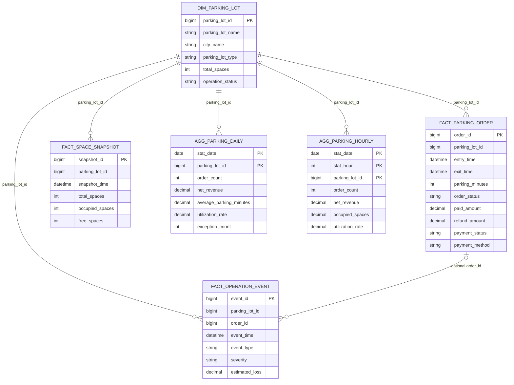

# Day7：智慧停车数据库设计

> 今日目标是为 AI ChatBI + Agent + Text2SQL 设计最小可行的分析数据模型，不是设计完整停车交易系统。
>
> 本文不创建数据库、不生成 DDL、不修改现有 Schema 或业务代码。设计以当前 `database/01_schema.sql` 中已经存在的六张停车表为现实基线，对其业务边界、分析能力和后续 AI 改造方式进行系统说明。

## 设计结论先行

智慧停车运营分析 MVP 保留六张表：

```text
1 张维度表
  dim_parking_lot          停车场维度

3 张明细事实表
  fact_parking_order       停车订单事实
  fact_space_snapshot      车位状态快照事实
  fact_operation_event     运营异常事件事实

2 张聚合事实表
  agg_parking_daily        停车场日经营汇总
  agg_parking_hourly       停车场小时经营汇总
```

该模型刻意不单独建设车辆、车主、泊位、支付流水、收费规则、设备、优惠券、会员和运营商等完整交易系统表。MVP 优先覆盖运营人员最常问的收入、订单、时长、利用率、高峰、支付和异常问题，并让 Schema Linking 容易召回、Text2SQL 容易生成、Agent 容易拆解。

## 一、业务目标分析

### 1. 智慧停车运营分析平台解决什么问题？

#### 停车场运营总览

运营人员需要快速知道各停车场是否正常经营，包括收入、订单、利用率、异常数量和运营状态。它解决“今天整体怎么样”的问题，是日常经营晨会和运营看板的基础。

#### 收入分析

回答总收入、收入趋势、停车场贡献、实收与应收差异、优惠和退款影响。收入是运营结果指标，可以帮助发现增长、下滑及现金回收问题。

#### 停车订单分析

分析完成订单、在场订单、异常订单和不同订单类型变化。订单量反映车流需求，也是解释收入变化的重要驱动因素。

#### 泊位利用率分析

分析平均占用车位、利用率、空闲率和低效停车场。它用于判断车位供给是否不足或闲置，为价格调整、引流和资源配置提供依据。

#### 停车高峰分析

识别一天中的高峰小时和拥堵时段。运营人员可以据此安排现场人员、设备巡检、入口引导和动态运营措施。

#### 停车时长分析

分析平均停车时长和不同时段、停车场、订单类型的时长差异。停车时长同时影响周转效率、收费收入和车位供给。

#### 支付分析

分析支付成功、未支付、退款以及微信、支付宝、现金等方式分布。它用于定位支付通道故障、退款异常和渠道依赖。

#### 停车场排行

按收入、订单量、利用率、平均费用或异常数量排名。排行帮助运营团队快速把注意力集中到高贡献或低绩效停车场。

#### 异常运营分析

分析设备离线、支付失败、车牌识别失败、人工抬杆和免费放行等现象。异常事件可以与收入、订单和利用率变化联合分析，帮助回答“为什么下降”。

### 2. 对运营人员的实际帮助

这套 ChatBI 的价值不是替代业务系统办理进出场，而是缩短“提出问题 → 找数据 → 写 SQL → 解释结果”的时间：

- 日常监控：自然语言查询今日经营情况；
- 问题定位：从总趋势逐步下钻到停车场、小时、订单和异常；
- 资源配置：根据利用率和高峰安排人员、车位和设备；
- 收入提升：识别低利用、免费放行、退款和支付失败损失；
- 管理复盘：自动生成有数据依据的经营报告；
- 决策验证：调整运营策略后持续跟踪指标变化。

### 3. Agent 为什么需要这样的数据库？

当前 Agent 是 Plan-and-Execute：它会把“为什么收入下降”拆成趋势、订单、利用率、停车场贡献和异常等子任务。数据库必须让每个子任务都能对应一条相对简单、结果可复用的查询。

因此模型设计优先满足：

```text
一个子任务
  → 一个清晰事实粒度
  → 少量明确 Join
  → 一个可解释指标结果
  → 后续步骤继续引用
```

## 二、用户最常问的 50 个自然语言问题

以下问题反推了六张表和核心字段。它们也可以作为后续 Schema Linking、Prompt Few-shot 和 Text2SQL 回归测试的候选语料。

### A. 经营总览（1～5）

1. 今天所有停车场的经营情况怎么样？
2. 昨天总收入、订单量和利用率分别是多少？
3. 本月各停车场的核心运营指标是多少？
4. 最近七天整体经营趋势怎么样？
5. 哪些停车场目前不是正常运营状态？

### B. 收入分析（6～13）

6. 今天停车净收入是多少？
7. 最近七天停车收入趋势怎么样？
8. 最近三个月每月收入变化情况如何？
9. 本月收入比上月增长了多少？
10. 哪个停车场收入最高？
11. 哪些停车场收入连续下降？
12. 应收金额和实收金额相差多少？
13. 优惠和退款分别减少了多少收入？

### C. 订单与车流分析（14～21）

14. 今天完成了多少笔停车订单？
15. 最近一个月订单量趋势怎么样？
16. 哪个停车场订单量最高？
17. 哪个停车场订单下降最明显？
18. 临停、月租和访客订单分别有多少？
19. 今天有多少车辆入场？
20. 今天有多少车辆出场？
21. 当前有多少未完成的在场订单？

### D. 车位利用率与空闲率（22～29）

22. 今天平均车位利用率是多少？
23. 哪个停车场利用率最高？
24. 哪个停车场利用率最低？
25. 最近三个月利用率趋势如何？
26. 哪些停车场长期低于 40% 利用率？
27. 当前各停车场还有多少空闲车位？
28. 某停车场今天平均占用了多少车位？
29. 收入下降的停车场利用率是否也在下降？

### E. 高峰与时段分析（30～35）

30. 今天停车高峰发生在几点？
31. 哪个小时的车位利用率最高？
32. 各停车场的高峰时段是否相同？
33. 最近七天每天的高峰小时是什么时候？
34. 上午和下午的订单量差异有多大？
35. 哪些小时收入高但利用率不高？

### F. 停车时长与收费效率（36～40）

36. 今天平均停车时长是多少？
37. 哪个停车场平均停车时间最长？
38. 不同订单类型的平均停车时长是多少？
39. 最近三个月平均停车时长如何变化？
40. 各停车场平均每单停车收入是多少？

### G. 支付、优惠与退款（41～45）

41. 今天支付成功率是多少？
42. 未支付订单主要集中在哪些停车场？
43. 微信、支付宝和现金分别贡献了多少收入？
44. 哪种支付方式的订单最多？
45. 最近一个月退款金额和退款订单数是多少？

### H. 异常与原因分析（46～50）

46. 今天发生了多少起运营异常？
47. 哪个停车场异常事件最多？
48. 支付失败和设备离线分别造成多少预估损失？
49. 人工抬杆和免费放行次数是否异常上升？
50. 为什么科技园停车场最近三个月收入下降？

### 这些问题如何支撑 Agent 拆解？

问题 50 可以拆成：

```text
任务 1：确认科技园停车场收入趋势和下降幅度
任务 2：检查订单量变化
任务 3：检查平均停车时长和平均每单收入
任务 4：检查利用率变化
任务 5：检查优惠、退款、人工抬杆和免费放行
任务 6：检查支付失败、设备离线等异常并汇总结论
```

六张表恰好分别提供这些任务需要的日汇总、订单明细、车位快照和异常事件数据。

## 三、业务对象分析

### 1. 停车场

停车场是全部分析的核心组织对象，负责承载名称、城市、类型、总车位数和运营状态。

为什么需要：用户通常按停车场查询、比较和排名；所有事实数据都通过 `parking_lot_id` 归属到停车场。

### 2. 停车订单

停车订单表示一次停车业务过程，包含入场、出场、时长、订单状态、应收、优惠、实收、退款和支付信息。

为什么需要：收入、订单量、停车时长、支付方式、人工抬杆和免费放行都可从订单事实中计算或下钻验证。

### 3. 车位状态快照

快照表示某停车场在某个时间点的总车位、已占用车位和空闲车位。

为什么需要：仅凭订单不能稳定还原任意时刻占用情况，尤其存在在场订单、设备状态差异和跨日停车时。快照能直接支持利用率和空闲车位分析。

### 4. 运营异常事件

异常事件记录支付失败、设备离线、车牌识别失败、人工抬杆等运营问题，以及严重程度、处理状态和预估损失。

为什么需要：趋势表只能告诉我们“下降了”，异常事件才能为原因诊断提供一个可验证的驱动因素来源。

### 5. 日经营统计

日统计是停车场每日的收入、订单、时长、利用率和异常等核心指标快照。

为什么需要：大多数经营问题以天、周、月为范围。日汇总能让 Text2SQL 用简单聚合完成趋势、同比、环比和排名，避免每次扫描明细并重复复杂口径。

### 6. 小时经营统计

小时统计记录每个停车场、每一天、每个小时的订单、收入、平均占用、利用率和异常。

为什么需要：高峰分析是停车运营的高频场景，小时表可以直接回答“几点最忙”，不必让 LLM 在多个时间字段和快照粒度间临时推导。

### 7. 被识别但不单独建表的业务对象

以下对象在完整停车系统中合理，但不进入本次 ChatBI MVP：

| 对象 | MVP 处理方式 | 暂不建表原因 |
|---|---|---|
| 车辆/车主 | 不保存；订单只分析次数和类型 | 当前问题不需要车主画像，且车牌、手机号带来隐私治理成本 |
| 物理泊位 | 只保留停车场总车位与快照数量 | MVP 分析停车场级利用率，不做单泊位调度 |
| 支付流水 | 支付状态、方式和金额并入订单 | 暂不处理分账、多次支付、渠道对账等复杂交易过程 |
| 收费规则 | 暂不建；保留订单实际金额结果 | 当前目标是经营结果分析，不做费用试算与计费引擎 |
| 设备 | 设备故障以异常事件记录 | 不做设备资产、型号、寿命和工单管理 |
| 优惠券/活动 | 只保留订单优惠金额 | 暂不分析具体活动归因，避免增加营销模型 |
| 会员/月卡 | 通过 `order_type` 粗粒度区分 | 暂不做会员生命周期与月卡权益管理 |
| 运营商 | 停车场保留 `operator_id` | 当前只有简单归属，不需要独立运营商属性分析 |

这不是认为这些对象不重要，而是它们暂未进入 50 个核心问题所要求的最小分析闭环。

## 四、数据库设计（重点）

### 1. 总体设计原则

本设计采用“维度 + 明细事实 + 聚合事实”：

```text
维度回答：谁、哪里、什么类型
明细事实回答：具体发生了什么
聚合事实回答：经营趋势和排行是多少
```

六张表不使用物理外键约束，与当前 DDL 保持一致。逻辑关系通过 `parking_lot_id`、可选 `order_id`、元数据和数据质量规则维护。

### 2. `dim_parking_lot`：停车场维度表

**用途**：保存停车场相对稳定的描述属性，是所有停车场分析的公共维度。

**主键**：`parking_lot_id`。

**核心字段**：

| 字段 | 中文含义 | ChatBI 用途 |
|---|---|---|
| `parking_lot_id` | 停车场 ID | 连接所有事实表 |
| `parking_lot_name` | 停车场名称 | 支持用户用名称查询和结果展示 |
| `operator_id` | 运营商 ID | 为未来多运营商过滤保留最小能力 |
| `city_name` | 城市 | 城市维度比较 |
| `parking_lot_type` | 停车场类型 | 商业、园区、医院等类型分析 |
| `total_spaces` | 总车位数 | 停车场基础容量；长期静态参考 |
| `operation_status` | 运营状态 | 排除停运/维护场站或查询异常状态 |
| `updated_at` | 更新时间 | 判断维度数据新鲜度 |

**关系**：一座停车场对应多条订单、多条车位快照、多条异常事件、多条日汇总和多条小时汇总。

**为什么保留**：如果把名称、城市、类型重复存入每张事实表，会产生重复、更新不一致和更长 Schema。独立维度表能让 Text2SQL 使用统一 Join。

### 3. `fact_parking_order`：停车订单事实表

**粒度**：一行表示一笔停车订单。

**用途**：提供收入、订单、停车时长、支付、优惠、退款和放行行为的明细事实。

**主键**：`order_id`。

**核心字段**：

| 字段 | 中文含义 | ChatBI 用途 |
|---|---|---|
| `order_id` | 停车订单 ID | 明细唯一标识、异常事件可选关联 |
| `parking_lot_id` | 停车场 ID | 按停车场统计与 Join |
| `order_type` | 订单类型 | 临停、月租、访客分析 |
| `entry_time` | 入场时间 | 入场车流与入场时段分析 |
| `exit_time` | 出场时间 | 完成订单和收入时间归属 |
| `parking_minutes` | 停车分钟数 | 平均停车时长 |
| `order_status` | 订单状态 | 区分在场、完成、取消、异常 |
| `receivable_amount` | 应收金额 | 收费前应收口径 |
| `discount_amount` | 优惠减免金额 | 优惠影响分析 |
| `paid_amount` | 实收金额 | 实际收款基础 |
| `refund_amount` | 退款金额 | 净收入扣减与退款分析 |
| `payment_status` | 支付状态 | 支付成功率、未支付和退款分析 |
| `payment_method` | 支付方式 | 微信、支付宝、现金渠道分析 |
| `manual_open_flag` | 人工抬杆标识 | 非标准放行分析 |
| `free_release_flag` | 免费放行标识 | 免费放行与潜在收入影响 |
| `updated_at` | 更新时间 | 增量同步和数据新鲜度 |

**关系**：多笔订单属于一个停车场；一笔订单可以被零条或多条异常事件引用。

**为什么保留**：聚合表适合趋势，但无法解释退款、优惠、订单类型和单笔异常。Agent 原因诊断需要从汇总结果下钻到订单事实。

### 4. `fact_space_snapshot`：车位状态快照事实表

**粒度**：一行表示某停车场某个快照时刻的车位状态。

**用途**：分析实时或历史占用、空闲和利用率。

**主键**：`snapshot_id`；业务唯一性为停车场加快照时间。

**核心字段**：

| 字段 | 中文含义 | ChatBI 用途 |
|---|---|---|
| `snapshot_id` | 快照 ID | 唯一标识 |
| `parking_lot_id` | 停车场 ID | 停车场归属 |
| `snapshot_time` | 快照时间 | 时间点、小时、日聚合 |
| `total_spaces` | 可运营车位数 | 利用率分母，支持容量临时变化 |
| `occupied_spaces` | 已占用车位数 | 利用率分子 |
| `free_spaces` | 空闲车位数 | 空闲量与供给分析 |

**关系**：多条快照属于一个停车场。

**为什么保留**：`dim_parking_lot.total_spaces` 表示基础容量，而快照中的 `total_spaces` 表示某时刻可运营容量。维护封闭、临时占用等情况会让两者不同。利用率应优先使用同时点快照的可运营车位数。

### 5. `fact_operation_event`：运营异常事件事实表

**粒度**：一行表示一次运营异常或人工操作事件。

**用途**：支持异常统计、损失估算、处理状态和收入下降归因。

**主键**：`event_id`。

**核心字段**：

| 字段 | 中文含义 | ChatBI 用途 |
|---|---|---|
| `event_id` | 事件 ID | 唯一标识 |
| `parking_lot_id` | 停车场 ID | 按停车场定位异常 |
| `order_id` | 关联订单 ID | 可选下钻到具体订单 |
| `event_time` | 事件时间 | 趋势和时段分析 |
| `event_type` | 事件类型 | 支付失败、设备离线等分类 |
| `severity` | 严重程度 | 高风险事件筛选 |
| `event_status` | 处理状态 | 待处理、处理中、已解决 |
| `estimated_loss` | 预估收入损失 | 异常影响估算，不能等同实际收入损失 |
| `description` | 事件说明 | 报告展示和人工核查 |

**关系**：多条事件属于一个停车场；`order_id` 可为空，因为设备离线等场级事件不一定对应订单。

**为什么保留**：只分析订单和利用率，Agent 很难回答“为什么下降”。异常事件提供候选原因证据，但最终报告必须使用“相关、可能影响”等谨慎表达，不能仅凭同时间出现就证明因果。

### 6. `agg_parking_daily`：停车场日经营汇总表

**粒度**：一行表示某停车场某自然日的经营结果。

**逻辑主键**：`stat_date + parking_lot_id`。

**用途**：快速支持日、周、月趋势、停车场排行和多指标归因。

**核心字段**：

| 字段 | 中文含义 | ChatBI 用途 |
|---|---|---|
| `stat_date` | 统计日期 | 日、周、月时间聚合 |
| `parking_lot_id` | 停车场 ID | 停车场维度 |
| `order_count` | 完成订单量 | 订单趋势与收入驱动分析 |
| `net_revenue` | 停车净收入 | 核心经营结果 |
| `average_parking_minutes` | 平均停车时长 | 周转和用户停车行为 |
| `average_occupied_spaces` | 平均占用车位数 | 供需水平 |
| `utilization_rate` | 车位利用率 | 资源使用效率 |
| `manual_open_count` | 人工抬杆次数 | 非标准放行监控 |
| `free_release_count` | 免费放行次数 | 免费策略或异常放行监控 |
| `exception_count` | 异常事件数 | 运营稳定性 |
| `updated_at` | 更新时间 | 汇总任务新鲜度和重算标识 |

**关系**：多条日汇总属于一个停车场；其指标逻辑来源于订单、快照和事件事实。

**为什么保留**：这是 ChatBI 高频趋势的首选表，能够减少 SQL 复杂度和扫描量。它是派生事实，不应成为指标定义的唯一来源，必要时可以回到明细表核对。

### 7. `agg_parking_hourly`：停车场小时经营汇总表

**粒度**：一行表示某停车场某自然日某小时的经营结果。

**逻辑主键**：`stat_date + stat_hour + parking_lot_id`。

**用途**：支持高峰、小时利用率、小时订单、小时收入和异常时段分析。

**核心字段**：

| 字段 | 中文含义 | ChatBI 用途 |
|---|---|---|
| `stat_date` | 统计日期 | 日期过滤 |
| `stat_hour` | 小时，0～23 | 高峰时段维度 |
| `parking_lot_id` | 停车场 ID | 停车场维度 |
| `order_count` | 小时完成订单量 | 时段车流代理指标 |
| `net_revenue` | 小时停车净收入 | 小时收入贡献 |
| `occupied_spaces` | 小时平均占用车位数 | 高峰占用水平 |
| `utilization_rate` | 小时车位利用率 | 高峰识别 |
| `exception_count` | 小时异常数量 | 异常时段对比 |
| `updated_at` | 更新时间 | 汇总新鲜度 |

**关系**：多条小时汇总属于一个停车场；其指标来源于三张明细事实表。

**为什么保留**：如果只保留日表，无法回答“几点最忙”。如果每次从不规则快照和订单动态计算，Text2SQL 的时间归属和平均口径更容易出错。

### 8. 为什么保留这六张表？

它们分别覆盖四种分析需求：

```text
停车场描述        → dim_parking_lot
经营结果与下钻    → fact_parking_order
资源使用效率      → fact_space_snapshot
异常原因证据      → fact_operation_event
日周月趋势与排行  → agg_parking_daily
小时高峰          → agg_parking_hourly
```

同时满足当前 Agent 的多步分析：先查日表定位趋势，再查订单、快照和事件验证驱动，最后汇总报告。

### 9. 为什么没有设计更多表？

MVP 的判断标准不是“业务上是否存在”，而是“50 个核心问题是否必须依赖它”。

- 车辆表会引入个人数据，但当前不做用户画像；
- 泊位表会扩大数据量，但当前只分析停车场级利用率；
- 支付流水表适合财务对账，但当前只分析订单支付结果；
- 收费规则表适合计费解释，但当前不重新计算应收；
- 设备表适合资产运维，但当前异常事件已经覆盖基本故障分析；
- 日期维度表适合复杂节假日和财务周期，MVP 可先使用 MySQL 日期函数；
- 独立运营商维表在单运营主体 Demo 中收益有限。

减少表数量不仅降低开发量，也降低 Schema Linking 的候选空间、Join 路径复杂度和 Text2SQL 幻觉风险。

## 五、ER 图

当前 DDL 不创建物理外键，下面表示的是逻辑关系。



### Join 设计原则

- 所有事实表通过 `parking_lot_id` 连接停车场维度；
- 异常事件只有在 `order_id` 非空时才与订单连接；
- 三张明细事实表之间不要直接按停车场进行明细对明细 Join，否则容易出现多对多行数膨胀；
- 原因分析应先各自聚合到相同的“日期 + 停车场”粒度，再比较，或者优先使用已经同粒度的日汇总表；
- 日表和小时表是同源的不同粒度事实，一般不直接互相 Join。

这些规则对 Text2SQL 很重要，因为“能连上”不等于“连接后指标正确”。

## 六、事实表与维度表

### 1. Dimension Table

| 表 | 类型 | 原因 |
|---|---|---|
| `dim_parking_lot` | 维度表 | 一行一个停车场，保存名称、城市、类型、容量和状态等描述属性 |

当前只保留一个维度表，是因为停车场是所有 50 个问题最稳定、最高频的公共分析维度。

### 2. Detail Fact Table

| 表 | 粒度 | 度量/事件 |
|---|---|---|
| `fact_parking_order` | 一笔停车订单 | 金额、时长、状态、支付和放行行为 |
| `fact_space_snapshot` | 一场一时点快照 | 总车位、占用车位、空闲车位 |
| `fact_operation_event` | 一次运营事件 | 事件类型、严重度、处理状态、预估损失 |

事实表描述“发生了什么”，时间字段和外部维度键清晰，可以被聚合。

### 3. Aggregate Fact Table

| 表 | 粒度 | 作用 |
|---|---|---|
| `agg_parking_daily` | 停车场 × 自然日 | 日周月趋势、排行和多指标归因 |
| `agg_parking_hourly` | 停车场 × 日期 × 小时 | 高峰、时段收入和时段利用率 |

聚合表仍然是事实表，不是维度表。它们保存可加、半可加或不可加指标，需要明确汇总方式。

### 4. 指标的可加性

- `order_count`、`net_revenue`、异常次数可以跨日求和；
- `average_parking_minutes` 不能直接跨日取简单平均，严格汇总需要订单数加权或从订单明细重算；
- `utilization_rate` 不能直接跨停车场或跨日简单平均，严格汇总需要用占用供给基础量加权；
- `average_occupied_spaces` 同样应结合快照数量或时间权重汇总。

这一点是 ChatBI 指标设计的核心：字段存在不代表可以随意 `SUM` 或 `AVG`。

## 七、指标设计（Metrics）

### 1. 指标口径前提

为避免 Text2SQL 自由猜测，MVP 先约定：

- “收入”默认指停车净收入；
- 订单收入按完成/离场日期归属；
- 完成订单指 `order_status=completed`；
- 支付成功以 `payment_status=paid` 为准；
- 利用率基于快照时点的已占用车位除以可运营车位；
- 预估损失只作为异常影响估算，不从实际收入中重复扣减。

### 2. 核心指标清单

| 指标 | 含义 | 计算方式 | 主要来源字段 |
|---|---|---|---|
| 停车净收入 | 实际保留的停车收入 | 实收金额减退款金额；只统计约定有效订单 | `fact_parking_order.paid_amount`、`refund_amount`、`order_status`；或 `agg_parking_daily.net_revenue` |
| 应收金额 | 按业务收费产生的应收 | 有效订单应收金额合计 | `receivable_amount`、`order_status` |
| 实收金额 | 实际支付金额 | 支付成功订单实收金额合计 | `paid_amount`、`payment_status` |
| 优惠金额 | 减免金额 | 有效订单优惠金额合计 | `discount_amount`、`order_status` |
| 退款金额 | 已退款金额 | 退款金额合计 | `refund_amount`、`payment_status` |
| 收入达成率 | 实收相对净应收的比例 | 实收 ÷（应收减优惠）；分母为零返回空 | `receivable_amount`、`discount_amount`、`paid_amount` |
| 完成订单量 | 已完成停车次数 | 完成订单计数 | `order_id`、`order_status`；或 `order_count` |
| 入场车流量 | 指定时间进入的车辆次数 | 按入场时间统计订单数 | `order_id`、`entry_time` |
| 出场车流量 | 指定时间离场的车辆次数 | 按出场时间统计完成订单数 | `order_id`、`exit_time`、`order_status` |
| 在场订单量 | 尚未完成离场的停车过程 | 在场状态订单计数 | `order_status`、`exit_time` |
| 异常订单量 | 订单状态异常的数量 | 异常状态订单计数 | `order_status` |
| 平均停车时长 | 有效完成订单平均停留时间 | 完成订单停车分钟数平均值 | `parking_minutes`、`order_status`；或日表 `average_parking_minutes` |
| 平均每单收入 | 单笔完成订单平均净收入 | 净收入 ÷ 完成订单量 | `paid_amount`、`refund_amount`、`order_id`；或日表两字段 |
| 平均占用车位 | 观察周期内平均占用量 | 快照占用车位的时间加权平均；等间隔快照可算术平均 | `snapshot_time`、`occupied_spaces`；或 `average_occupied_spaces` |
| 车位利用率 | 可运营车位供给被占用的程度 | 同时点占用车位 ÷ 可运营车位，再按时间加权 | `occupied_spaces`、`total_spaces`、`snapshot_time`；或汇总表 `utilization_rate` |
| 空闲率 | 可运营车位空闲比例 | 空闲车位 ÷ 可运营车位，或 1 减利用率 | `free_spaces`、`total_spaces` |
| 当前空闲车位 | 最新快照可用空闲量 | 每个停车场最新快照的空闲车位 | `snapshot_time`、`free_spaces` |
| 支付成功率 | 应支付订单中成功支付的比例 | 已支付订单数 ÷ 应支付有效订单数 | `payment_status`、`order_status`、`order_id` |
| 支付方式订单占比 | 各支付渠道订单构成 | 某方式已支付订单数 ÷ 全部已支付订单数 | `payment_method`、`payment_status` |
| 人工抬杆次数 | 非自动正常放行数量 | 人工抬杆标识为 1 的订单数 | `manual_open_flag`；或日表 `manual_open_count` |
| 免费放行次数 | 免费放行数量 | 免费放行标识为 1 的订单数 | `free_release_flag`；或日表 `free_release_count` |
| 异常事件数 | 运营异常发生次数 | 事件记录计数 | `event_id`；或汇总表 `exception_count` |
| 未解决异常数 | 尚未闭环的异常 | 处理状态非 resolved 的事件计数 | `event_status`、`event_id` |
| 异常预估损失 | 异常事件影响估计 | 预估损失合计 | `estimated_loss` |
| 收入增长率 | 本期相对上期变化 | （本期净收入减上期净收入）÷ 上期净收入 | `agg_parking_daily.stat_date`、`net_revenue` |
| 订单增长率 | 本期相对上期变化 | （本期订单量减上期订单量）÷ 上期订单量 | `stat_date`、`order_count` |

### 3. “高峰”不是单一固定指标

用户说“停车高峰”可能指：

- 利用率最高小时；
- 平均占用车位最多小时；
- 入场流量最高小时；
- 出场流量最高小时；
- 完成订单最多小时。

MVP 默认建议把“停车高峰”定义为**小时利用率最高的时段**，同时在回答中说明口径。若用户明确说入场高峰或出场高峰，则回到订单表按对应时间统计。

### 4. 收入下降原因不是一个数据库字段

“原因”应由 Agent 对多个可计算驱动项进行比较：

```text
净收入变化
≈ 订单量变化
 + 平均每单收入变化
 + 优惠/退款变化
 + 订单类型结构变化
 + 利用率和停车时长变化
 + 异常事件与预估损失变化
```

这里的“≈”表示经营分析框架，不代表严格数学恒等式。报告必须区分已验证事实、相关性和推测，不能把异常事件与收入下降的同时发生直接写成因果关系。

## 八、维度设计（Dimensions）

| 维度 | 来源 | 为什么需要 |
|---|---|---|
| 日期 | `stat_date` 或各事实时间字段 | 日、周、月趋势和同期比较 |
| 小时 | `stat_hour` 或时间字段小时部分 | 高峰和时段运营 |
| 停车场 | `parking_lot_id/name` | 单场查询、排名、贡献和下钻 |
| 城市 | `city_name` | 区域经营比较 |
| 停车场类型 | `parking_lot_type` | 商业、园区、医院经营模式对比 |
| 运营商 | `operator_id` | 最小多运营主体过滤能力 |
| 运营状态 | `operation_status` | 区分正常、停运和维护场站 |
| 订单类型 | `order_type` | 临停、月租、访客结构分析 |
| 订单状态 | `order_status` | 完成、在场、取消、异常过滤 |
| 支付状态 | `payment_status` | 成功率、未支付和退款分析 |
| 支付方式 | `payment_method` | 渠道分布和故障定位 |
| 异常类型 | `event_type` | 支付、设备、识别等原因分类 |
| 异常严重度 | `severity` | 高风险事件优先级 |
| 异常处理状态 | `event_status` | 异常闭环管理 |

### 暂不支持的维度

由于没有对应表或字段，MVP 不应让模型生成以下维度：

- 车牌、车型、能源类型；
- 车主年龄、性别、会员等级；
- 单个泊位、泊位类型；
- 设备型号、厂家；
- 优惠活动、优惠券；
- 收费规则版本；
- 节假日标签、天气。

Planner 的可用维度白名单必须与上述真实能力一致。遇到未建模维度时，应说明不支持，而不是让 LLM“回退到一个接近维度”后给出容易误导的答案。

## 九、支持 ChatBI 的数据库设计

### 1. 表名表达粒度和角色

- `dim_` 表示描述性维度；
- `fact_` 表示明细事实；
- `agg_` 表示预聚合事实；
- `daily/hourly` 明确时间粒度。

这让 Schema Linking 和 LLM 能从名称初步判断表的职责。

### 2. 字段名避免业务歧义

使用 `receivable_amount`、`paid_amount`、`refund_amount`、`net_revenue`，而不是多个含义不清的 `amount`。使用 `entry_time`、`exit_time`、`event_time`、`snapshot_time`、`stat_date` 区分时间语义。

### 3. 每张事实表必须写清粒度

Prompt 和 Schema 元数据中必须说明：

- 订单表一行一订单；
- 快照表一行一场一时点；
- 事件表一行一事件；
- 日表一行一场一天；
- 小时表一行一场一天一小时。

缺少粒度说明，LLM 很容易产生错误 Join 和重复聚合。

### 4. 时间归属必须统一

同一订单同时有入场和出场时间：

- 入场车流使用 `entry_time`；
- 出场车流使用 `exit_time`；
- 收入和完成订单默认按 `exit_time` 归属；
- 异常使用 `event_time`；
- 利用率使用 `snapshot_time`；
- 聚合事实使用 `stat_date/stat_hour`。

这些规则必须进入指标知识和 Prompt，不能只依赖字段名。

### 5. 指标字段要说明可加性

计数和金额可以求和；平均时长和利用率不能跨粒度直接简单平均。指标知识库应保存聚合方法、分子、分母、过滤条件和零分母处理。

### 6. 聚合表与明细表要有选择规则

- 趋势、排名、经营总览优先日/小时聚合表；
- 支付方式、订单类型、优惠、退款明细使用订单表；
- 实时空闲与利用率核查使用快照表；
- 异常原因和处理状态使用事件表；
- 对聚合结果有疑问时回到明细重算。

这套规则能帮助 Planner 决定子任务，帮助 Schema Linking 选锚表，也能减少 Text2SQL 扫描量。

### 7. 逻辑关系必须进入 Schema Linking

数据库不使用物理外键，因此 `parking_lot_id` 和可选 `order_id` 的逻辑关系必须写入：

- 表级描述；
- 字段级描述；
- `TABLE_RELATIONSHIPS`；
- Prompt Schema；
- Join 测试用例。

### 8. 避免明细事实多对多 Join

订单、快照、事件都可能在同一天同一停车场有多行。直接互相 Join 会放大收入、订单和异常数量。Agent 原因分析应该分别聚合后再合并，或使用同粒度日表。

### 9. 枚举值要稳定且有业务说明

`completed`、`paid`、`refunded`、`operating` 等状态既要在 Schema 描述中列出，也应在指标规则中说明哪些状态纳入计算。否则 LLM 即便使用了正确字段，也可能采用错误过滤。

### 10. 不把安全交给数据库命名

简洁 Schema 有助于生成 SQL，但不等于安全。仍需要：

- 只读数据库账号；
- SQL AST/安全校验；
- 停车场或运营商行级权限；
- 敏感字段脱敏；
- 查询范围和成本限制。

## 十、迁移方案

### 1. 先区分项目中的两套“数据库认知”

当前项目存在不一致：

```text
物理数据库与 DDL
  → 已经是 chatbi_park 和六张停车表

AI 侧 Schema / Prompt / RAG / Planner / 安全规则
  → 仍主要描述旧新能源销售业务
```

所以数据库物理设计不需要再从销售表迁移一次；真正需要迁移的是 AI 对数据库的认知。

### 2. 可以直接复用

- MySQL 连接和 `chatbi_park` 默认库名；
- 六张停车表的 MVP 分层；
- `parking_lot_id` 的统一关联方式；
- 订单、快照、事件和聚合事实结构；
- 数据库连接池、执行、异常转换和慢查询记录框架；
- Agent 多步骤查询同一数据源的机制。

### 3. 必须替换

- 静态销售 Schema；
- 表级和字段级销售元数据；
- 销售表 Join 图；
- 收入、成本、利润等旧指标目录；
- 客户、产品、区域等旧 Planner 维度；
- 销售 SQL Few-shot 和业务规则；
- 面向 `dim_customers.region` 的行级权限；
- 报告模板中的产品线、费用项等旧业务措辞。

### 4. 需要重新明确而不是新增字段

当前字段已能支撑 MVP，但以下语义需要在指标层明确：

- 净收入是否只统计完成且已支付订单；
- 退款按原订单日期还是退款发生日期归属。当前没有 `refund_time`，MVP 只能按订单完成日期归属或接受退款时点分析能力不足；
- 小时 `order_count/net_revenue` 按入场小时还是出场小时。建议收入和完成订单按出场小时；
- 日/小时利用率采用何种快照频率和时间加权；
- 免费放行是否产生零金额完成订单；
- 月租订单是否与临停采用同一收入确认方式。

这些是数据契约问题，不能让每次 SQL 临时决定。

### 5. 当前 MVP 明确无法精确回答的内容

- 按真实退款发生日期分析退款趋势；
- 按车辆类型或新能源车分析；
- 按单泊位类型分析利用率；
- 重新验证收费规则是否计算正确；
- 支付多次尝试、分账和渠道对账；
- 设备级故障率和维修时长；
- 天气、节假日对停车需求的影响。

ChatBI 应明确返回能力边界，不能通过模型补造字段。

## 十一、为后续改造做准备

### Day8：改 Schema

Day8 建议一次只改 Schema Linking 业务元数据，不同时改 Prompt 和 Agent。

需要处理：

1. `schema/table_retriever.py::TABLE_METADATA`：六张停车表描述、领域和关键字段；
2. `schema/field_matcher.py::FIELD_METADATA`：停车字段语义、同义表达和聚合注意事项；
3. `schema/field_matcher.py::BUSINESS_RULES`：收入、订单、退款、利用率和时间规则；
4. `schema/join_resolver.py::TABLE_RELATIONSHIPS`：停车场到各事实表、订单到事件的逻辑关系；
5. `TABLE_TYPES`、`TABLE_KEYWORDS`、指标/实体信号词；
6. 表级和字段级 Chroma 索引重建；
7. 增加停车表召回、字段召回、锚表和 Join 路径测试。

Day8 的验收不是“代码能运行”，而是典型问题能召回正确表、字段和 Join，且不会把多张事实明细错误直连。

### Day9：改 Prompt

需要处理：

1. `prompts/builder.py::SCHEMA`：替换为六张停车表；
2. `FEW_SHOT_EXAMPLES`：收入趋势、停车场排行、利用率、高峰和平均时长；
3. `RULES`：统一停车指标、状态和时间归属；
4. `ERROR_GUARDS`：避免简单平均利用率、重复 Join、除零和错误时间字段；
5. `rag/indicators.json`、`indicators_full.json`：停车指标定义与来源；
6. 报告 Prompt/Fallback 的旧业务措辞；
7. Prompt 回归测试与执行准确率用例。

Day9 应优先测试一问一 SQL，不先扩展复杂 Agent。

### Day10：改 Agent

需要处理：

1. `agent/planner/query_decomposer.py::AVAILABLE_DIMENSIONS`：停车维度白名单；
2. 拆解 Prompt 的停车分析策略；
3. 收入下降原因的子任务模板与数量边界；
4. `PlanGenerator` 的 Step Question 是否适配停车指标；
5. `StepExecutor` 的表选择和前置结果上下文；
6. `ResultSummarizer` 与 `ReportGenerator` 的停车表达；
7. 安全角色从销售区域迁移为运营商/停车场范围；
8. Agent 端到端测试：拆解、执行、依赖、失败和报告。

### 三天之间的依赖


如果跳过 Day7 的指标与粒度定义，Day8～Day10 只会把旧名称替换成新名称，无法保证查询结果正确。

## 十二、企业级优化

以下属于 MVP 验证后的扩展方向，不在今天实施。

### 1. 索引

- 订单按停车场与出场时间建立组合访问路径；
- 入场车流按停车场与入场时间访问；
- 快照按停车场与时间唯一定位；
- 事件按停车场/类型与时间检索；
- 汇总表按停车场、日期和排行指标访问。

当前 DDL 已有部分相应索引。后续应基于真实慢查询和 EXPLAIN 调整，而不是为每个字段盲目建索引。

### 2. 分区

订单、快照和事件数据增长后可按时间分区。分区字段要与最常见查询时间范围一致，并考虑跨月停车、数据归档和分区裁剪。

### 3. 汇总表

现有日/小时表是第一层汇总。未来可按真实高频问题增加城市日汇总或运营商日汇总，但应由查询量和成本证明需要，避免每个维度都建聚合表。

### 4. 宽表

可建设停车场经营分析宽表，将日收入、订单、利用率和异常统一到相同粒度，降低 Agent 多表查询难度。但宽表必须有清晰血缘、刷新时间和指标版本，不能成为难以解释的冗余副本。

### 5. 指标中心

把指标定义、公式、过滤、粒度、可用维度、聚合方式和版本集中管理。Text2SQL 优先选择已注册指标，而不是让模型自由组合字段。

### 6. 元数据管理

从数据库自动同步表字段、注释和变更版本，并把业务描述、同义词、敏感等级、负责人、更新时间与物理 Schema 绑定。Schema 变更时自动重建向量索引和执行回归测试。

### 7. 数据质量

需要监控：

- `occupied_spaces + free_spaces` 是否等于可运营车位；
- 利用率是否在 0～1；
- 出场时间是否早于入场时间；
- 停车分钟数与时间差是否一致；
- 净收入是否能与订单重算对齐；
- 聚合订单数与明细是否一致；
- 停车场 ID 是否存在；
- 数据和汇总任务是否延迟。

### 8. 实时与离线分层

实时空闲车位可读取最新快照；经营趋势和归因优先读取离线汇总。Prompt/指标层要说明数据时效，避免把 T+1 日表称为实时数据。

### 9. 历史维度

停车场类型、容量或运营归属发生变化后，若要重现历史口径，可引入缓慢变化维。MVP 先保留当前状态，不提前增加生效/失效版本字段。

### 10. 数据权限

企业级需要按运营商、城市和停车场维护可访问范围。权限应在数据库执行层强制生效，不能只靠 Prompt 告诉模型不要查询。

## 十三、今日学习总结

### 今天真正应该掌握的数据库设计思想

1. ChatBI 数据库从用户问题和指标反推，不从传统业务功能菜单反推。
2. MVP 只保留形成分析闭环所需的表，而不是复制完整交易系统。
3. 事实表设计首先确定粒度，再确定字段和主键。
4. 维度表提供稳定描述，事实表记录事件与度量，聚合事实提升高频查询效率。
5. 平均值和比率通常不能跨粒度直接求和或简单平均。
6. 收入、订单和利用率必须提前规定状态过滤与时间归属。
7. 多张事实明细直接 Join 会产生行数膨胀，是 Text2SQL 的高风险点。
8. 聚合表适合趋势，明细表适合下钻和核对，两者不是互相替代。
9. 不建物理外键不代表没有关系；逻辑关系必须进入元数据、Schema Linking 和测试。
10. 数据库名正确不代表 AI 已理解数据库，Prompt、RAG、Planner 和安全规则必须同步迁移。

### AI Agent 面试高频考点

- 为什么只设计六张表；
- 如何从自然语言问题反推事实和维度；
- 为什么同时保留明细表和日/小时汇总表；
- 利用率为什么不能简单平均；
- 收入下降如何拆成可执行子任务；
- 多事实表 Join 如何避免重复聚合；
- Schema 设计如何提升 Text2SQL 准确率；
- 指标中心与物理字段的区别；
- Schema 变更后向量索引如何治理；
- 权限为什么不能交给 Prompt。

## 十四、面试总结

如果面试官问“为什么你的智慧停车数据库这样设计”，可以这样回答：

> 我设计这套数据库时，目标不是覆盖完整停车交易系统，而是支撑智慧停车运营分析 Agent 的 MVP，所以我先从用户问题反推数据模型。核心问题集中在收入趋势、订单变化、车位利用率、高峰时段、停车时长、支付和异常归因。对于“为什么某停车场收入下降”这种复杂问题，Agent 需要分别查询收入、订单、每单收入、利用率和异常，再汇总证据。因此数据库既要支持快速趋势，也要支持明细下钻。
>
> 最终我采用了维度、明细事实和聚合事实三层，一共六张表。`dim_parking_lot` 是唯一核心维度，一行一个停车场，保存名称、城市、类型、容量和运营状态。三个明细事实分别是停车订单、车位状态快照和运营异常事件。订单表一行一订单，负责金额、时长、支付、优惠、退款和放行；快照表一行一停车场一时点，负责占用、空闲和利用率；事件表一行一异常，负责设备离线、支付失败等归因证据。两个聚合事实是停车场日经营和小时经营表，日表服务日周月趋势和排行，小时表服务高峰分析。
>
> 这套设计特别强调事实粒度。订单、快照和事件不能只按停车场直接做明细 Join，否则会形成多对多并把收入重复累计。复杂归因时，应分别聚合到日期和停车场粒度后再比较，或者优先使用已经对齐粒度的日汇总表。利用率和平均停车时长也不能跨日简单平均，必须使用分子分母、订单数或时间权重。因此指标知识库不仅要存公式，还要存过滤条件、时间归属、聚合方式和零分母处理。
>
> 我保留日表和小时表，不是传统数仓为了完整分层，而是为了 Text2SQL 稳定性。运营人员最常问最近七天、三个月、停车场排行和几点最忙。如果每次让 LLM 从订单、快照和异常明细动态计算，SQL 更长、扫描更大、时间口径也更容易错。聚合表可以让一个 Agent 子任务对应一条简单 SQL；当需要解释优惠、退款或支付方式时，再回到订单明细；当需要实时空闲车位时，查最新快照；当需要异常原因时，查事件表。
>
> 同时，我刻意没有设计车辆、车主、单泊位、独立支付流水、收费规则、设备、优惠券和会员表。它们在完整停车系统里有价值，但当前 50 个运营问题不依赖它们。增加这些表会扩大 Schema Linking 候选空间、增加 Join 路径和 Prompt Token，也会带来车牌手机号等隐私治理问题。MVP 先用订单中的支付状态和方式、用事件表中的设备异常、用停车场级快照完成闭环，等需求和查询证明确有必要再拆表。
>
> 从 ChatBI 角度，我使用语义明确的表字段名，例如应收、实收、退款、净收入，以及入场、出场、快照、事件和统计日期，避免一个 `amount` 或 `time` 承担多种含义。所有事实都用 `parking_lot_id` 连接停车场，关系简单，便于 Schema Linking 召回和 BFS Join 推理。表前缀和 daily/hourly 后缀也直接表达表角色和粒度。数据库不建物理外键，但逻辑关系会进入表描述、字段元数据、Join 图和测试。
>
> 从 Agent 角度，这个模型支持 Plan-and-Execute。Agent 可以先查日表确认下降，再并行或顺序查询订单驱动、利用率和异常，保存中间结果，最后报告模型只能根据真实查询结果总结。数据库负责提供可验证事实，模型不应该凭常识猜原因。
>
> 当前项目物理 DDL 和默认数据库已经是这六张停车表，但 AI 侧的 Prompt、Schema Linking、指标目录、Planner 维度和安全规则仍是旧销售业务。因此下一步不是继续增加表，而是先让 Schema Linking 认识这六张表，再迁移停车 Prompt，最后改 Agent 拆解策略。上线后再根据真实数据量增加时间分区、指标中心、元数据同步、数据质量、执行前成本控制和权限体系。这样既保持 MVP 简洁，也给企业级演进留下了明确路径。

# 我的思考题

1. 为什么 `fact_parking_order`、`fact_space_snapshot` 和 `fact_operation_event` 不能直接按 `parking_lot_id` 与日期做明细级 Join？这种 Join 会怎样影响收入和异常数量？

2. 如果要计算最近三个月全部停车场的总体利用率，为什么不能直接对 `agg_parking_daily.utilization_rate` 求平均？你需要哪些权重或基础字段？

3. 为什么 MVP 同时保留 `fact_parking_order` 和 `agg_parking_daily`？请分别说明“哪个停车场收入最高”和“收入下降是否由退款增加导致”应该优先使用哪张表。

4. 当前模型没有独立支付流水表。它能回答哪些支付问题，不能可靠回答哪些支付问题？在什么业务条件下你会决定新增支付事实表？

5. 用户问“为什么科技园停车场最近三个月收入下降”，请只使用本设计中的六张表，给出合理的 Agent 子任务、每个任务的事实粒度，以及最终报告中哪些结论只能表达为相关性而不能表达为因果。

> 请先独立作答。后续点评将依据本设计的六表边界、指标口径、事实粒度和当前 Agent 执行方式判断答案是否合理，不以表数量多或术语复杂作为优秀标准。
