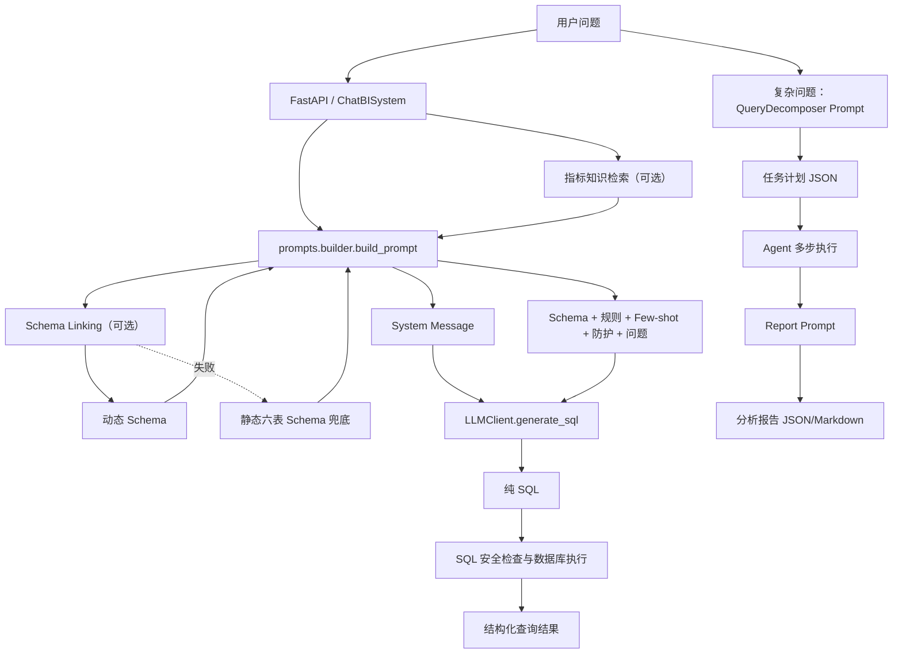

# Day9：智慧停车 Prompt 改造记录

## 0. 今日改造边界

Day9 只改造 Prompt Engineering，不修改 Agent、Planner、Schema、Schema Linking、SQL 生成器和 SQL 执行器。

本次实际修改：

- `prompts/builder.py`：Text2SQL Prompt 的集中定义与组装。
- `docs/09_Prompt改造记录.md`：本次学习和改造记录。

本次明确不修改：

- `agent/planner/query_decomposer.py`：Planner/任务拆解 Prompt，留到 Day10。
- `agent/executor/report_generator.py`：报告生成 Prompt，留到 Day11。
- `rag/indicators.json`、`rag/indicators_full.json`：指标知识仍属于 RAG 模块，不属于今天的 Prompt 文件。
- `schema/*`：Day8 已完成，不在 Day9 重复修改。
- `text2sql/llm_client.py`、`text2sql/main.py`：LLM 调用和 SQL 主链路保持不变。

这里有一个必须坚持的原则：Prompt 必须服从真实数据库 Schema。需求示例中提到的 `parking_fee` 和 `pay_time` 并不存在于 Day8 六表设计中，所以本次没有虚构这两个字段，而是使用真实口径：

- 聚合净收入：`agg_parking_daily.net_revenue`，时间字段为 `stat_date`；
- 明细净收入：`fact_parking_order.paid_amount - fact_parking_order.refund_amount`，时间字段为 `exit_time`。

---

## 1. 原 Prompt 分析

### 1.1 当前项目有哪些 Prompt

| Prompt | 类型 | 文件与位置 | 调用方 | 输入 | 输出 |
|---|---|---|---|---|---|
| Text2SQL System Prompt | System Prompt | `prompts/builder.py` 的 `SYSTEM_MESSAGE` / `STRICT_SYSTEM_MESSAGE` | `build_prompt()` | 功能开关决定普通或严格角色 | System Message 字符串 |
| Text2SQL User Prompt | Text2SQL Prompt | `prompts/builder.py:build_prompt()` | `text2sql/main.py:ChatBISystem.run()`、`run_stream()` | 用户问题、Schema、Few-shot、规则、防护、指标知识 | User Message 字符串 |
| Planner Prompt | Planner/Task Decomposition Prompt | `agent/planner/query_decomposer.py:build_decomposition_prompt()` | `QueryDecomposer.decompose()` | 用户问题、静态 Schema、维度目录、指标目录 | 要求模型返回任务计划 JSON |
| Planner Retry Prompt | 修正 Prompt | `QueryDecomposer._build_retry_prompt()` | `QueryDecomposer.decompose()` 校验失败后 | 原 Prompt、校验错误 | 修正后的任务拆解 Prompt |
| Report System Prompt | Report System Prompt | `agent/executor/report_generator.py:_build_system_message()` | `ReportGenerator.generate()` | 无动态输入 | 报告角色字符串 |
| Report User Prompt | Report/Summary Prompt | `ReportGenerator._build_prompt()` | `ReportGenerator.generate()` | 原问题、目标、步骤结果、执行汇总 | 要求模型返回报告 JSON |
| Zero-shot 教学 Prompt | 早期演示 Prompt | `text2sql/text2sql_v0.py:generate_sql()` | 该脚本独立运行 | 用户问题 | SQL 文本 |

### 1.2 当前不存在的独立 Prompt

当前项目没有以下独立 Prompt：

- 独立 Schema Linking Prompt：Schema Linking 使用 Embedding、业务规则、锚表与 Join 图完成，不通过 LLM Prompt 选表选字段。
- 独立 SQL 修正 Prompt：当前没有把数据库错误重新提交给 LLM 修正 SQL 的闭环。
- 独立意图识别 Prompt：部分意图识别采用 Python 关键词规则。

`text2sql/error_analyzer.py` 会分类错误并给出优化建议，但它没有调用 LLM 重新生成 SQL，因此不能称为 SQL 修正 Prompt。

### 1.3 Prompt 完整调用链



主 Text2SQL 调用位置是 `text2sql/main.py`：先检索指标知识，再调用 `build_prompt()`，最后把返回的 `system_msg` 和 `prompt` 传入 `LLMClient.generate_sql()`。`LLMClient` 将二者分别放入 `system` 和 `user` 消息。

---

## 2. Prompt 修改原因

改造前，`prompts/builder.py` 仍属于新能源销售经营域，包含：

- `dim_customers`、`dim_products`、`sales_orders`；
- 汇率表 `exchange_rates`；
- 费用表 `finance_expenses`；
- 销售收入、成本、毛利、期间费用等规则；
- 客户类型、产品线、汇率换算等 Few-shot。

Day8 的 Schema 已切换成智慧停车六表。如果 Prompt 不同步迁移，会产生四类严重问题：

1. 模型可能生成已不存在的销售表和字段；
2. Schema Linking 成功时，旧业务规则仍可能覆盖动态 Schema 的正确语义；
3. Schema Linking 失败回退时，会直接把旧销售全量 Schema 发给模型；
4. Few-shot 会通过示范效应把模型继续引向客户、产品和汇率场景。

### 2.1 修改映射

| Prompt 内容 | 旧业务 | 新业务 | 修改原因 |
|---|---|---|---|
| 系统角色 | 通用 SQL 生成助手 | 智慧停车运营分析与 Text2SQL 专家 | 建立停车语义边界 |
| 核心事实 | `sales_orders` | 停车订单、车位快照、异常事件、日/小时聚合 | 与 Day8 六表一致 |
| 核心维度 | 客户、产品 | 停车场、城市、停车场类型 | 支持停车场经营分析 |
| 收入口径 | `net_amount` + 汇率 | `net_revenue` 或 `paid_amount-refund_amount` | 与真实停车收入字段一致 |
| 时间字段 | `order_date` | `stat_date`、`exit_time`、`entry_time`、`snapshot_time`、`event_time` | 不同业务事实必须使用各自时间 |
| 经营指标 | 销售额、成本、毛利、费用 | 收入、订单量、利用率、停车时长、异常、高峰 | 覆盖目标业务问题 |
| Few-shot | 客户、产品、费用、汇率 | 收入、趋势、停车场排名、利用率、时长 | 用正确示范稳定 SQL |
| 错误防护 | 含税/不含税、汇率、费用重复 | 粒度混用、事实表直接 Join、错误时间、比率 SUM | 防止停车场景常见 SQL 错误 |

---

## 3. 修改文件列表

### 3.1 `prompts/builder.py`

修改原因：这是当前 Text2SQL Prompt 的唯一集中入口，`ChatBISystem` 同步和流式路径都调用它。

修改前：

- System Prompt 是通用 SQL 助手；
- 静态 Schema 是销售、客户、产品、汇率、费用；
- 业务规则是销售收入、成本、毛利和费用；
- Four-shot 全部为旧业务；
- 最终要求硬编码 `net_amount` 和汇率转换。

修改后：

- 增加智慧停车 System Prompt 和严格模式 System Prompt；
- 静态兜底 Schema 替换为 Day8 六张停车表；
- 增加十条停车指标与时间口径规则；
- 增加十类停车 Text2SQL 错误防护；
- 增加五个智慧停车 Few-shot；
- 使用 `prompt_parts` 分块组装，只有功能开启时才注入对应模块；
- 明确 Schema、规则与外部指标知识的优先级；
- 强制输出一条只读 MySQL 查询。

影响范围：只改变发送给 LLM 的文本，不改变 Schema Linking 结果、模型调用方式、SQL 提取、SQL 安全校验和数据库执行。

### 3.2 `docs/09_Prompt改造记录.md`

修改原因：记录 Day9 的设计依据、代码边界、测试证据、遗留问题和面试表达。

影响范围：仅文档，无运行时影响。

---

## 4. 修改前后对比

### 4.1 System Prompt

修改前的核心角色：

```text
你是一个专业的 SQL 生成助手，擅长根据业务问题生成标准 MySQL 查询语句。
```

修改后的核心角色：

```text
你是一名智慧停车运营分析与 Text2SQL 专家。
你能够理解停车收入、停车订单、停车场经营、车位利用率、停车时长、
车流高峰和运营异常等问题，并依据提供的数据库 Schema 生成标准 MySQL 查询。
```

设计意图不是单纯替换角色名称，而是明确模型负责的业务边界、数据库约束和禁止幻觉要求。

### 4.2 Schema

修改前：Prompt 回退时注入五张销售域表。

修改后：Prompt 回退时注入六张停车 MVP 表：

1. `dim_parking_lot`
2. `fact_parking_order`
3. `fact_space_snapshot`
4. `fact_operation_event`
5. `agg_parking_daily`
6. `agg_parking_hourly`

动态 Schema Linking 成功时仍优先使用动态 Schema，从而减少无关表字段和 Token。

### 4.3 输出约束

修改后明确要求：

- 只输出一条完整 SQL；
- 不输出解释和 Markdown；
- 只生成 `SELECT` 或 `WITH ... SELECT`；
- 只使用当前 Schema 中的数据库对象；
- 先识别指标、维度、时间和业务粒度；
- 禁止事实表直接 Join 导致重复统计。

---

## 5. 新智慧停车 Prompt 设计

### 5.1 Prompt 分层

当前 Text2SQL Prompt 分为七层：

```text
System Role
    ↓
动态 Schema / 静态六表兜底
    ↓
关键停车业务规则（可选）
    ↓
智慧停车 Few-shot（可选）
    ↓
错误防护（可选）
    ↓
指标知识（可选，低于 Schema 与规则）
    ↓
用户问题 + 输出格式
```

为什么不能只使用一句 Prompt？因为 Text2SQL 同时需要解决五类不同问题：

- “我是谁”：System Role；
- “数据库有什么”：Schema；
- “指标怎么算”：业务规则和指标知识；
- “正确 SQL 长什么样”：Few-shot；
- “哪些错误不能犯”：Guards 和输出约束。

把这些职责混在一句话里，会导致可维护性差、冲突难排查、功能无法按开关控制。

### 5.2 停车业务规则放在哪里

停车业务规则被注入 Text2SQL User Prompt 的 `【关键业务规则】` 区块，位置在 Schema 之后、Few-shot 之前。

原因：

1. 模型先知道有哪些表字段，再理解指标如何映射；
2. Few-shot 随后展示规则怎样落成 SQL；
3. 业务规则属于可变上下文，不应全部塞入 System Prompt；
4. `use_rules` 可以控制是否进行消融测试。

核心规则如下：

| 指标/问题 | 默认口径 | 数据来源 |
|---|---|---|
| 停车净收入 | `SUM(net_revenue)` | 日/小时聚合表 |
| 明细净收入 | `SUM(paid_amount - refund_amount)` | 停车订单表，过滤 `completed` |
| 完成订单量 | `SUM(order_count)` 或 `COUNT(order_id)` | 聚合表或订单明细 |
| 平均停车时长 | `AVG(parking_minutes)` | 完成订单明细 |
| 历史利用率 | `utilization_rate`，不得 `SUM` | 日/小时聚合表 |
| 快照利用率 | `occupied_spaces / NULLIF(total_spaces, 0)` | 车位快照表 |
| 当前空闲车位 | 每个停车场最新快照的 `free_spaces` | 车位快照表 |
| 高峰时段 | `stat_hour` + 订单量/利用率 | 小时聚合表 |
| 异常证据 | 异常数量、类型、严重程度、预估损失 | 日聚合与异常事件表 |

### 5.3 Few-shot 设计

改造前已经存在 Few-shot，但全部是旧销售业务。本次不是“新增 Few-shot 机制”，而是迁移 Few-shot 内容。

五个示例分别覆盖：

1. 单表、单日、单指标；
2. 时间范围与按月趋势；
3. 事实表 Join 维度表与 Top 1 排名；
4. 比率指标与运营状态过滤；
5. 明细平均值、状态过滤与空值处理。

这些示例覆盖了停车 ChatBI MVP 最常见的 SQL 结构，而没有为了“示例多”注入大量重复 SQL。

### 5.4 Prompt 稳定性设计

当前通过以下方式提升稳定性：

- System Prompt 限定角色和业务域；
- Schema 明确真实表字段；
- 规则明确指标口径和时间语义；
- Few-shot 提供正确 SQL 模式；
- Guards 提供负向约束；
- 输出要求限制为一条只读 SQL；
- `LLMClient.generate_sql()` 再移除可能出现的 Markdown SQL 代码块。

需要注意：Prompt 约束不是安全边界。禁止写操作仍必须依赖后续 SQL 安全校验，不能只相信模型。

---

## 6. Prompt Token 优化

### 6.1 当前优化

- 开启 Schema Linking 时只注入相关表、字段、字段短描述和 Join；
- 规则、Few-shot、Guards、指标知识均由功能开关控制；
- 静态回退只保留六张 MVP 表，没有扩展到完整停车管理系统；
- Few-shot 控制为五个互补结构，没有为每个同义问题重复示例。

### 6.2 当前仍有的重复

- 动态 Schema 字段描述与业务规则可能重复说明净收入、时间字段；
- Few-shot 中出现的口径与规则存在必要重复；
- 静态 Schema 与 Day8 Python Metadata 是两份定义，未来可能漂移；
- 指标知识 RAG 可能再次注入与规则相同的公式。

### 6.3 后续优化方向

1. 建立单一元数据源，由 DDL/Metadata 自动生成静态兜底 Schema；
2. 根据问题类型选择 Few-shot，而不是每次注入全部五个；
3. 指标知识采用 RAG Top-K，只注入命中指标；
4. 增加 Prompt 版本号和 Token 统计；
5. 对简单问题启用精简 Prompt，对异常归因启用增强 Prompt；
6. 建立离线评测集，根据准确率而不是直觉决定 Prompt 长度。

---

## 7. 测试结果

### 7.1 本地确定性检查

验证结果：

- `prompts/builder.py` 通过 Python 编译；
- 静态兜底 Schema 包含六张停车表；
- 静态 Schema 中没有 `sales_orders`、`dim_customers`、`dim_products`、`exchange_rates`、`finance_expenses`；
- 五个问题的 Prompt 均包含对应业务字段和规则；
- `git diff --check` 通过。

原有 `tests/test_prompt_and_config.py` 中日期规则测试通过。另一个测试要求 `LLMClient.max_tokens >= 4000`，但当前环境配置为 `1000`，因此失败；该问题属于 `tools/config.py`，与本次 Prompt 修改无关，Day9 没有越界修改配置。

### 7.2 实际 LLM 生成验证

验证仅生成 SQL，没有执行 SQL。

#### 问题1：今天停车收入是多少？

模型使用：

```sql
SELECT COALESCE(SUM(net_revenue), 0) AS parking_revenue
FROM agg_parking_daily
WHERE stat_date = CURDATE();
```

结论：正确使用日聚合净收入和统计日期。

#### 问题2：最近三个月收入趋势？

模型使用 `agg_parking_daily.stat_date` 按月分组并 `SUM(net_revenue)`。

结论：指标、粒度、时间范围和排序正确。

#### 问题3：哪个停车场收入最高？

模型使用：

- `agg_parking_daily` 作为收入事实表；
- `dim_parking_lot` 输出停车场名称；
- `parking_lot_id` Join；
- 过滤 `operation_status = 'operating'`；
- 降序并 `LIMIT 1`。

结论：维度 Join、经营过滤和排名结构正确。

#### 问题4：哪个停车场利用率最低？

模型使用 `AVG(agg_parking_daily.utilization_rate)`，没有错误地 `SUM` 利用率，并过滤运营中停车场。

结论：利用率口径和排名方向正确。

#### 问题5：为什么某停车场收入下降？

模型生成两个 CTE：

- 先按停车场聚合本期/上期收入和异常数量；
- 再按停车场聚合异常事件和预估损失；
- 最后 Join 已聚合结果。

结论：没有直接 Join 两张事实表造成重复统计，且把 `estimated_loss` 保留为异常证据而非实际收入。

限制：问题中的“某停车场”没有具体停车场名称，模型将其解释成“寻找收入下降最明显的停车场”。Prompt 可以约束不编造字段和因果，但无法替代交互澄清。Day10 Agent 应增加缺失实体识别与澄清节点。

---

## 8. 代码 Review

### 8.1 优点

#### 易维护

System、Schema、Few-shot、Rules、Guards 分区定义，`build_prompt()` 只负责按功能开关组装，职责比大段字符串拼接更清楚。

#### 易扩展

新增停车指标时，可以优先增加指标知识或规则；新增 SQL 结构时，可以增加有代表性的 Few-shot，不需要修改 LLM 调用代码。

#### 支持 Text2SQL

规则明确了指标、来源表、时间字段、过滤条件和聚合陷阱，模型获得的不只是字段清单，还有生成 SQL 所需的业务语义。

#### 支持 Agent

复杂问题被 Agent 拆成简单子问题后，每个子任务仍复用同一个 `build_prompt()` 生成 SQL，因此 Prompt 可以作为 Executor 的稳定底座。

#### Token 可控

动态 Schema、Few-shot、规则、Guards、RAG 都有开关，具备后续进行消融实验和分场景注入的基础。

### 8.2 当前问题

#### Planner 仍有旧业务目录

`agent/planner/query_decomposer.py` 的维度仍是客户、产品、产品线等，指标目录来自旧销售 RAG。这会影响复杂停车问题拆解。根据范围要求，本次未修改，必须在 Day10 处理。

#### 指标 RAG 仍是旧销售知识

`rag/indicators.json` 和 `rag/indicators_full.json` 仍包含销售收入、成本、毛利、费用。当前 Prompt 增加了冲突优先级防护，但这只是防御，不是根治。后续 RAG 改造时必须替换成停车指标知识。

#### Report Prompt 仍偏通用经营分析

报告角色和 fallback 建议中仍出现产品线、区域、费用项等旧表达。本次按范围不修改，Day11 应迁移为停车运营报告。

#### 静态 Schema 存在双份维护

DDL、Schema Linking Metadata 和 Prompt 静态 Schema 都描述同一套表。任何一处改表都可能造成漂移。企业项目应该建立元数据单一事实源并自动生成 Prompt Schema。

#### Prompt 没有结构化中间输出

当前 Text2SQL 直接输出 SQL，没有先输出指标、维度、时间、粒度和选表决策。优点是 Token 少，缺点是可解释性和自动校验能力有限。

#### 没有 SQL 自修正闭环

数据库报错后没有 Error Prompt、Retry Prompt 和重新生成流程。企业级上线通常需要错误分类、受控重试、SQL Diff 和重试次数上限。

### 8.3 企业级优化建议

1. 给 Prompt 增加版本号，例如 `parking_text2sql_v1`；
2. 记录最终 Prompt Token、模型、Schema 召回结果和生成 SQL；
3. 建立 50～100 条停车问题黄金 SQL 评测集；
4. 分别评估 Few-shot、Rules、Guards、Schema Linking 的增益；
5. 对收入、利用率等指标做结构化 Metric Registry；
6. 增加 SQL AST 校验、Explain、超时控制和自修正；
7. 对缺失停车场名称、时间范围等槽位优先澄清。

---

## 9. 后续 Day10 Agent 改造计划

Day10 不应重复修改 Text2SQL Prompt，而应改造 Agent 如何组织问题：

1. 把 Planner 可用维度迁移为时间、停车场、城市、停车场类型、订单类型、支付方式、异常类型；
2. 把 Planner 指标目录迁移为停车收入、订单量、平均停车时长、利用率、空闲车位、异常数等；
3. 为收入下降设计任务拆解：收入趋势、订单变化、退款/免费放行、利用率、异常事件、证据汇总；
4. 增加缺失实体和时间范围的澄清策略；
5. 让每个 SQL 子任务继续复用 Day9 的 `build_prompt()`；
6. 增加中间状态和子任务结果引用，避免多个步骤重复查询；
7. 明确“相关性证据”与“因果结论”的边界。

Day11 再单独迁移 Report Prompt，使最终报告使用停车运营语言和行动建议。

---

## 10. 面试总结：如何介绍 ChatBI Prompt 设计和优化

如果面试官问“你的 ChatBI Prompt 是如何设计和优化的”，可以这样回答：

> 我负责把一个原来面向销售经营分析的 ChatBI 改造成智慧停车运营分析平台。在 Prompt 层我没有只做角色文案替换，而是按照 Text2SQL 的错误来源重新分层设计。
>
> 第一层是 System Prompt，明确模型是智慧停车运营分析与 Text2SQL 专家，负责理解停车收入、订单、利用率、停车时长、高峰和异常，但只能使用提供的数据库对象。第二层是 Schema Context，优先使用 Day8 Schema Linking 动态召回的表、字段和 Join，召回失败才回退到六张停车 MVP 表。这样既降低 Token，也减少模型看到无关表后的选表干扰。
>
> 第三层是业务规则。我把最容易出错的指标语义显式化。例如停车收入在日趋势和停车场排名中优先使用日汇总表的 net_revenue；如果回到订单明细，则使用 paid_amount 减 refund_amount，并按 exit_time 归属且过滤 completed。车位利用率不能 SUM，历史分析优先使用日或小时聚合的 utilization_rate，快照分析才使用 occupied_spaces 除以 total_spaces。平均停车时长在明细层使用 completed 订单的 parking_minutes，跨日平均不能直接平均每日平均值。
>
> 第四层是 Few-shot。我设计了五个互补示例，分别覆盖今日单指标、月趋势、停车场排名、利用率最低和平均停车时长。示例全部使用真实六表字段，避免旧销售示例继续影响模型。第五层是错误防护，重点防止使用 updated_at 作为业务时间、事实表直接 Join 导致多对多膨胀、把预估损失当收入、生成不存在的 parking_fee 或 pay_time，以及生成写操作。
>
> Prompt 构建采用功能开关，可以分别控制 Few-shot、规则、防护、指标知识和 Schema Linking，便于做消融评测。实际验证中，五个核心停车问题都生成了符合真实 Schema 的 SQL；复杂的收入下降问题也先分别聚合日经营和异常事件，再 Join 聚合结果，没有直接连接事实明细造成重复统计。
>
> 我也明确 Prompt 的边界。Prompt 不能替代 SQL 安全校验，也不能在用户没说具体停车场时可靠地猜出实体。因此后续 Agent 层会增加澄清节点，SQL 层会增加 AST 校验和错误自修正，指标 RAG 也要迁移为停车指标。整体思路是让 Schema 控制“有什么”，指标规则控制“怎么算”，Few-shot 控制“怎么写”，Guard 控制“不能犯什么错”，再通过评测数据持续优化。

---

## 11. 今日学习总结

今天应真正掌握以下内容：

1. Prompt 在 Agent 中不是 Planner 本身，而是 Planner、Text2SQL、Report 等 LLM 节点各自的行为契约；
2. Text2SQL Prompt 的正确性取决于 Schema、指标口径、时间语义、粒度和 Join，而不只是“请生成 SQL”；
3. Schema 解决数据库对象范围，业务规则解决指标含义，二者不能互相替代；
4. Few-shot 的价值是展示 SQL 结构和业务规则如何落地，不是堆大量示例；
5. Guard 可以降低幻觉和常见 SQL 错误，但真正的安全仍要靠代码校验；
6. 动态 Schema 能节省 Token，但必须保留可靠的静态兜底；
7. Prompt 与 RAG 冲突时必须定义优先级，根治方案则是同步迁移知识库；
8. 用户信息缺失时，Prompt 很难替代 Agent 的澄清能力。

最容易成为面试考点的是：

- 为什么 Schema Linking 后仍需要业务规则；
- 为什么利用率、平均值不能随便 SUM/AVG；
- 如何避免事实表 Join 造成指标翻倍；
- Few-shot 如何选择而不是越多越好；
- Prompt 如何做版本、评测、可观测和安全兜底；
- Prompt、RAG、Agent、SQL 校验各自负责什么。

---

# 我的思考题

1. 为什么动态 Schema 已经提供了表和字段，Text2SQL Prompt 仍然需要独立的停车指标规则？请结合停车净收入和车位利用率回答。

2. 当前 Prompt 规定“跨日平均停车时长不能直接平均每日平均值”。为什么？在现有六表中可以采用哪两种正确计算方式？

3. 为什么 `fact_parking_order` 和 `fact_operation_event` 不能只通过 `parking_lot_id` 直接 Join 后计算收入和异常数量？这会造成什么 SQL 结果问题？

4. 当前项目同时存在动态 Schema、静态 Schema、业务规则和指标 RAG。如果四者内容冲突，你会如何设计优先级和自动校验机制？

5. 用户问“为什么某停车场收入下降”，但没有提供停车场名称和时间范围。你认为 Prompt 应该直接生成 SQL，还是 Agent 应该先澄清？请结合用户体验、执行成本和结果可信度说明。

请先自行回答。后续 Review 应结合当前项目源码、六表 Schema 和本次 Prompt 实现判断，而不是只按通用理论评分。
