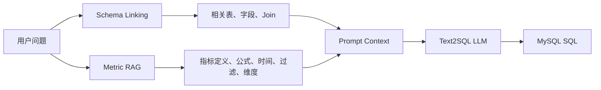
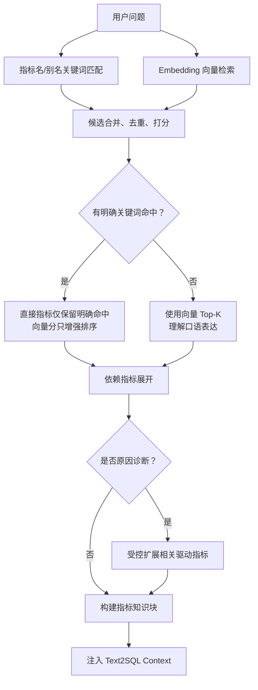

# Day9：智慧停车指标知识库 RAG 改造记录

## 0. 今日目标与边界

Day9 的目标是让 ChatBI 不只知道“数据库有哪些表和字段”，还知道“业务指标是什么意思、如何计算、用什么时间口径和过滤条件”。

本次只改造 `rag/`：

- 智慧停车指标文档；
- 关键词兜底识别；
- Embedding 文档构建；
- Chroma 向量索引；
- 关键词与向量混合检索；
- 指标依赖和诊断关联指标扩展；
- 指标知识块生成；
- RAG 离线回归测试。

本次没有修改：

- Prompt；
- Agent、Planner、Executor；
- Schema、Schema Linking；
- SQL 生成与执行逻辑；
- FastAPI 和运行配置。

当前项目技术栈是 OpenAI-compatible/Qwen Embedding + LangChain + ChromaDB，不是 Milvus。MVP 实现继续沿用 Chroma，文档单独给出未来 Milvus 存储设计，不虚构当前能力。

---

## 1. 为什么需要指标知识库

### 1.1 Schema 不能完整表达指标语义

Schema 能告诉模型：

```text
agg_parking_daily 有 net_revenue、order_count、utilization_rate
fact_parking_order 有 paid_amount、refund_amount、exit_time
```

但它不能稳定回答：

- 用户说“收入”时，是应收、实收、净收入还是预估损失？
- 收入按入场时间、出场时间还是数据更新时间归属？
- 利用率能否直接求和？
- 跨日平均停车时长能否直接平均每日平均值？
- 收入下降需要关联哪些驱动指标？

这些属于指标口径，而不是物理 Schema。

### 1.2 指标知识如何影响 SQL

用户问题：

```text
最近一个月停车收入是多少？
```

Schema Linking 负责找到：

```text
agg_parking_daily
net_revenue
stat_date
```

Metric RAG 负责补充：

```text
指标：停车净收入
公式：SUM(net_revenue)
时间：stat_date
维度：时间、停车场、城市、停车场类型
规则：应收、优惠、预估损失都不是实际收入
```

模型最终才有足够上下文生成正确 SQL。

### 1.3 为什么不能把所有规则都写死在 Prompt

如果把全部指标定义永久塞进 Prompt：

- 每次请求都消耗所有指标 Token；
- 指标增加后 Prompt 越来越长；
- 业务口径变更需要发布 Prompt；
- 不同租户和业务线难以隔离指标；
- 很难记录“这次 SQL 使用了哪个指标版本”。

RAG 的价值是按问题检索必要指标，实现动态注入。

---

## 2. Schema Linking 与指标 RAG 的区别

| 对比项 | Schema Linking | Metric RAG |
|---|---|---|
| 核心问题 | 数据库有什么、去哪里取 | 业务指标是什么、怎么算 |
| 主要内容 | 表、字段、类型、Join | 定义、公式、时间、过滤、维度、规则 |
| 典型输出 | `agg_parking_daily.net_revenue` | 停车净收入=`SUM(net_revenue)` |
| 错误类型 | 找错表、找错字段、漏 Join | 指标口径错、时间错、过滤错、聚合错 |
| 是否互相替代 | 不能 | 不能 |

组合关系：



一句话总结：

> Schema Linking 解决“用哪些数据库对象”，Metric RAG 解决“这些对象按什么业务口径组合”。

---

## 3. 原 RAG 架构分析

### 3.1 关键词知识路径

文件：`rag/indicator_knowledge.py`

核心类：`IndicatorKnowledge`

| 方法 | 输入 | 输出 | 职责 |
|---|---|---|---|
| `__init__()` | 指标 JSON 路径 | 指标字典、别名映射 | 加载知识库 |
| `detect_indicators()` | 用户问题 | 标准指标名列表 | 名称/别名子串匹配 |
| `get_indicator_text()` | 指标名称 | 指标知识文本 | 格式化单指标 |
| `build_knowledge_block()` | 用户问题 | `【指标知识】`文本 | 识别并组装上下文 |
| `get_indicator_context()` | 用户问题 | 指标名和知识块字典 | 供主链路一次调用 |

优点：确定性、无外部调用、适合作为 fallback。

不足：原数据只有销售收入、成本、毛利、费用、利润；无法理解停车业务，也不能理解没有出现指标关键词的口语表达。

### 3.2 向量 RAG 路径

文件：`rag/indicator_retriever.py`

原有组件：

- Loader：`load_indicators()` 读取 `indicators_full.json`；
- Splitter：没有通用 Splitter，一项指标作为一个 Document；
- Embedding：`OpenAIEmbeddings`，模型和地址来自 `LLM_CONFIG`；
- Vector Store：LangChain `Chroma`；
- Index Builder：`build_indicator_index()`；
- Retriever：`retrieve_indicators()`；
- Context Builder：`build_indicator_knowledge_block_from_results()`；
- 集成接口：`retrieve_indicator_context()`。

原有向量文档只包含：

```text
指标名 + 别名 + 定义 + 公式
```

缺少关联表、字段、时间口径、维度、业务规则和典型问题，且 13 个指标全部属于旧销售业务。

### 3.3 主调用链

```text
ChatBISystem.run / run_stream
    ↓
_resolve_indicator_context()
    ↓
use_indicator_rag=True ?
    ├─ 是：retrieve_indicator_context()
    │       ↓失败或空
    │   IndicatorKnowledge.get_indicator_context() 兜底
    └─ 否且开启关键词知识：直接走关键词兜底
    ↓
detected_indicators + indicator_block
    ↓
build_prompt(indicator_knowledge=indicator_block)
    ↓
LLM 生成 SQL
```

主链路本来已经存在，Day9 的核心不是重新造 RAG 框架，而是迁移知识并提高指标召回质量。

---

## 4. 新指标知识库设计

### 4.1 MVP 指标范围

本次设计 18 个核心指标，没有超过 20 个。只保留能由 Day8 六表可靠计算、且对停车运营分析有直接价值的指标。

| 类别 | 指标 | 描述 | 核心公式 | 关联表/字段 | 支持问题 |
|---|---|---|---|---|---|
| 收入 | 停车净收入 | 实际确认净收入 | `SUM(net_revenue)` 或 `SUM(paid_amount-refund_amount)` | 日/小时聚合、订单；净收入、实收、退款 | 收入、趋势、排名、下降原因 |
| 收入 | 应收金额 | 优惠支付前应收 | `SUM(receivable_amount)` | 订单表；应收、出场时间 | 应收、应收实收差异 |
| 收入 | 优惠金额 | 优惠减免 | `SUM(discount_amount)` | 订单表；优惠、出场时间 | 优惠规模、收入驱动 |
| 收入 | 退款金额 | 已支付订单退款 | `SUM(refund_amount)` | 订单表；退款、支付状态 | 退款趋势、收入下降 |
| 收入 | 平均订单金额 | 每完成订单平均净收入 | 净收入/完成订单数 | 订单ID、实收、退款 | 客单价、平均停车费 |
| 订单 | 完成订单量 | 已完成停车次数 | 聚合 `SUM(order_count)` 或明细去重计数 | 聚合表、订单表 | 订单趋势、停车场排名 |
| 订单 | 取消订单量 | cancelled 订单数 | `COUNT(DISTINCT order_id)` | 订单状态、入场时间 | 取消量、取消排行 |
| 支付 | 支付成功率 | 完成订单中曾成功支付占比 | paid/refunded 数÷完成订单数 | 支付状态、订单状态 | 支付率、低支付停车场 |
| 运营 | 平均停车时长 | 完成订单平均停留分钟 | `AVG(parking_minutes)` | 订单表/日聚合 | 平均停车时间、最长停车场 |
| 运营 | 车位利用率 | 可运营车位占用比例 | `AVG(utilization_rate)` 或占用/总车位 | 日/小时聚合、快照 | 利用率、占用率、紧张时段 |
| 运营 | 空闲车位数 | 最新快照可用车位 | 最新快照 `free_spaces` | 车位快照 | 当前空位、剩余车位排行 |
| 流量 | 进场车辆数 | 指定时间入场车流 | 按 `entry_time` 去重订单 | 订单表 | 今日进场、进场高峰 |
| 流量 | 出场车辆数 | 指定时间完成出场车流 | 按 `exit_time` 去重完成订单 | 订单表 | 今日出场、离场高峰 |
| 流量 | 高峰时段 | 小时订单量/利用率最高时段 | 按 `stat_hour` 排序取首位 | 小时聚合 | 几点最忙、收入高峰 |
| 异常 | 异常事件数 | 运营异常数量 | 聚合异常数或事件ID去重计数 | 异常事件/聚合表 | 异常趋势、异常类型 |
| 异常 | 预估收入损失 | 异常预估影响金额 | `SUM(estimated_loss)` | 异常事件表 | 风险损失、异常影响 |
| 异常 | 人工抬杆次数 | 人工放行行为数量 | 聚合数或标志求和 | 日聚合/订单表 | 人工放行趋势、异常分析 |
| 异常 | 免费放行次数 | 免费停车订单数量 | 聚合数或标志求和 | 日聚合/订单表 | 免费放行、收入下降驱动 |

### 4.2 为什么没有设计更多指标

以下指标暂未纳入 MVP：

- 车辆周转率：现有日汇总没有同口径历史可运营车位总数，直接使用停车场静态容量可能产生历史偏差；
- 支付渠道手续费：没有手续费字段；
- 会员收入、月租续费率：没有会员、月卡或续费事实；
- 逃费率：没有逃费确认字段；
- 设备可用率：异常事件只能记录事件，没有设备在线总时长；
- 严格退款发生日指标：没有 `refund_time`。

企业指标库的原则不是“指标越多越完整”，而是每个指标必须有可验证的数据来源和明确口径。

---

## 5. 指标数据结构

完整知识文件：`rag/indicators_full.json`

示例结构：

```json
{
  "metric_id": "parking_net_revenue",
  "name": "停车净收入",
  "category": "收入类",
  "level": "原子指标",
  "aliases": ["停车收入", "收入", "营收"],
  "definition": "停车业务实际确认的净收入",
  "formula": "SUM(net_revenue)",
  "sql_template": "SELECT SUM(net_revenue) ...",
  "tables": ["agg_parking_daily"],
  "fields": ["net_revenue", "stat_date"],
  "data_source": "agg_parking_daily",
  "time_field": "stat_date",
  "filters": [],
  "dimensions": ["时间", "停车场", "城市"],
  "business_rules": ["默认收入指净收入"],
  "supported_questions": ["最近一个月停车收入是多少"],
  "depends_on": [],
  "related_metrics": ["完成订单量", "退款金额"],
  "notes": "趋势优先使用日汇总"
}
```

### 5.1 各字段作用

| 字段 | 用途 |
|---|---|
| `metric_id` | 稳定唯一ID，用作向量主键，名称变化不影响索引身份 |
| `name/aliases` | 关键词匹配和业务标准名归一化 |
| `category/level` | 分类过滤、原子/派生指标治理 |
| `definition` | 给 Embedding 和 LLM 的业务语义 |
| `formula/sql_template` | 指导 Text2SQL 计算方式 |
| `tables/fields` | 与 Schema Linking 结果交叉验证 |
| `time_field/filters` | 防止时间和统计范围错误 |
| `dimensions` | 告诉模型可以按哪些维度分析 |
| `business_rules` | 指标口径、禁止项和聚合注意事项 |
| `supported_questions` | 增强自然语言问题的向量可检索性 |
| `depends_on` | 派生指标自动补充原子指标 |
| `related_metrics` | 只在原因诊断时补充驱动指标 |
| `notes` | 数据限制和解释边界 |

### 5.2 单一事实源

`indicators_full.json` 是唯一完整知识源。

`indicators.json` 只保存：

```json
{
  "source": "indicators_full.json"
}
```

`IndicatorKnowledge` 会解析该引用。关键词兜底和向量 RAG 因此共享同一套指标公式，避免两份 JSON 发生口径漂移。

---

## 6. Embedding 流程

### 6.1 Document Loader

`load_indicator_catalog()` 读取完整 JSON，`load_indicators()` 转成：

```python
{
    "停车净收入": {...},
    "车位利用率": {...}
}
```

### 6.2 文本切分

项目没有使用 `RecursiveCharacterTextSplitter`。这是有意设计，而不是遗漏。

每项指标本身就是一个完整的语义 Chunk：

```text
指标名称
指标类别
别名
定义
公式
关联表
关联字段
时间口径
维度
业务规则
典型问题
```

如果按字符把它拆开，可能让公式、时间字段和业务规则分离，检索到半条指标知识。指标知识适合“按业务对象切分”，不适合“按固定字符切分”。

对应函数：`build_indicator_document()`。

### 6.3 Embedding

`get_embeddings()` 复用 `LLM_CONFIG`：

- 模型：当前配置的 `text-embedding-v3`；
- 接口：OpenAI-compatible；
- 当前服务可由 Qwen/阿里兼容端点提供；
- `check_embedding_ctx_length=False`；
- 批量大小 `chunk_size=10`。

### 6.4 索引构建

`build_indicator_index()`：

1. 加载指标和 `knowledge_version`；
2. 读取 Chroma 现有 ID 和版本；
3. ID 或版本不一致时清理旧索引；
4. 一指标一 Document；
5. 使用 `metric_id` 作为向量 ID；
6. 写入 Chroma 持久化目录。

本次真实构建结果：

```text
18 个停车指标
知识版本 parking_metrics_v1
持久化目录 rag/chroma_db/indicators
```

版本检测解决了原实现的一个问题：旧实现只要集合非空就可能跳过构建，JSON 已经改变但旧销售向量仍然存在。

---

## 7. Milvus 存储设计

### 7.1 当前为什么没有直接使用 Milvus

当前 `pyproject.toml` 已有 Chroma 和 LangChain Chroma，没有 Milvus/PyMilvus，也没有 Milvus 服务配置。MVP 强行引入 Milvus会增加：

- 新依赖和容器；
- 网络、鉴权和连接池配置；
- Collection 生命周期管理；
- 部署和运维成本；
- 与本次指标语义改造无关的风险。

因此当前实现继续使用 Chroma，这是符合“保持当前技术栈、优先MVP可运行”的选择。

### 7.2 企业级 Milvus Collection 建议

未来多租户、大规模指标平台可以建立：

```text
Collection: chatbi_metric_knowledge

metric_id          VARCHAR       主键
tenant_id          VARCHAR       租户隔离
domain             VARCHAR       业务域，如 parking
knowledge_version  VARCHAR       指标版本
metric_name        VARCHAR       标准名称
category           VARCHAR       指标类别
level              VARCHAR       原子/派生
content            VARCHAR       完整检索文本
tables_json        JSON/VARCHAR  关联表
fields_json        JSON/VARCHAR  关联字段
is_active          BOOL          是否生效
updated_at         INT64         更新时间戳
embedding          FLOAT_VECTOR  向量
```

索引建议：

- 距离：COSINE；
- 小规模高精度：FLAT；
- 大规模低延迟：HNSW；
- 标量过滤：`tenant_id + domain + is_active + knowledge_version`；
- 分区优先按租户或业务域，不建议每个指标建分区。

迁移接口应抽象为 `MetricVectorStore`，让 Chroma 和 Milvus 只负责存取，检索融合和知识块构建保持不变。

---

## 8. 检索流程

### 8.1 当前没有单独的 LLM Query Understanding

当前查询理解由三种轻量机制完成：

1. 指标名称/别名子串匹配；
2. Embedding 语义检索；
3. “下降、原因、为什么、异常”等诊断关键词识别。

项目没有调用一个额外 LLM 把 Query 重写成结构化指标请求。本次没有虚构该能力。

### 8.2 混合检索流程



### 8.3 为什么关键词命中时不让弱向量结果凑满 Top-K

初次真实测试中：

- “哪个停车场利用率最低”除了车位利用率，还召回空闲车位和停车净收入；
- “平均停车时间”还召回高峰时段和平均订单金额。

主指标虽然排第一，但额外知识会增加 Token，并可能干扰 SQL。

优化后：

- 明确出现指标名称或别名时，直接指标只保留关键词命中；
- 向量分仍为命中项增强和排序；
- 没有明确词时，向量 Top-K 才负责口语语义召回。

这是一种“高精度规则优先、语义检索补盲”的混合策略。

### 8.4 原因诊断扩展

简单查询：

```text
停车收入是多少
→ 只注入停车净收入
```

诊断查询：

```text
收入下降原因
→ 停车净收入
  + 完成订单量
  + 退款金额
  + 车位利用率
  + 异常事件数
```

诊断扩展最多补充 4 个相关指标，防止知识块无限膨胀。相关指标不重复注入 SQL 模板，只注入定义、公式、表字段、时间、维度和规则。

---

## 9. 测试结果

### 9.1 测试1：最近一个月停车收入是多少

召回：

```text
停车净收入  score=0.9300  keyword+vector
```

关键知识：

- 公式：`SUM(net_revenue)`；
- 时间：`stat_date`；
- 维度包含时间、停车场、城市、停车场类型；
- 明细口径为 `paid_amount-refund_amount`。

结果：正确，没有注入应收金额或平均订单金额等弱相关项。

### 9.2 测试2：哪个停车场利用率最低

召回：

```text
车位利用率  score=0.9700  keyword+vector
```

关键知识：

- 历史使用日/小时 `utilization_rate`；
- 时点使用同快照占用车位/总车位；
- 利用率不得 `SUM`；
- 支持停车场维度。

结果：正确。

### 9.3 测试3：平均停车时间是多少

召回：

```text
平均停车时长  score=0.9700  keyword+vector
```

关键知识：

- `AVG(parking_minutes)`；
- 过滤 `completed` 和非空时长；
- 时间使用 `exit_time`；
- 跨日不可简单平均每日平均值。

结果：正确。

### 9.4 测试4：收入下降原因

召回：

```text
停车净收入      直接命中
完成订单量      诊断关联指标
退款金额        诊断关联指标
车位利用率      诊断关联指标
异常事件数      诊断关联指标
```

停车净收入文档携带：

```text
维度：时间、停车场、城市、停车场类型
```

因此满足“收入 + 订单量 + 停车场 + 时间维度”的诊断上下文要求，并额外补充退款、利用率和异常证据。

结果：正确。这里只提供分析证据，不把相关性直接声明为因果。

### 9.5 口语补充测试

问题：

```text
这个月每辆车平均花了多少钱
```

没有直接出现“平均订单金额”或“客单价”，向量仍将平均订单金额排在第一位，证明语义检索补足了关键词匹配能力。

### 9.6 自动化测试

新增：`rag/test_parking_indicator_rag.py`

覆盖：

- 指标数量和必填结构；
- 四个核心问题的关键词兜底；
- 关键词优先抑制弱向量结果；
- 收入下降诊断扩展；
- 口语化向量召回；
- 知识块关联字段和维度。

相关回归结果：

```text
9 passed
```

---

## 10. 指标 RAG 与 Schema Linking 如何结合

两个模块当前在 `ChatBISystem` 中都作为 Prompt 上下文来源：

```text
用户问题
  ├─ Schema Linking
  │    └─ 表、字段、锚表、Join
  └─ Metric RAG
       └─ 指标、公式、时间、过滤、维度、业务规则
             ↓
         Prompt Builder
             ↓
           Text2SQL
```

当前组合是“上下文合并”，还没有结构化交叉校验。例如 Metric RAG 说使用 `net_revenue`，Schema Linking 是否召回该字段，目前主要由 LLM 在上下文中共同理解。

企业级下一步可以增加 `Metric-Schema Alignment`：

1. 检查指标 `tables` 是否在召回表中；
2. 检查指标 `fields` 是否在召回字段中；
3. 缺少必要字段时，让 Schema Linking 定向补召回；
4. 表字段不存在时阻止进入 Text2SQL；
5. 将最终采用的 `metric_id + knowledge_version` 写入请求日志。

今天没有修改 Schema Linking，因此只提出设计，不实现跨模块校验。

---

## 11. 修改文件与影响范围

### 11.1 `rag/indicators_full.json`

修改原因：原 13 个指标全部属于销售、成本、毛利和费用，无法支持停车业务。

修改后：18 个停车 MVP 指标，增加表、字段、时间、维度、规则、问题、依赖和诊断关系。

影响：向量索引内容和关键词知识来源切换为停车业务。

### 11.2 `rag/indicators.json`

修改原因：原关键词兜底仍是旧销售知识，与向量知识可能发生口径分叉。

修改后：引用 `indicators_full.json`，两条检索路径共享单一事实源。

影响：向量服务异常时，关键词 fallback 仍返回停车指标。

### 11.3 `rag/indicator_knowledge.py`

修改原因：需要解析单一知识源引用，并输出表、字段、时间、维度和业务规则。

修改后：保留原公开接口，扩充停车知识格式和自测问题。

影响：`tools/runtime_factory.py` 无需修改，现有 fallback 调用保持兼容。

### 11.4 `rag/indicator_retriever.py`

修改原因：旧文档内容不足、索引可能不随知识变更刷新、纯向量 Top-K 精度不足、没有诊断扩展。

修改后：

- 完整指标 Document；
- 指标版本和 ID 校验；
- 余弦相似度；
- 关键词+向量混合召回；
- 关键词明确时抑制弱向量项；
- 依赖和诊断关联扩展；
- Token 受控知识块；
- 保持原有主接口兼容。

影响：`ChatBISystem` 无需修改即可使用新的停车指标 RAG。

### 11.5 `rag/test_parking_indicator_rag.py`

修改原因：为指标结构和混合检索策略建立无需外部 API 的确定性回归测试。

影响：仅测试，无运行时影响。

---

## 12. 对后续 Agent 改造的影响

Metric RAG 为 Day11 Agent 提供了三类能力：

### 12.1 任务拆解依据

收入下降问题可以根据 `related_metrics` 拆成：

1. 停车净收入趋势；
2. 完成订单量变化；
3. 退款金额变化；
4. 利用率变化；
5. 异常事件变化；
6. 证据汇总。

### 12.2 工具参数

Planner 可以把 `metric_id`、维度、时间范围交给 Executor，而不是只传自然语言。

### 12.3 可解释性

最终报告可以说明：

```text
本次“停车收入”采用 parking_net_revenue v1，
公式为 SUM(net_revenue)，时间字段为 stat_date。
```

但当前 Planner 仍读取指标名称列表，没有消费完整指标对象。Day11 改造时应避免让 Planner 和 RAG各自维护一套指标目录。

---

## 13. 企业级代码 Review

### 13.1 支持 Text2SQL

是。每项指标包含公式、表、字段、时间、过滤和 SQL 参考，能够直接约束 SQL 生成。

不足：还没有自动校验 RAG 字段与 Schema Linking 字段的一致性。

### 13.2 支持指标口径统一

是。关键词和向量路径共享 `indicators_full.json`，并使用稳定 `metric_id` 和 `knowledge_version`。

不足：JSON 仍是文件级治理，没有指标审批、负责人、生效时间和历史版本服务。

### 13.3 支持业务扩展

基本支持。新增指标主要是增加 JSON 文档并重建索引，检索器不需要增加大量业务 if/else。

不足：诊断触发词和相关指标扩展仍有轻量规则；未来复杂多业务域应使用可配置策略或 Planner。

### 13.4 Token 控制

较合理：

- 明确关键词只注入直接指标；
- 简单问题不扩展相关指标；
- 诊断相关指标限制最多4个；
- 依赖/相关指标不注入 SQL模板；
- 一项指标一个 Chunk，不返回整库。

不足：知识块尚未按模型 Token 精确预算，Top-K 也没有随问题复杂度动态调整。

### 13.5 其他优点

- 旧索引版本自动识别；
- 关键词路径为向量服务提供降级能力；
- 真实表字段经过离线一致性检查；
- 诊断知识明确相关性不等于因果；
- 没有为了架构名词强行引入 Milvus。

### 13.6 后续优化建议

1. 增加 `owner`、`status`、`effective_from/to`、`unit`、`aggregation_type`；
2. 记录召回 Precision@K、Recall@K、MRR 和最终 SQL 执行准确率；
3. 建立同义词冲突检测，例如“订单量”是否指全部订单还是完成订单；
4. 用结构化 Metadata 过滤租户、业务域、版本和数据源；
5. 增加 Metric-Schema Alignment；
6. 建立指标审批和版本发布流程；
7. 缓存 Query Embedding 和高频指标结果；
8. 监控无召回率、低分召回率和 fallback 比例；
9. 多租户规模扩大后再迁移 Milvus。

---

## 14. 面试总结：为什么 ChatBI 需要 RAG

如果面试官问“你的 ChatBI 为什么需要 RAG”，可以这样回答：

> 我们在智慧停车 ChatBI 中使用 RAG，不是为了做通用知识问答，而是为 Text2SQL 增强指标语义。Schema Linking 只能告诉模型收入可能涉及日汇总表的 net_revenue，或者订单表的 paid_amount、refund_amount，但它不能稳定决定收入到底采用哪种口径、按哪个时间字段统计、需要什么过滤条件。
>
> 所以我们建立了停车指标知识库。每个指标不是一段普通说明，而是一个结构化业务对象，包括标准名称、别名、定义、公式、关联表字段、时间口径、过滤条件、支持维度、业务规则、依赖指标和典型问题。比如停车净收入在趋势查询中优先使用日汇总表的 SUM(net_revenue)；如果回到订单明细，则使用 paid_amount 减 refund_amount，过滤 completed，并按 exit_time 归属。这样模型得到的是可落地为 SQL 的指标知识。
>
> 检索上我们采用关键词和向量混合策略。明确出现“收入”“利用率”时，关键词提供高精度确定性召回，向量分只用于增强排序，不会用弱相关指标凑满 Top-K。用户说“每辆车平均花了多少钱”这种没有标准指标名的口语表达时，向量检索可以召回平均订单金额。对“收入下降原因”这类诊断问题，系统会在停车净收入之外，受控扩展完成订单量、退款、利用率和异常事件等驱动指标，但限制扩展数量，避免 Prompt 过长。
>
> 技术上我们沿用项目已有的 OpenAI-compatible Embedding、LangChain 和 ChromaDB。一项指标就是一个完整语义 Chunk，不使用通用字符切分，因为不能让公式和业务规则分开。索引使用稳定 metric_id，并带 knowledge_version；当指标版本或ID发生变化时自动重建，避免代码已经切到停车业务但向量库仍保留旧销售知识。
>
> 在完整链路里，Schema Linking 提供表、字段和 Join，Metric RAG 提供定义、公式、时间和过滤，两部分共同进入 Text2SQL Prompt。我们还保留纯关键词 fallback，即使向量服务异常，核心指标仍能识别。
>
> 当前是 18 个指标的 MVP，重点保证收入、订单、支付、利用率、停车时长、车流和异常分析。企业化下一步会增加指标版本审批、负责人、多租户过滤、Metric-Schema 一致性校验和召回评测；规模扩大后可以把 Chroma 抽象替换为 Milvus。RAG 在这里的核心价值是统一指标口径、按需提供业务语义，并最终提升 SQL 正确率，而不是简单地返回一段相似文本。

---

## 15. 今日学习总结

今天应该掌握：

1. ChatBI 需要 RAG，是因为数据库字段名不能完整承载业务指标口径；
2. Schema Linking 找物理数据对象，Metric RAG 找业务定义与计算规则；
3. 指标文档必须包含公式、表字段、时间、过滤、维度和规则，才能影响 SQL；
4. 指标知识应按业务对象切分，而不是机械按字符切分；
5. 关键词匹配与向量召回是互补关系：前者保精度，后者补语义；
6. 派生指标需要依赖展开，原因诊断需要受控关联指标扩展；
7. 简单问题不能无条件注入整库，否则增加 Token 和干扰；
8. 指标知识必须有稳定 ID、版本和单一事实源；
9. Chroma 适合当前 MVP，Milvus 适合未来多租户和大规模部署；
10. RAG 提供的是分析证据和指标口径，不能自动证明业务因果。

最容易成为面试考点：

- Schema Linking 和 Metric RAG 为什么不能合并成一个模块；
- 为什么一项指标作为一个 Chunk；
- 混合检索如何平衡准确率和召回率；
- 为什么收入下降需要相关指标扩展；
- 如何防止旧指标索引和新 JSON 不一致；
- 如何控制指标知识注入的 Token；
- Chroma 与 Milvus 在项目不同阶段如何选型；
- 如何评价指标 RAG 最终是否真的提升 Text2SQL。
