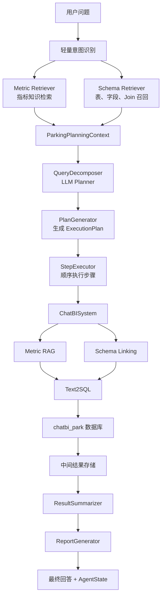

# Day11：智慧停车 ChatBI Agent 改造记录

> 本文完全基于当前项目源码与 Day11 实际改造结果。  
> 本次只修改 Agent、Planner 及其测试，没有修改 Schema、Schema Linking、Metric RAG、Text2SQL、Prompt 模块和 Report 实现。

## 1. 原 Agent 架构分析

### 1.1 Agent 入口

当前项目的 Agent 主入口是：

- 文件：`agent/workflow/agent_planner.py`
- 类：`PlanAndExecuteAgent`
- 初始化：`PlanAndExecuteAgent.__init__()`
- 调用入口：`PlanAndExecuteAgent.run()`
- 命令行入口：`agent/workflow/agent_planner.py::main()`

`run()` 原有主链路为：

```text
用户问题
  ↓
QueryDecomposer.decompose()
  ↓
PlanGenerator.build_plan()
  ↓
StepExecutor.execute_plan()
  ↓
ResultSummarizer.summarize()
  ↓
ReportGenerator.generate()
```

需要特别注意：当前 FastAPI 接口还没有调用 `PlanAndExecuteAgent`。

- 文件：`api/service.py`
- `/api/v1/query` 调用的是 `ChatBISystem`
- `ChatBISystem` 位于 `text2sql/main.py`

因此，Day11 改造完成后，Agent 可以通过 Python/CLI 运行，但线上 HTTP 请求仍走单次 ChatBI 链路。把 Agent 接入 API 属于后续集成工作，不能把它描述成当前已经完成的能力。

### 1.2 原 Agent 的核心模块

| 阶段 | 文件与类 | 核心方法 | 输入 | 输出 | 职责 |
|---|---|---|---|---|---|
| 问题拆解 | `agent/planner/query_decomposer.py::QueryDecomposer` | `decompose()` | 用户问题 | `DecompositionPlan` 字典 | 使用 LLM 把复杂问题拆成子任务 |
| 计划生成 | `agent/workflow/agent_planner.py::PlanGenerator` | `build_plan()` | 原问题、拆解结果 | `ExecutionPlan` | 将逻辑任务转换成可执行步骤 |
| 步骤执行 | `agent/workflow/agent_planner.py::StepExecutor` | `execute_plan()` | `ExecutionPlan` | `StepExecutionResult[]` | 顺序执行 Text2SQL 和数据库查询 |
| 中间结果 | `MemoryResultStore` / `TempTableResultStore` | `put()`、`get()` | SQL 结果 | 结果引用 | 保存多步执行中的中间数据 |
| 结果汇总 | `ResultSummarizer` | `summarize()` | 计划、步骤结果 | `ExecutionSummary` | 汇总成功、失败和关键发现 |
| 报告生成 | `agent/executor/report_generator.py::ReportGenerator` | `generate()` | 原问题、步骤结果、摘要 | `AnalysisReport` | 生成最终分析报告 |
| Text2SQL 能力 | `text2sql/main.py::ChatBISystem` | `run()` | 单个步骤问题 | SQL、查询数据、格式化结果、元数据 | 完成指标理解、Schema Linking、SQL 生成和执行 |

### 1.3 原执行流程

`PlanGenerator` 将每个 `DecomposedTask` 转成一个 `PlanStep`。  
`StepExecutor` 按步骤顺序执行，并通过 `ChatBISystem.run()` 复用已有 ChatBI 能力。

原有 `StepExecutor` 默认已经传入以下开关：

```python
{
    "use_schema_linking": True,
    "use_indicator_rag": True,
    "use_indicator_knowledge": True,
}
```

这说明执行阶段已经能够使用 Day8 的 Schema Linking 和 Day9 的指标 RAG，但原 Planner 在规划前看不到这些召回结果。

### 1.4 原状态、Context 和 Memory

原项目具有部分状态能力，但没有统一 Agent State：

- `ExecutionPlan`：保存执行计划。
- `StepExecutionResult`：保存单步结果。
- `MemoryResultStore`：在当前 Python 进程中保存中间结果。
- `TempTableResultStore`：可将中间结果写入临时表。
- `depends_on`：表达步骤依赖。

原项目不存在：

- 统一的请求级 `AgentState`。
- 跨请求 Session。
- 对话历史 Memory。
- 可恢复 Checkpoint。
- 持久化运行轨迹。

`MemoryResultStore` 的 “Memory” 仅指当前工作流的中间查询结果，不等于大模型对话记忆。

### 1.5 原 Agent 如何控制流程

原流程由 Python 代码确定性控制：

1. LLM 生成子任务。
2. `PlanGenerator` 生成步骤。
3. `StepExecutor` 按数组顺序逐个执行。
4. 当前步骤依赖失败时跳过。
5. `failure_policy="abort"` 时，一个步骤失败后停止后续步骤。
6. 全部步骤结束后统一总结并生成报告。

模型不能在每一步观察结果后自由决定下一个工具，也没有动态 Replan。

## 2. Agent 类型判断

当前项目属于：

> **Plan-and-Execute + 固定 Workflow 的组合 Agent**

判断依据：

- 有显式任务拆解：`QueryDecomposer.decompose()`。
- 有结构化执行计划：`ExecutionPlan`、`PlanStep`。
- Planner 与 Executor 分离。
- 有多步执行、依赖、中间结果和最终汇总。
- 主链路由 `PlanAndExecuteAgent.run()` 固定编排。

当前项目不是 ReAct Agent，原因是：

- 没有持续的 `Thought → Action → Observation` 循环。
- Executor 执行完一步后，不会让 LLM 根据观察结果重新选择工具。
- 没有动态增加、删除或改写后续任务。

当前项目不是 Multi-Agent，原因是：

- Planner、Executor、Summarizer 是同一进程中的职责模块，不是多个自治 Agent。
- 没有 Agent 间通信、角色协商或独立状态。

当前项目也不只是 Chain，原因是：

- 复杂问题会生成数量不固定的子任务。
- 任务之间可以通过 `depends_on` 构成执行依赖。
- 存在中间结果存储和失败控制。

## 3. 原 Agent 存在的问题

### 3.1 Planner 仍带有旧业务语义

原 `AVAILABLE_DIMENSIONS` 包含客户、产品、区域、产品线等销售业务维度。  
这会导致停车问题被错误拆成销售任务，或者 Planner 生成停车 Schema 中不存在的指标。

### 3.2 Planner 与 Metric RAG、Schema Linking 割裂

原链路中，Planner 只看到完整 Schema 和指标目录，召回能力只在每个执行步骤内部发生。

问题是：

- Planner 可能选择不存在的业务指标。
- Planner 不知道本次问题真正召回了哪些表和字段。
- 复杂问题的任务边界可能与实际数据能力不一致。

### 3.3 简单问题容易过度规划

“今天停车收入是多少”本质上只需要一个查询任务。  
如果 Planner 套用通用“趋势 + 驱动 + 维度 + 总结”模板，会增加 SQL 数量、延迟和失败概率。

### 3.4 缺少统一状态和工具轨迹

原返回结果中虽然有 plan、step_results、summary，但没有统一字段描述：

- 当前运行到哪个阶段。
- 识别了什么意图。
- 召回了哪些指标、表和字段。
- 调用了哪些能力。
- 哪一步出现错误。

这会影响日志、监控、调试和后续 API 返回设计。

### 3.5 Planner LLM 不可用时缺少业务兜底

原 Planner 遇到模型服务异常会直接中断。  
企业应用需要保证至少能对常见问题生成最小可执行计划。

### 3.6 SQL 重试不是真正的 SQL 自修复

`StepExecutor._execute_with_retry()` 会重新执行相同问题，但没有把数据库错误反馈给 SQL 生成器形成修正 Prompt。

因此当前能力是：

- 有固定次数重试。
- 没有错误驱动的 SQL Self-Correction。

### 3.7 API 尚未接入 Agent

当前 FastAPI 仍直接调用 `ChatBISystem`。  
因此复杂多步分析还没有成为 HTTP API 的正式能力。

## 4. 智慧停车 Agent 设计

### 4.1 改造目标

本次遵循最小改造原则，不重写 Agent 框架，只完成：

1. 把 Planner 迁移到智慧停车指标和维度。
2. 在规划前联合调用 Metric RAG 与 Schema Linking。
3. 让 Planner 使用真实召回上下文。
4. 给每个计划步骤声明工具链。
5. 增加请求级 `AgentState` 和工具轨迹。
6. 增加停车场景的 Planner Fallback。
7. 保持原 Executor、Text2SQL、Report 调用方式不变。

### 4.2 新 Workflow



这里存在两次业务上下文使用：

- 规划前召回：帮助 Planner 决定“查什么”。
- 每步执行时召回：帮助 Text2SQL 决定“如何查”。

这不是完全重复。两次召回服务于不同决策阶段，但未来可以通过 Context 透传减少重复检索。

### 4.3 Agent 各阶段与代码映射

| 新阶段 | 当前代码 |
|---|---|
| 意图理解 | `agent/workflow/agent_planner.py::_classify_parking_intent()` |
| Metric RAG 检索 | `ParkingContextResolver._retrieve_metrics()` → `rag.indicator_retriever.retrieve_indicator_context()` |
| Schema Linking | `ParkingContextResolver._retrieve_schema()` → `schema.schema_linker.schema_link()` |
| 任务规划 | `agent/planner/query_decomposer.py::QueryDecomposer.decompose()` |
| Fallback 规划 | `build_parking_fallback_plan()` |
| 执行计划生成 | `PlanGenerator.build_plan()` |
| Text2SQL + SQL 执行 | `StepExecutor._run_with_chatbi()` → `ChatBISystem.run()` |
| 中间结果 | `MemoryResultStore` / `TempTableResultStore` |
| 结果汇总 | `ResultSummarizer.summarize()` |
| 报告生成 | `ReportGenerator.generate()`，本次未修改 |
| 状态记录 | `AgentState`、`ToolTrace` |

## 5. 修改文件列表

### 5.1 `agent/planner/query_decomposer.py`

**修改原因**

原 Planner 使用销售业务维度，无法稳定规划停车运营问题；同时缺少停车指标白名单和模型故障兜底。

**修改前**

- 维度包含客户、产品、区域、产品线等。
- Planner 只接收用户问题。
- 不校验指标是否属于知识库。
- LLM 服务失败直接抛异常。
- 复杂问题策略仍是通用经营分析策略。

**修改后**

- 维度替换为停车场、城市、日期、月份、季度、支付方式、异常类型等。
- 从 `rag/indicators_full.json` 加载标准指标和别名。
- 指标别名统一为标准指标名。
- 校验 Planner 输出的指标和维度。
- Planner 接收规划前召回的指标、表和字段。
- 简单查询、趋势、排名、收入诊断、运营总览使用不同拆解策略。
- LLM 调用失败时使用 `build_parking_fallback_plan()`。
- 最终原因总结不再作为 Text2SQL 子任务，由后置 Summarizer/Report 完成。

**影响范围**

- 只影响 Agent 的任务规划。
- 不改变 Metric RAG、Schema Linking、Text2SQL 或 Report 实现。
- 原销售业务 Planner 计划不再受支持，这是迁移到智慧停车后的预期变化。

### 5.2 `agent/workflow/agent_planner.py`

**修改原因**

原 Workflow 没有规划前业务上下文、统一 AgentState 和工具轨迹。

**修改前**

- `PlanAndExecuteAgent.run()` 直接调用 Planner。
- `PlanStep` 不声明所需工具。
- `StepExecutionResult` 丢弃 `ChatBISystem` 返回的 metadata。
- 没有统一状态。

**修改后**

- 增加 `ParkingContextResolver`。
- 规划前调用指标检索和 Schema Linking。
- 增加轻量停车意图标签：query、trend、ranking、diagnosis、overview。
- 增加 `ParkingPlanningContext`。
- 增加 `AgentState`。
- 增加 `ToolTrace`。
- `PlanStep.tools` 声明 Metric Retriever、Schema Retriever、Text2SQL、SQL Executor。
- `StepExecutionResult.metadata` 保留底层 ChatBI 元数据。
- 最终返回值新增 `agent_state`，原返回字段保持不变。
- 有失败或跳过步骤时，状态为 `completed_with_errors`。

**影响范围**

- 新增字段是向后兼容的，原 plan、step_results、summary、report 返回结构仍保留。
- 默认真实运行会做规划前召回。
- 使用 `decomposition_override` 的测试默认不访问外部检索服务；也可以显式设置 `resolve_context=True`。
- 执行器仍然是顺序执行，没有改为并发。

### 5.3 `tests/test_query_decomposer.py`

**修改原因**

原测试断言的是销售指标和销售维度，已经不能验证新的停车 Planner。

**修改后验证**

- 停车 Planner Prompt 包含停车指标、维度和规划上下文。
- 不支持的停车维度会被拒绝。
- 任务数量过多时会重试。
- LLM 不可用时会产生停车 Fallback 计划。
- 简单查询只生成一个任务。

### 5.4 `tests/test_parking_agent.py`

**修改原因**

需要对新 Context、State、Tool Trace 和四类停车问题进行离线回归。

**新增验证**

- Metric Retriever 和 Schema Retriever 的工具轨迹。
- 每个计划步骤的 ChatBI 工具声明。
- AgentState 保存指标、表、步骤结果和底层 metadata。
- 四类停车问题的工作流规模。
- 检索服务失败时记录错误但不中断规划。
- SQL 步骤失败时状态为 `completed_with_errors`。

## 6. State 变化

### 6.1 新增请求级 AgentState

```json
{
  "user_query": "哪个停车场收入下降，原因是什么？",
  "intent": "diagnosis",
  "status": "executing",
  "metrics": ["停车净收入", "完成订单量", "退款金额"],
  "tables": ["agg_parking_daily", "dim_parking_lot"],
  "fields": ["agg_parking_daily.net_revenue"],
  "decomposition": {},
  "plan": {},
  "step_results": [],
  "summary": {},
  "report": {},
  "tool_traces": [],
  "errors": []
}
```

### 6.2 为什么需要这些字段

| 字段 | 作用 |
|---|---|
| `user_query` | 保留原始目标，避免多步执行中语义丢失 |
| `intent` | 区分简单查询、趋势、排名、诊断和总览 |
| `status` | 让 API、日志和监控知道当前执行阶段 |
| `metrics` | 记录本次问题命中的标准指标 |
| `tables` / `fields` | 记录 Schema Linking 结果，便于解释和排错 |
| `decomposition` / `plan` | 区分逻辑任务和物理执行步骤 |
| `step_results` | 保存 SQL、数据和每步状态 |
| `summary` / `report` | 保存后置汇总产物 |
| `tool_traces` | 记录工具调用结果和关键元数据 |
| `errors` | 汇总非致命检索错误和执行错误 |

### 6.3 当前 State 的边界

当前 `AgentState` 是一次 `run()` 调用中的状态快照：

- 没有存入 Redis 或数据库。
- 不能在进程重启后恢复。
- 不能跨轮对话共享。
- 没有 `run_id`、`session_id`、`user_id`。
- 当前代码只在结束时随返回值输出，不支持实时查询运行状态。
- 虽然模型中声明了 `failed` 状态，但当前顶层 `run()` 没有统一异常捕获；未处理异常发生时会直接抛出，调用方拿不到失败状态快照。

企业级下一步通常会增加：

- `run_id` 和幂等键。
- Redis/PostgreSQL Checkpoint。
- 状态版本号和节点耗时。
- 用户、租户、数据权限上下文。
- 可取消、可恢复的长任务。

## 7. Tool 变化

### 7.1 当前已有工具能力

| 工具名 | 实际实现 | 是否已有 |
|---|---|---|
| Metric Retriever | `retrieve_indicator_context()` | Day9 已有，本次增加 Agent 包装 |
| Schema Retriever | `schema_link()` | Day8 已有，本次增加 Agent 包装 |
| Text2SQL | `ChatBISystem.run()` 内部链路 | 已有 |
| SQL Executor | `ChatBISystem.run()` 内部数据库执行 | 已有 |
| Intermediate Result Store | Memory / Temp Table | 已有 |
| Report Generator | `ReportGenerator.generate()` | 已有，本次未修改 |

### 7.2 当前 Tool Calling 的真实形态

当前不是 OpenAI Function Calling 或模型动态工具选择。

它是：

> Python Workflow 按固定顺序直接调用函数和类。

`PlanStep.tools` 目前是声明和可观测信息；执行阶段仍通过一次 `ChatBISystem.run()` 完成 Metric RAG、Schema Linking、Text2SQL 和 SQL 执行，并没有四个可独立调度的 Tool 对象。

这种设计适合 MVP：

- 控制稳定。
- 容易测试。
- 不需要模型决定所有工具。

但其扩展性有限：

- 无统一工具协议。
- 无参数 Schema。
- 无超时、熔断、权限和审计中间件。
- Planner 不能基于工具返回动态 Replan。

### 7.3 后续工具抽象建议

未来可统一为：

```text
Tool
├── name
├── description
├── input_schema
├── output_schema
├── timeout
├── execute()
└── permission_policy
```

但 Day11 没有做这一层重构，因为会扩大改动范围并影响 Text2SQL、RAG 和 Schema Linking。

## 8. 复杂问题拆解

### 8.1 示例

用户问题：

> 分析最近三个月停车收入下降原因

Fallback Planner 会拆为：

1. 查询停车净收入趋势，定位下降区间。
2. 查询完成订单量变化，判断是否由订单减少驱动。
3. 按停车场比较收入贡献，定位主要下降停车场。
4. 查询退款、车位利用率和异常事件，补充运营原因证据。
5. Summarizer 和 Report 根据以上数据生成最终原因总结。

这里最重要的设计是：

- Task 1～4 是数据证据任务，可以交给 Text2SQL。
- Task 5 不是 SQL 查询任务，因此不应再次交给 Text2SQL。
- 最终归因必须区分“数据证据”和“模型推断”，避免模型凭空解释。

### 8.2 LLM Planner 与 Fallback Planner

当前有两条路径：

```text
LLM 可用
  → 依据 Schema、指标目录和召回上下文动态规划

LLM 不可用
  → build_parking_fallback_plan() 生成确定性最小计划
```

Fallback 主要覆盖：

- 简单指标查询。
- 单指标趋势。
- 停车场排名。
- 收入下降诊断。
- 停车运营总览。

Fallback 不是完整业务规划器，它不能覆盖所有自由表达，但可以保证核心 MVP 场景不中断。

## 9. 异常处理分析

| 异常 | 当前行为 | 是否完整 |
|---|---|---|
| Metric RAG 失败 | 记录 ToolTrace 和 errors，继续执行 | 有降级 |
| Schema Linking 失败 | 记录错误，Text2SQL 可使用静态 Schema 兜底 | 有降级 |
| Planner LLM 调用失败 | 使用停车规则 Fallback 计划 | 本次补充 |
| Planner 输出非法 JSON | 解析失败直接报错 | 仍不足 |
| Planner 指标/维度非法 | 将错误反馈给 Planner 并重试一次 | 已有校验 |
| SQL 执行失败 | 按 `max_retries` 重跑同一问题 | 有简单重试 |
| 依赖任务失败 | 跳过依赖它的步骤 | 已有 |
| 执行策略为 abort | 后续步骤停止 | 已有 |
| Report 模型失败 | `ReportGenerator` 使用 Fallback 报告 | 已有，本次未修改 |

仍需改进：

- Planner 非法 JSON 也应触发一次结构化重试或 Fallback。
- SQL 重试需要携带数据库错误进行 SQL 修正。
- 检索为空时可以 Query Rewrite 后重试。
- 复杂问题缺少动态 Replan。
- 模糊时间范围缺少澄清，例如“哪个停车场收入下降”没有说明比较周期。

## 10. 测试结果

### 10.1 自动化回归

Day11 定向回归覆盖：

- Planner 停车业务迁移。
- Agent Context。
- Tool Trace。
- AgentState。
- 四类问题工作流。
- 检索异常降级。
- 执行失败状态。
- 原 Agent Planner/Executor 行为。

回归命令：

```bash
uv run pytest -q tests rag/test_parking_indicator_rag.py \
  --deselect tests/test_prompt_and_config.py::test_llm_client_allows_longer_sql_output
```

结果：

```text
55 passed, 1 deselected
```

被排除的既有测试要求 `LLMClient.max_tokens >= 4000`，当前实现值为 `1000`。该问题位于 Text2SQL 配置范围，不是 Day11 Agent 改造引入；按照“今天只修改 Agent”的约束，本次没有修改它。

### 10.2 真实 Metric RAG + Schema Linking + LLM Planner 验证

以下是连接真实模型与本地知识索引得到的规划结果。数据库连接验证失败，因此本节只代表“真实检索与真实规划”，不代表 SQL 已在 `chatbi_park` 中成功执行。

#### 问题 1：今天停车收入是多少？

```text
用户问题
  ↓
召回指标：停车净收入
  ↓
召回表：agg_parking_daily
  ↓
Agent 计划：1 个任务
  - 查询今日停车净收入
  - 指标：停车净收入
  - 维度：日期
  ↓
预期执行：Text2SQL → SQL Execute
  ↓
最终结果：因测试环境数据库不可用，未生成真实收入数值
```

评价：简单问题没有被过度拆解，符合预期。

#### 问题 2：最近三个月收入趋势

```text
用户问题
  ↓
召回指标：停车净收入
  ↓
召回表：agg_parking_daily
  ↓
Agent 计划：1 个任务
  - 查询最近三个月按月停车净收入趋势
  - 指标：停车净收入
  - 维度：月份
  ↓
预期执行：按月聚合 SQL
  ↓
最终结果：因测试环境数据库不可用，未生成真实趋势数据
```

评价：单指标趋势保持单任务，延迟和 SQL 数量可控。

#### 问题 3：哪个停车场收入下降，原因是什么？

```text
用户问题
  ↓
意图：diagnosis
  ↓
召回指标：
  停车净收入、完成订单量、退款金额、车位利用率、异常事件数
  ↓
召回表：
  agg_parking_daily、fact_operation_event、dim_parking_lot
  ↓
LLM Agent 计划：5 个数据证据任务
  1. 各停车场近期停车净收入趋势
  2. 各停车场完成订单量趋势
  3. 各停车场退款金额趋势
  4. 各停车场车位利用率趋势
  5. 异常事件数和预计损失
  ↓
预期：多步 SQL → 结果汇总 → 原因报告
  ↓
最终结果：因数据库不可用，未生成基于真实数据的原因结论
```

评价：

- 已具备多指标、多停车场、多步骤规划能力。
- 计划围绕证据展开，没有直接让模型编造原因。
- 问题没有明确比较周期，Planner 自行使用“近期/近 30 天”属于业务假设。企业上线时应增加时间澄清节点。

#### 问题 4：分析最近一个季度停车运营情况

```text
用户问题
  ↓
意图：overview
  ↓
规划前召回：
  停车净收入、平均停车时长、完成订单量
  agg_parking_daily
  ↓
LLM Agent 计划：5 个任务
  1. 停车净收入与完成订单量趋势
  2. 平均停车时长与车位利用率趋势
  3. 停车场收入排名
  4. 停车场订单排名
  5. 异常事件、人工抬杆、免费放行分析
  ↓
预期：多维运营分析 → Report
  ↓
最终结果：因数据库不可用，未生成真实季度运营报告
```

评价：

- Planner 使用完整指标目录补充了预召回中未直接命中的运营指标。
- 说明规划前 RAG 是增强信息，不是限制 Planner 的硬白名单。
- 后续可对 overview 意图增加指标组合召回，提高预召回完整度。

### 10.3 离线完整 Workflow 验证

为了在数据库不可用时验证 Agent 编排，本次测试使用假的 Step Runner 返回结构化 SQL 结果，并注入假的报告模型结果。

验证结果：

- 简单查询：1 步成功。
- 趋势查询：1 步成功。
- 收入诊断：Fallback 4 步成功。
- 运营总览：Fallback 4 步成功。
- State、Tool Trace、Summary、Report 全链路返回正常。

这只能证明 Workflow 编排正确，不能代替真实数据库集成测试。

## 11. 代码 Review

### 11.1 当前优点

**支持多步骤任务**

- 复杂问题可以拆成多个数据证据任务。
- 使用 `depends_on` 表达依赖。
- 支持中间结果传递。

**支持指标检索和 Schema Linking**

- Planner 在生成计划前可看到指标、表和字段。
- Executor 内部继续使用 ChatBI 的 RAG 和 Schema Linking。

**保持架构边界**

- 没有重写 Text2SQL。
- 没有修改 Day8、Day9 和 Day10 模块。
- Report 保持原实现，留给 Day12。

**具备基础可观测性**

- State 能看到意图、上下文、计划、结果和错误。
- Tool Trace 能记录召回与执行结果。

**具备核心降级能力**

- Planner 模型不可用时有停车规则 Fallback。
- 检索失败不会立即导致整个 Agent 崩溃。

### 11.2 当前不足

**还不是动态自治 Agent**

- 工具顺序固定。
- 没有 ReAct 循环。
- 没有根据中间结果重新规划。

**工具抽象不完整**

- `PlanStep.tools` 是声明，不是独立 Tool Dispatcher。
- Text2SQL 和 SQL Execute 在 `ChatBISystem` 内绑定。

**State 不可持久化**

- 不支持断点恢复。
- 不支持跨轮 Memory。
- 不支持分布式任务。

**执行效率仍可提升**

- Context Resolver 当前顺序调用 Metric RAG 和 Schema Linking。
- Executor 也是顺序执行。
- 无依赖的多个任务理论上可以并行，但当前没有并发调度。

**错误恢复仍不完整**

- 没有 SQL Self-Correction。
- 没有检索 Query Rewrite。
- 没有动态 Replan。

**入口没有统一**

- FastAPI 仍直接使用 `ChatBISystem`。
- Agent 尚未形成独立 API 合约。

### 11.3 企业级优化优先级

1. 将 `PlanAndExecuteAgent` 接入独立 API，并添加 `run_id`。
2. 增加数据库可用环境下的真实端到端测试。
3. 根据 SQL 错误实现修正 Prompt 和安全校验。
4. 增加澄清节点，解决时间范围和比较基准歧义。
5. 将 AgentState 持久化为 Checkpoint。
6. 对无依赖任务做受控并发。
7. 建立统一 Tool 协议、超时、权限、审计和熔断。
8. 增加 Replan 和结果充分性评估。

## 12. 后续 Day12 Report 改造计划

Day12 建议只处理 Report，不反向修改 Agent：

1. 将 Report 角色明确为智慧停车运营分析师。
2. 区分事实、推断和数据不足。
3. 报告中显示统计时间范围、指标口径和停车场范围。
4. 收入诊断报告按“现象 → 证据 → 原因 → 建议”组织。
5. 运营总览报告按收入、订单、利用率、时长、异常组织。
6. 对失败或缺失步骤明确提示，不生成伪结论。
7. 增加适合前端展示的结构化图表建议。
8. 保持 Report 只消费 Agent 输出，不重新查询数据库。

## 13. 面试总结

如果面试官问：

> 你们 ChatBI 中的 Agent 是如何设计的？

可以这样回答：

我们的智慧停车 ChatBI 采用的是 Plan-and-Execute 和固定 Workflow 结合的 Agent 架构，不是简单地把用户问题直接交给大模型生成 SQL。整个流程主要解决两个问题：复杂问题如何拆解，以及指标、Schema、SQL 和分析结果如何稳定编排。

用户问题进入 Agent 后，我们先做一个轻量意图识别，把问题分成简单查询、趋势、停车场排名、原因诊断和运营总览。接着在 Planner 之前联合调用两个业务工具：一个是 Metric RAG，用于召回停车净收入、完成订单量、车位利用率等标准指标及计算口径；另一个是 Schema Linking，用于召回候选表、字段、锚表和 Join 路径。这样 Planner 不只看到用户原话，还能看到本次问题真实相关的指标和数据库结构。

Planner 使用结构化 JSON 输出任务列表。例如用户问“哪个停车场收入下降，原因是什么”，它不会直接让模型给一个原因，而是拆成收入趋势、完成订单量、退款金额、车位利用率和异常事件等数据证据任务。Planner 输出后，PlanGenerator 会把任务转换为 ExecutionPlan，每个步骤包含指标、维度、依赖关系和工具声明。

Executor 按计划执行每个步骤。当前每个步骤复用已有的 ChatBISystem，内部依次完成指标知识增强、Schema Linking、Text2SQL 和数据库查询。步骤结果可以存到内存或临时表，后续依赖步骤可以读取前序结果。全部步骤完成后，ResultSummarizer 负责汇总执行状态和关键发现，ReportGenerator 再生成最终的智慧停车运营报告。也就是说，SQL 子任务只负责查证据，最终归因和业务建议在后置报告阶段完成。

为了提升工程稳定性，我们增加了请求级 AgentState，记录用户问题、意图、指标、表字段、计划、步骤结果、工具轨迹和错误。Planner 模型不可用时，会使用停车业务规则生成最小 Fallback 计划；指标检索或 Schema Linking 失败时，也会记录错误并使用下游兜底能力继续运行。

这个项目目前仍是可控 Workflow Agent，而不是完全自治的 ReAct Agent。工具由 Python 固定编排，步骤按顺序执行，还没有动态 Replan、持久化 Memory 和 SQL 自修复。我们选择这种方案是因为 ChatBI 涉及数据库查询，MVP 阶段优先保证链路可解释、可测试和可审计。下一步会把 Agent 接入 FastAPI，增加运行状态持久化、SQL 错误驱动修正和无依赖任务并发。

## 14. 今日学习总结

### 14.1 Agent 为什么需要 Workflow

ChatBI 涉及指标口径、Schema、SQL、安全执行和报告生成。  
固定 Workflow 可以明确每一步输入输出，降低模型自由调用数据库带来的不可控风险。

### 14.2 Planner 和 Agent 的区别

- Planner 负责决定“需要完成哪些任务”。
- Agent 负责组织 Planner、工具、Executor、状态和最终输出。
- Planner 是 Agent 的一个模块，不等于完整 Agent。

### 14.3 Agent 如何编排多个能力

本项目采用 Python 编排：

```text
意图
→ Metric RAG
→ Schema Linking
→ Planner
→ Text2SQL
→ SQL Execute
→ Summary
→ Report
```

每个模块解决一个明确问题，Agent 负责把这些能力组成一个可运行闭环。

### 14.4 ChatBI 为什么需要 Agent

简单指标查询可以直接 Text2SQL，但“为什么收入下降”需要多份证据：

- 收入趋势。
- 订单变化。
- 停车场贡献。
- 退款、利用率和异常事件。

Agent 的价值不是“多调用几次大模型”，而是把复杂业务目标转成可执行、可追踪、可汇总的数据任务。

### 14.5 今天真正应该掌握的源码

建议按以下顺序阅读：

1. `agent/workflow/agent_planner.py::PlanAndExecuteAgent.run()`
2. `agent/workflow/agent_planner.py::ParkingContextResolver`
3. `agent/planner/query_decomposer.py::QueryDecomposer.decompose()`
4. `agent/planner/query_decomposer.py::build_parking_fallback_plan()`
5. `agent/workflow/agent_planner.py::PlanGenerator.build_plan()`
6. `agent/workflow/agent_planner.py::StepExecutor.execute_plan()`
7. `text2sql/main.py::ChatBISystem.run()`
8. `agent/workflow/agent_planner.py::ResultSummarizer.summarize()`
9. `agent/executor/report_generator.py::ReportGenerator.generate()`

阅读时要始终区分：

- 任务规划和步骤执行。
- 指标语义和数据库 Schema。
- 中间数据事实和最终业务推断。
- 请求级 State 和跨会话 Memory。
