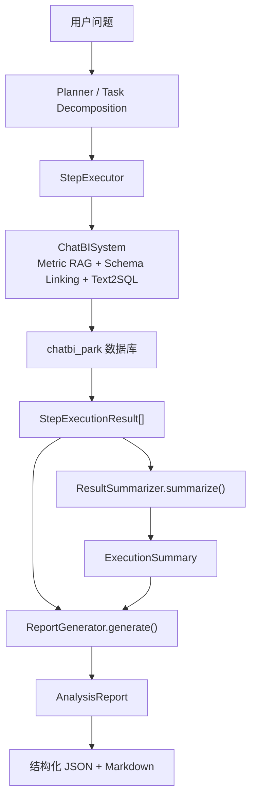

# Day12：智慧停车运营分析 Report 改造记录

> 本文基于当前项目源码和 Day12 实际改造结果。  
> 本次只修改 Report 模块、Report 测试和本文档，没有修改 Schema、Schema Linking、Metric RAG、Text2SQL Prompt 或 Agent Workflow。

## 1. 当前 Report 架构

### 1.1 Report 在 Agent 中的位置

当前 Report 位于 Agent 工作流的最后一层：



Report 不参与 SQL 生成，也不重新查询数据库。它只消费已经执行完成的步骤结果。

### 1.2 Report Prompt

Report Prompt 没有放在全局 `prompts/` 目录中，而是定义在 Report 模块内部：

- 文件：`agent/executor/report_generator.py`
- System Prompt：`ReportGenerator._build_system_message()`
- User Prompt：`ReportGenerator._build_prompt()`

这是 Report 专用 Prompt，不是 Text2SQL Prompt。Day12 修改它不会影响 SQL 生成逻辑。

### 1.3 Report Generator

- 文件：`agent/executor/report_generator.py`
- 类：`ReportGenerator`
- 入口：`generate()`

输入：

```text
original_question
analysis_goal
step_results
summary
```

输出：

```text
AnalysisReport
```

`generate()` 的执行方式：

1. 判断是否存在 LLM 文本生成器。
2. 压缩步骤结果并构建 Report Prompt。
3. 调用 LLM 生成 JSON。
4. 使用 Pydantic 校验 JSON。
5. 渲染 Markdown。
6. LLM 不可用、JSON 非法或字段校验失败时，进入确定性 Fallback。

### 1.4 Summary 模块

- 文件：`agent/workflow/agent_planner.py`
- 类：`ResultSummarizer`
- 方法：`summarize()`
- 输出模型：`ExecutionSummary`

Summary 负责：

- 统计成功、失败和跳过步骤数量。
- 从每个步骤提取一条简短结果。
- 形成执行层摘要。

Summary 不负责：

- 计算同比或环比。
- 生成完整运营报告。
- 判断根因。
- 给出停车运营建议。

因此，Summary 是执行摘要，Report 才是面向业务人员的表达层。

### 1.5 最终输出位置

- 文件：`agent/workflow/agent_planner.py`
- 类：`PlanAndExecuteAgent`
- 方法：`run()`

调用关系：

```text
PlanAndExecuteAgent.run()
  ├─ ResultSummarizer.summarize()
  └─ ReportGenerator.generate()
       └─ AnalysisReport.model_dump()
```

最终结果同时出现在：

```python
result["report"]
result["agent_state"]["report"]
```

当前 FastAPI 入口仍直接调用 `ChatBISystem`，还没有调用 `PlanAndExecuteAgent`。因此 Report Agent 当前可通过 Agent Python/CLI 链路使用，但还没有作为 HTTP API 的正式输出。

## 2. 当前 Report 存在的问题

### 2.1 原 Report 是否只是 SQL 结果加文本总结

严格来说，不完全是。

它已经具备：

- 多步骤结果输入。
- LLM 结构化 JSON 输出。
- Pydantic 校验。
- Markdown 渲染。
- 模型失败时的 Fallback。

但原实现仍接近“查询结果摘要器”，原因是：

- 只有执行摘要、关键发现、归因、趋势判断和行动建议。
- 没有关键指标卡。
- 没有单独的排名分析和异常分析。
- 没有数据范围和数据限制。
- 没有要求每条原因必须对应证据。
- 没有图表建议。

### 2.2 原 Prompt 仍是通用经营分析

原 System Prompt 的角色是“企业经营分析师”，没有智慧停车业务定位。

它没有约束：

- 收入必须使用停车净收入口径。
- 利用率是比率，不能直接求和。
- 原因必须由订单、利用率、退款或异常事件等证据支持。
- 同比和环比必须存在比较期数据。
- 失败步骤不能作为事实证据。

### 2.3 原上下文压缩丢失分析证据

原 `_compress_step_result()` 只传递：

```python
"rows_preview": rows[:3]
```

这会产生两个问题：

1. 三个月以上的时间序列可能看不到末期数据，无法判断完整趋势。
2. 停车场排名只看到前三条，无法分析尾部停车场。

同时原上下文没有明确提供：

- 总行数。
- 字段列表。
- 尾部样本。
- SQL 时间过滤范围。
- 当前步骤识别的指标。

### 2.4 原 Fallback 仍包含销售业务

原行动建议包括：

- 复核关键产品线。
- 复核区域。
- 复核费用项。

这些内容与智慧停车业务不一致，而且在没有相应数据时会造成误导。

### 2.5 原原因分析缺少证据等级

原 Prompt 只要求“归因分析”，但没有要求：

```text
现象
  ↓
驱动指标变化
  ↓
停车场或时段定位
  ↓
异常证据
  ↓
谨慎结论
```

这会使 LLM 把业务常识写成已经被数据证明的根因。

## 3. 智慧停车 Report 设计

### 3.1 设计目标

新的 Report 面向：

- 停车运营负责人。
- 区域经理。
- 停车场现场管理人员。
- 经营分析人员。

报告需要同时满足：

- 快速看到结论。
- 能追溯数据证据。
- 能区分事实和推断。
- 能识别异常对象。
- 能执行下一步运营动作。

### 3.2 报告结构

```text
一、问题概述
  用户问了什么
  分析目标是什么
  统计范围是什么

二、核心结论
  一句话直接回答用户问题

三、关键指标
  指标名称
  当前值
  同比/环比/排名
  业务解释
  证据步骤

四、关键发现
  从查询结果提炼的事实

五、趋势分析
  变化方向
  起止值
  变化幅度
  拐点

六、排名与异常分析
  停车场排名
  异常停车场
  异常时段
  异常事件

七、原因分析
  现象
  驱动证据
  谨慎原因判断

八、运营建议
  与发现一一对应的可执行动作

九、数据限制
  失败步骤
  缺少比较期
  缺少维度
  口径限制

十、可视化建议
  图表类型
  图表目的
  数据来源步骤
```

### 3.3 新结构化模型

`AnalysisReport` 保留了原有字段：

- `title`
- `executive_summary`
- `key_findings`
- `root_causes`
- `trend_judgment`
- `action_suggestions`
- `markdown`

新增字段：

- `question_overview`
- `data_scope`
- `key_metrics`
- `trend_analysis`
- `ranking_analysis`
- `anomaly_analysis`
- `data_limitations`
- `visualization_suggestions`

新增两个子模型：

```text
MetricInsight
  ├─ metric_name
  ├─ value
  ├─ comparison
  ├─ interpretation
  └─ evidence_step

VisualizationSuggestion
  ├─ chart_type
  ├─ title
  ├─ purpose
  └─ source_step
```

新增字段都有默认值，因此旧的 Report JSON 仍可以被解析，Agent Workflow 不需要修改。

## 4. 修改文件

### 4.1 `agent/executor/report_generator.py`

**修改原因**

原报告结构和 Prompt 无法稳定生成智慧停车运营分析。

**修改前**

- 通用企业经营分析师角色。
- 每个步骤只保留前三行。
- 没有指标卡、排名、异常和数据限制。
- Fallback 使用销售业务建议。
- 原因分析没有证据链要求。

**修改后**

- 角色调整为智慧停车运营分析 Report Agent。
- 报告读者明确为运营负责人和区域经理。
- 新增结构化运营分析字段。
- 只允许成功步骤作为事实证据。
- 同比、环比必须有比较期数据。
- 原因必须形成证据链。
- 扩展代表性数据窗口，同时控制 Token。
- Fallback 使用停车收入、订单、利用率、退款和异常事件等业务语言。
- 从单行汇总结果确定性提取停车核心指标。
- 根据实际字段生成图表建议。

**影响范围**

- `ReportGenerator.generate()` 方法签名不变。
- Agent Workflow 不需要修改。
- 原有六个报告字段仍保留。
- Report JSON 会新增字段，前端可以逐步接入。
- 模型失败时的报告内容发生预期变化，不再返回销售业务建议。

### 4.2 `tests/test_report_generator.py`

**修改原因**

原测试使用利润、产品线和材料成本样例，无法验证停车 Report。

**修改后**

- 使用停车净收入、停车场、利用率和异常事件数据。
- 验证完整结构化运营报告。
- 验证 Prompt 的证据约束。
- 验证大结果集的 Token 控制。
- 验证单值指标卡。
- 验证原因分析不把相关性写成确定因果。
- 验证失败步骤进入数据限制。
- 覆盖五类用户问题。

## 5. Report Prompt

### 5.1 System Prompt 的职责

新的 System Prompt 定义：

- 角色：智慧停车运营分析 Report Agent。
- 读者：运营负责人和区域经理。
- 目标：把数据转化为经营结论、异常线索和行动建议。
- 事实边界：只能使用成功步骤数据。
- 归因边界：相关性不能直接写成因果。
- 输出约束：必须是合法 JSON。

### 5.2 User Prompt 的职责

User Prompt 注入：

- 用户原问题。
- Agent 分析目标。
- 执行摘要。
- 每个步骤的状态。
- SQL。
- 字段列表。
- 总行数。
- 代表性数据行。
- 尾部数据行。
- 指标识别信息。
- 错误信息。

同时明确 12 条分析规则。

### 5.3 最关键的 Prompt 约束

#### 约束一：只使用成功步骤

```text
只把 status=completed 且 success=true 的步骤作为事实证据。
```

失败 SQL 不能成为业务结论。

#### 约束二：同比和环比需要比较期

```text
同比、环比只有在上下文存在对应比较期数据时才能输出。
```

Report 不能因为用户提到“下降”就自己生成下降百分比。

#### 约束三：原因必须有证据链

```text
现象 → 驱动指标/异常证据 → 谨慎结论
```

例如：

```text
事实：
A停车场收入下降12%

驱动证据：
完成订单量下降9%
车位利用率下降6个百分点

谨慎结论：
订单和利用率下降是当前主要关联因素
```

不能直接写：

```text
因为收费太高，所以收入下降
```

除非数据中存在收费规则变化和对应影响证据。

#### 约束四：建议必须对应发现

如果发现是支付失败事件增加，建议可以是：

```text
检查支付通道和出口缴费设备。
```

不能无依据建议：

```text
增加停车场车位。
```

### 5.4 Prompt 输出结构

LLM 只返回 JSON，不直接返回 Markdown。

原因：

- 便于 Pydantic 校验。
- 便于前端分别展示指标卡、趋势和建议。
- 便于后续生成 PDF、邮件和大屏。
- Markdown 只是结构化报告的一种渲染方式。

## 6. 输出模板

示例：

```json
{
  "title": "最近一个季度智慧停车运营分析报告",
  "question_overview": "分析季度停车收入、订单、利用率和异常情况",
  "executive_summary": "季度停车净收入逐月下降，A停车场下降贡献最大",
  "data_scope": "2026年第二季度，覆盖A、B两个停车场",
  "key_metrics": [
    {
      "metric_name": "停车净收入",
      "value": "960,000.00 元",
      "comparison": "季度内月末较月初下降22.22%",
      "interpretation": "收入呈持续下降趋势",
      "evidence_step": "step_1"
    }
  ],
  "key_findings": [
    "月度停车净收入从36万元下降到28万元"
  ],
  "trend_analysis": [
    "停车净收入连续三个月下降"
  ],
  "ranking_analysis": [
    "B停车场收入高于A停车场"
  ],
  "anomaly_analysis": [
    "A停车场支付失败事件增加"
  ],
  "root_causes": [
    "A停车场订单量和利用率同步下降，是收入下降的重要关联因素"
  ],
  "trend_judgment": "若订单和利用率未恢复，短期收入仍有压力",
  "action_suggestions": [
    "优先排查A停车场支付设备"
  ],
  "data_limitations": [
    "缺少去年同期数据，不能给出同比结论"
  ],
  "visualization_suggestions": [
    {
      "chart_type": "line",
      "title": "月度停车净收入趋势",
      "purpose": "观察收入变化和拐点",
      "source_step": "step_1"
    }
  ]
}
```

## 7. 运营分析能力

| 能力 | 改造前 | 改造后 | 当前边界 |
|---|---|---|---|
| 数据总结 | 有执行摘要 | 增加核心结论和指标卡 | 依赖成功查询结果 |
| 趋势分析 | 只有一个自由文本字段 | 增加趋势数组、整体判断和折线图建议 | 不负责补查缺失时间点 |
| 排名分析 | 无独立结构 | 增加 `ranking_analysis` | SQL 必须返回完整排名数据 |
| 同比分析 | 无明确约束 | 有比较期才允许输出 | Report 不主动查询去年数据 |
| 环比分析 | 无明确约束 | 有上期数据才允许输出 | Report 不主动生成环比 SQL |
| 异常分析 | 混在关键发现中 | 增加 `anomaly_analysis` | 只识别已有查询证据 |
| 原因分析 | 有 `root_causes`，证据约束弱 | 强制证据链和谨慎表述 | 当前没有自动事实校验器 |
| 建议生成 | 有通用建议 | 生成停车业务可执行建议 | 仍由 LLM 生成，需要人工评估 |
| 数据限制 | 无独立字段 | 增加 `data_limitations` | 依赖上下文完整性 |
| 可视化建议 | 不支持 | 根据实际字段推荐图表 | 当前不真正绘图 |

### 7.1 一个重要边界

Report Agent 可以解释同比、环比，但不能凭空创造同比、环比。

正确链路：

```text
Planner 识别同比需求
  ↓
Text2SQL 查询当前期和比较期
  ↓
Report 解释同比结果
```

错误链路：

```text
SQL 只返回当前值
  ↓
Report 猜测同比下降
```

## 8. Report 可视化建议

当前不真正绘图，只输出结构化图表建议。

### 8.1 折线图

适用：

- 收入趋势。
- 订单量趋势。
- 利用率趋势。
- 小时车流趋势。

数据要求：

- 时间字段。
- 至少一个数值指标。

### 8.2 柱状图

适用：

- 不同停车场收入对比。
- 不同停车场订单量对比。
- 不同异常类型数量对比。
- 不同时段车流量对比。

### 8.3 饼图

适用：

- 支付方式构成。
- 订单类型构成。
- 异常事件类型构成。

注意：类别过多时不适合饼图，应切换为条形图。

### 8.4 排行图

适用：

- 停车场收入排名。
- 利用率排名。
- 异常事件排名。
- 退款金额排名。

当前代码检测到停车场字段和数值字段时，会推荐 `ranking`。

### 8.5 KPI 指标卡

适用：

- 今日停车收入。
- 当前空闲车位数。
- 今日订单量。
- 平均停车时长。

当前代码只从单行汇总结果中提取指标卡，避免把趋势第一行误当成总体指标。

## 9. 测试结果

### 9.1 测试方法

由于当前数据库连接不可用，本次没有把模拟数据描述成真实经营结果。

测试分为：

1. 结构化 LLM 输出模拟：验证 JSON 解析、字段和 Markdown 渲染。
2. 非法 LLM 输出：验证停车业务 Fallback。
3. Agent 兼容回归：验证 Agent 调用 Report 的接口没有变化。

### 9.2 五类问题

#### 问题一：今天停车收入是多少？

输入数据：

```text
parking_revenue = 125800.5
```

验证结果：

- 生成“停车净收入”指标卡。
- 格式化为 `125,800.50 元`。
- 推荐 KPI Card。
- 不生成无依据的趋势和原因。

#### 问题二：最近三个月收入趋势

输入数据：

```text
2026-04：360000
2026-05：320000
2026-06：280000
```

验证结果：

- 进入趋势分析部分。
- 推荐折线图。
- Prompt 要求说明起止值和变化幅度。
- Fallback 不会擅自补算上下文中不存在的同比。

#### 问题三：哪个停车场收入下降？

输入数据：

```text
A停车场：revenue_change = -80000
B停车场：revenue_change = -10000
```

验证结果：

- 进入异常分析。
- 可以定位下降金额更大的停车场。
- 推荐停车场排行图。

测试过程中曾使用只有“收入排名”、没有“下降幅度”的数据。Report 正确拒绝生成异常结论。随后补充 `revenue_change` 后测试通过。这说明证据约束生效。

#### 问题四：分析最近一个季度停车运营情况

输入包含：

- 月度停车净收入。
- 停车场收入排名。
- 停车场利用率。
- 异常事件类型。

验证结果：

- 可以形成完整运营报告结构。
- 包含核心指标、趋势、排名、异常、建议和图表建议。

#### 问题五：为什么某停车场收入下降？

输入包含：

- 收入趋势。
- 停车场下降贡献。
- 一个模拟失败的退款与异常查询。

验证结果：

- 原因分析使用保守表述。
- 不把相关性直接认定为因果。
- 失败步骤写入数据限制。
- 建议继续核对订单、退款、利用率和异常事件。

### 9.3 自动化结果

Report 专项和 Agent 兼容测试：

```bash
uv run pytest -q \
  tests/test_report_generator.py \
  tests/test_parking_agent.py \
  tests/test_agent_planner.py
```

结果：

```text
26 passed
```

全项目相关回归：

```bash
uv run pytest -q tests rag/test_parking_indicator_rag.py \
  --deselect tests/test_prompt_and_config.py::test_llm_client_allows_longer_sql_output
```

结果：

```text
62 passed, 1 deselected
```

被排除的是 Day11 已确认的既有 Text2SQL 配置测试：测试要求 `LLMClient.max_tokens >= 4000`，当前实现值为 `1000`。它不是 Report 改造导致的问题，本次按照范围约束没有修改。

## 10. 代码 Review

### 10.1 是否适合运营人员

相比改造前更适合：

- 开头直接回答用户问题。
- 指标值带单位。
- 趋势、排名、异常分区展示。
- 原因和建议分开。
- 明确告诉读者哪些结论受数据限制。

### 10.2 可读性

优点：

- 结构化 JSON 适合前端组件展示。
- Markdown 适合 CLI 和文档展示。
- 指标卡保留证据步骤。
- 图表建议包含数据来源。

不足：

- 当前 Markdown 只是后端渲染，没有前端交互。
- 指标名称和单位仍依赖 LLM 或字段映射。
- 复杂表格没有自动生成小计和总计。

### 10.3 解释能力

优点：

- 强制区分事实、原因和建议。
- 原因分析要求证据链。
- 缺少比较期时禁止生成同比、环比。
- Fallback 不生成确定性根因。

不足：

- 当前只是 Prompt 约束，没有自动验证 LLM 中每个数字是否存在于输入。
- 没有给每条结论生成结构化 Citation。
- 没有置信度评分。
- 没有因果模型，只能做数据支持的关联解释。

### 10.4 是否支持业务决策

当前可以支持初步运营决策：

- 识别收入下降停车场。
- 识别低利用率停车场。
- 识别异常事件集中的对象。
- 给出下一步排查和运营动作。

不能直接支持高风险自动决策：

- 自动修改收费规则。
- 自动执行营销活动。
- 自动处罚停车场。
- 根据单次模型报告直接调整预算。

这些动作需要人工审批和更完整的数据验证。

### 10.5 企业级优化建议

优先级一：事实一致性校验

- 将报告中的数值与步骤结果逐项匹配。
- 每条结论绑定 `step_id + row_id + field`。
- 检测模型输出中不存在的数字和停车场名称。

优先级二：报告类型模板

- 指标快报。
- 趋势报告。
- 排名报告。
- 异常诊断报告。
- 综合运营报告。

不同问题不必输出所有章节。

优先级三：指标格式中心

- 金额统一为元/万元。
- 比率统一为百分比。
- 时长统一为分钟/小时。
- 数量统一为笔、次、辆。

优先级四：真实可视化

- Report 输出图表规范。
- 前端根据规范渲染 ECharts。
- 图表与表格共享同一数据引用。

优先级五：可审计报告

- 增加报告 ID、生成时间、数据版本和指标版本。
- 保存 Prompt 版本、模型版本和执行 SQL。
- 支持运营人员反馈报告是否有用。

## 11. 面试总结

如果面试官问：

> 为什么你们 ChatBI 不直接返回 SQL 查询结果？

可以这样回答：

在我们的智慧停车 ChatBI 中，SQL 查询结果只是数据证据，还不是运营人员真正需要的答案。比如运营负责人问“为什么某停车场最近收入下降”，数据库可能返回收入、订单量、利用率、退款和异常事件几张结果表。如果直接把这些表返回给用户，用户还需要自己判断下降幅度、异常停车场、可能原因和下一步动作，这与传统查数工具没有本质区别。

所以我们在 Text2SQL 和数据库执行之后设计了独立的 Report Agent。前面的 Planner 和 Executor 负责把复杂问题拆成多个可执行查询，ResultSummarizer 负责统计步骤是否成功，Report Agent 则负责把多份结果转换成面向运营人员的结构化报告。

Report Agent 的输出不仅包含一句总结，还包含问题概述、数据范围、关键指标、趋势分析、停车场排名、异常分析、原因判断、运营建议和数据限制。例如收入下降分析不会只说“收入下降了”，而是尝试形成一条证据链：先确认收入下降的时间和幅度，再看完成订单量、平均订单金额、车位利用率、退款和异常事件是否同步变化，最后用谨慎语言说明哪些因素得到数据支持。

我们特别关注分析型幻觉。Report 只能使用执行成功的 SQL 结果；如果没有去年同期数据，就不能生成同比；如果只有收入变化但没有订单和利用率数据，就不能直接断言具体根因。失败步骤和缺少的维度必须写入数据限制。模型不可用时，系统还会进入确定性 Fallback，只整理已有事实，不自动给出确定性原因。

在工程上，Report 使用结构化 JSON，而不是让模型直接写 Markdown。JSON 通过 Pydantic 校验，前端可以分别渲染指标卡、趋势、异常和建议，Markdown 只是其中一种展示方式。每个指标和图表建议还可以关联证据步骤，后续方便做数据追溯。

因此 Report Agent 的价值是把“查到数据”提升为“解释数据并辅助决策”。它让 ChatBI 更接近真正的 BI 产品，同时又通过证据约束、数据限制和结构化输出控制 LLM 风险。当前我们还没有做到自动事实一致性校验和真正的因果分析，后续会增加字段级 Citation、数值校验、报告版本和用户反馈闭环。

## 12. 学习总结

### 12.1 Report 在 Agent 中的位置

Report 是 Agent 最后的业务表达层：

```text
数据查询负责提供事实
Summary 负责描述执行情况
Report 负责解释事实并组织业务表达
```

### 12.2 为什么运营分析需要 Report

运营人员通常不关心：

- SQL 使用了哪张表。
- Join 条件是什么。
- 返回了多少原始行。

他们关心：

- 发生了什么。
- 影响有多大。
- 主要发生在哪里。
- 有哪些可能原因。
- 下一步应该做什么。

### 12.3 如何让 AI 解释数据

核心不是增加更长的 Prompt，而是建立边界：

1. 只输入成功的结构化结果。
2. 明确指标、时间和停车场范围。
3. 区分事实、推断和建议。
4. 要求原因对应证据。
5. 数据不足时允许回答“不足以判断”。
6. 使用结构化输出进行校验。

### 12.4 如何让 ChatBI 更像真正的 BI 产品

一个完整 ChatBI 不只是：

```text
自然语言 → SQL
```

而是：

```text
自然语言
  ↓
业务指标理解
  ↓
Schema Linking
  ↓
任务规划
  ↓
多步数据查询
  ↓
证据汇总
  ↓
运营报告
  ↓
可视化与决策支持
```

# 我的思考题

1. 为什么 Report Agent 不应该自己补查数据库？如果报告发现证据不足，应该由哪个模块触发补充查询？

2. 用户问“为什么收入下降”，只有收入下降和订单量下降两份数据时，Report 应该如何表述原因，才能避免把相关性误写成因果？

3. 如果 LLM 报告中出现了 SQL 结果里不存在的数字，企业项目应该如何自动发现并阻止它返回给用户？

4. 同比和环比分别需要什么数据范围？为什么只查询最近三个月数据不一定能计算同比？

5. Report 输出结构化 JSON 相比直接输出 Markdown 有哪些工程优势？它又带来了哪些额外成本？
