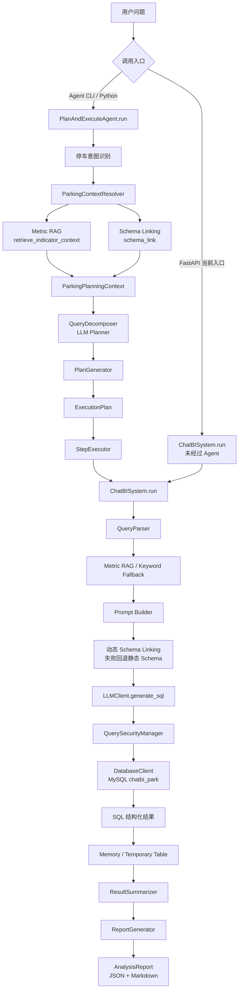

# Day13：智慧停车 ChatBI Agent 项目总结与最终验收

> 验收日期：2026-07-24  
> 验收原则：基于当前源码、真实模型服务、真实 Embedding 服务和本机 `chatbi_park` 数据库，不把模拟数据冒充生产结果。  
> 本次不新增业务功能，只进行 Review、测试、性能分析和明确 Bug 修复。

# 一、项目整体架构

## 1.1 验收结论

当前项目已经形成可运行的智慧停车 ChatBI Agent 技术闭环：

```text
自然语言问题
→ 指标语义理解
→ Schema Linking
→ Planner
→ 多步骤执行计划
→ Text2SQL
→ SQL 安全校验
→ MySQL 查询
→ 结果汇总
→ 运营分析 Report
```

本次真实运行验证了：

- Planner 可以区分简单查询、趋势、排名、原因诊断和运营总览。
- Metric RAG 可以检索停车净收入、利用率、订单量等指标。
- Schema Linking 可以召回表、字段、锚表和 Join 路径。
- Text2SQL 可以生成并执行 MySQL SQL。
- Agent 可以执行单步和多步计划。
- Report 可以基于步骤结果生成运营分析报告。
- 数据库安全层可以阻止危险 SQL，并分类数据库错误。
- 模型、RAG 或 Schema Linking 发生异常时存在基础降级路径。

最终验收评级：

> **MVP 技术闭环：通过。**  
> **演示与学习项目：通过。**  
> **生产环境上线：有条件不通过。**

生产验收尚未完全通过的主要原因：

1. FastAPI 主入口没有接入 `PlanAndExecuteAgent`。
2. 无关问题缺少领域拒答，RAG 和 Schema Linking 会产生假召回。
3. 不存在停车场与“存在但收入为零”无法区分。
4. SQL 失败没有自动修正和重新生成。
5. Agent 多步骤串行执行，复杂问题延迟达到 48～62 秒。
6. Agent State 不持久化，不能断点恢复。
7. 权限模型仍残留销售业务配置。
8. Text2SQL 评估用例仍是旧销售业务，无法衡量停车 SQL 准确率。
9. Report 主要依赖 Prompt 约束，没有自动核验报告数字。

## 1.2 完整架构图



## 1.3 两条真实调用链

### Agent 完整链路

```text
PlanAndExecuteAgent.run()
  → ParkingContextResolver.resolve()
      → retrieve_indicator_context()
      → schema_link()
  → QueryDecomposer.decompose()
  → PlanGenerator.build_plan()
  → StepExecutor.execute_plan()
      → ChatBISystem.run()
          → QueryParser.parse()/validate()
          → retrieve_indicator_context()
          → build_prompt()
              → build_dynamic_prompt_schema()
                  → schema_link()
          → LLMClient.generate_sql()
          → DatabaseClient.execute()
              → QuerySecurityManager.secure_sql()
              → MySQL
              → QuerySecurityManager.mask_result()
  → ResultSummarizer.summarize()
  → ReportGenerator.generate()
  → AnalysisReport
```

### FastAPI 当前链路

```text
POST /api/v1/query
  → api.service.query_chatbi()
  → ChatBISystem.run()
  → Text2SQL
  → DatabaseClient
  → SQL 查询结果
```

FastAPI 当前没有：

- Planner。
- 多步骤 Executor。
- AgentState。
- Report。

因此不能把当前 HTTP API 描述为完整 Agent API。

# 二、核心模块说明

## 2.1 数据库

文件：

- `database/01_schema.sql`
- `database/02_mock_data.sql`
- `database/client.py`
- `tools/config.py`

真实数据库：

```text
chatbi_park
```

真实表清单：

```text
agg_parking_daily
agg_parking_hourly
dim_parking_lot
fact_operation_event
fact_parking_order
fact_space_snapshot
```

表类型：

| 表 | 类型 | 作用 |
|---|---|---|
| `dim_parking_lot` | 维度表 | 停车场名称、城市、类型、总车位和运营状态 |
| `fact_parking_order` | 明细事实表 | 停车订单、金额、时长、支付、退款和人工操作 |
| `fact_space_snapshot` | 快照事实表 | 某时点总车位、占用和空闲车位 |
| `fact_operation_event` | 事件事实表 | 支付失败、设备离线、人工抬杆等异常事件 |
| `agg_parking_daily` | 日聚合事实表 | 日收入、订单、时长、利用率和异常指标 |
| `agg_parking_hourly` | 小时聚合事实表 | 小时收入、订单、利用率和高峰分析 |

`DatabaseClient` 提供：

- 轻量连接池。
- SQL 安全检查。
- 行级权限预留。
- 结果脱敏。
- 慢查询阈值。
- `EXPLAIN` 记录。
- 数据库错误分类。

本次真实数据状态：

```text
日汇总最早日期：2026-02-10
日汇总最晚日期：2026-04-10
日汇总记录：9
停车场：3
停车订单：18
异常事件：8
```

当前日期是 2026-07-24，因此“今天”“最近一个月”“最近一个季度”多数查询没有匹配数据。

## 2.2 Schema

Schema 当前有多种表达：

1. `database/01_schema.sql`：真实 DDL。
2. `prompts/builder.py::SCHEMA`：Text2SQL 静态兜底 Schema。
3. `schema/table_retriever.py::TABLE_METADATA`：表级向量文档。
4. `schema/field_matcher.py::FIELD_METADATA`：字段级向量文档。
5. `schema/join_resolver.py::TABLE_RELATIONSHIPS`：逻辑关联图。

优点：

- 各阶段有适合自身用途的 Schema 表达。
- 不依赖数据库外键也能推理 Join。
- 静态 Schema 可以在向量服务失败时兜底。

问题：

- 同一表和字段在多个文件重复维护。
- DDL 修改后容易忘记同步 Prompt、向量元数据和 Join 图。

企业级建议：

```text
information_schema / Metadata Registry
  → 统一表字段元数据
  → 自动生成 Prompt Schema
  → 自动生成向量文档
  → 单独维护业务别名和 Join 语义
```

## 2.3 Schema Linking

核心文件：

- `schema/table_retriever.py`
- `schema/field_matcher.py`
- `schema/join_resolver.py`
- `schema/schema_linker.py`

核心入口：

```python
schema.schema_linker.schema_link(query)
```

执行流程：

```text
用户问题
→ Chroma 表召回
→ 停车业务事实表路由
→ 停车场维度补充
→ 锚表选择
→ 字段向量召回
→ 白名单/黑名单业务规则
→ BFS Join 路径
→ 动态 Schema
```

真实索引：

```text
表索引：6
字段索引：59
```

当前方式：

> Embedding + 关键词规则 + 业务路由 + 图算法的混合 Schema Linking。

## 2.4 Metric RAG

核心文件：

- `rag/indicators_full.json`
- `rag/indicators.json`
- `rag/indicator_retriever.py`
- `rag/indicator_knowledge.py`

知识库规模：

```text
18 个智慧停车指标
```

主要指标包括：

- 停车净收入。
- 应收金额。
- 优惠金额。
- 退款金额。
- 平均订单金额。
- 完成订单量。
- 支付成功率。
- 平均停车时长。
- 车位利用率。
- 空闲车位数。
- 进出场车辆数。
- 高峰时段。
- 异常事件数。
- 预估收入损失。
- 人工抬杆和免费放行次数。

检索流程：

```text
关键词/别名确定性命中
  +
Chroma 向量语义召回
  ↓
依赖指标展开
  ↓
原因诊断关联指标展开
  ↓
指标知识块
```

真实指标索引：

```text
18
```

当前向量库是：

> ChromaDB，而不是 Milvus。

## 2.5 Prompt

核心文件：

- `prompts/builder.py`

Prompt 组成：

```text
System Role
+ 动态/静态 Schema
+ 停车业务规则
+ Few-shot
+ SQL Error Guards
+ Metric RAG 指标知识
+ 用户问题
+ 输出格式约束
```

核心能力：

- 限制只使用真实表和字段。
- 约束停车净收入、订单、时长和利用率口径。
- 禁止事实表直接多对多 Join。
- 约束时间字段。
- 约束只读 SQL。
- 提供五个停车 Few-shot。

## 2.6 Text2SQL

核心文件：

- `text2sql/main.py`
- `text2sql/llm_client.py`
- `prompts/builder.py`
- `database/client.py`

核心入口：

```python
ChatBISystem.run()
```

输入：

```text
用户问题 + 功能开关 + 数据源 + 权限上下文
```

输出：

```text
SQL
columns
results
formatted
metadata
error_type
```

优点：

- 同步与 SSE 流式接口。
- RAG、Schema Linking 可独立开关。
- 数据源运行时工厂。
- 结构化错误类型。
- 查询耗时和慢查询计划。

不足：

- 没有 SQL AST 校验。
- 没有 SQL 自动修正。
- 没有执行前 `EXPLAIN` 成本门控。
- 没有统一行数上限。
- 复杂平均指标仍可能生成口径错误 SQL。

## 2.7 Agent

核心文件：

- `agent/planner/query_decomposer.py`
- `agent/workflow/agent_planner.py`

Agent 类型：

> Plan-and-Execute + 固定 Workflow。

不是 ReAct：

- 没有 Thought/Action/Observation 循环。
- 步骤执行后不会动态重新规划。

不是 Multi-Agent：

- Planner、Executor、Summarizer 是同一工作流中的模块，不是自治 Agent。

核心模型：

- `DecompositionPlan`
- `ExecutionPlan`
- `PlanStep`
- `StepExecutionResult`
- `AgentState`
- `ToolTrace`

## 2.8 Report

核心文件：

- `agent/executor/report_generator.py`

核心入口：

```python
ReportGenerator.generate()
```

输出：

- 核心结论。
- 关键指标。
- 趋势分析。
- 排名分析。
- 异常分析。
- 原因分析。
- 运营建议。
- 数据限制。
- 可视化建议。

Report 的边界：

- 不重新查询数据库。
- 不应凭空计算同比和环比。
- 只能使用成功步骤作为事实证据。

# 三、整体调用流程

## 3.1 一个简单问题

用户：

```text
今天停车收入是多少？
```

流程：

```text
Intent = query
→ Metric RAG = 停车净收入
→ Schema Linking = agg_parking_daily.net_revenue + stat_date
→ Planner = 1 个任务
→ Text2SQL
→ MySQL
→ KPI Report
```

## 3.2 一个复杂问题

用户：

```text
最近三个月收入下降原因
```

流程：

```text
Intent = diagnosis
→ Metric RAG
   停车净收入
   完成订单量
   退款金额
   车位利用率
   异常事件数
→ Schema Linking
   agg_parking_daily
   fact_operation_event
→ Planner
   收入趋势
   订单趋势
   停车场贡献
   退款趋势
   利用率趋势
   异常趋势
→ 6 个 Text2SQL 查询
→ ResultSummarizer
→ Report
```

# 四、真实功能演示

## 4.1 验收环境说明

本节使用：

- 真实 LLM。
- 真实 Embedding 服务。
- 真实 Chroma 索引。
- 真实本机 MySQL。
- 真实 `chatbi_park` 数据库。
- 真实 Agent 和 Report。

由于数据库数据截止 2026-04-10，而验收日期为 2026-07-24，近期问题出现空数据属于测试数据时效问题。

## 4.2 问题一：今天停车收入是多少？

### Planner

```text
查询今日停车净收入
指标：停车净收入
维度：日期
```

### Metric RAG

```text
停车净收入
```

### Schema Linking

```text
agg_parking_daily
net_revenue
stat_date
```

### Prompt

注入：

- 停车净收入定义。
- `SUM(net_revenue)`。
- 今天使用 `CURDATE()`。
- 动态日汇总 Schema。

### SQL

```sql
SELECT COALESCE(SUM(net_revenue), 0) AS parking_net_revenue
FROM agg_parking_daily
WHERE stat_date = CURDATE();
```

### SQL 执行

```text
success = true
row_count = 1
parking_net_revenue = 0.00
```

### Report

```text
今日停车净收入为0.00元。
```

数据限制：

- 没有分停车场和分时段数据。
- 没有昨日或同期数据。
- 零值可能来自没有业务，也可能来自今日汇总数据尚未生成。

### 耗时

```text
22.20 秒
```

## 4.3 问题二：最近一个月收入趋势

### Planner

```text
查询最近一个月每日停车净收入
指标：停车净收入
维度：日期
```

### Metric RAG

```text
停车净收入
```

### Schema Linking

```text
agg_parking_daily
```

### SQL

```sql
SELECT stat_date,
       SUM(net_revenue) AS parking_net_revenue
FROM agg_parking_daily
WHERE stat_date >= DATE_SUB(CURDATE(), INTERVAL 30 DAY)
  AND stat_date < CURDATE() + INTERVAL 1 DAY
GROUP BY stat_date
ORDER BY stat_date;
```

### SQL 执行

```text
success = true
row_count = 0
```

### Report

```text
最近一个月无停车净收入数据记录。
```

Report 同时给出数据缺失提示。

验收评价：

- SQL 正确。
- 空结果处理没有崩溃。
- “没有数据记录”容易被业务人员理解为“收入确实为零”，应改成“当前查询未返回数据，不能判断收入趋势”。

### 耗时

```text
21.45 秒
```

## 4.4 问题三：哪个停车场利用率最低？

### Planner

```text
查询各停车场车位利用率
指标：车位利用率
维度：停车场
```

### Metric RAG

```text
车位利用率
```

### Schema Linking

```text
agg_parking_daily
dim_parking_lot
```

### SQL

```sql
SELECT p.parking_lot_name,
       AVG(d.utilization_rate) AS average_utilization_rate
FROM agg_parking_daily d
JOIN dim_parking_lot p
  ON d.parking_lot_id = p.parking_lot_id
WHERE p.operation_status = 'operating'
GROUP BY p.parking_lot_id, p.parking_lot_name
ORDER BY average_utilization_rate ASC;
```

### SQL 执行

```text
科技园停车场      54.00%
市民医院停车场    68.13%
中心商场停车场    72.67%
```

### Report

```text
科技园停车场的平均车位利用率为54.00%，
是三个运营中停车场中最低的。
```

### 耗时

```text
26.68 秒
```

## 4.5 问题四：最近三个月收入下降原因

### Planner

生成 6 个任务：

1. 停车净收入趋势。
2. 完成订单量趋势。
3. 各停车场收入贡献排名。
4. 退款金额趋势。
5. 车位利用率趋势。
6. 异常事件数趋势。

### Metric RAG

```text
停车净收入
完成订单量
退款金额
车位利用率
异常事件数
```

### Schema Linking

规划前主要召回：

```text
agg_parking_daily
fact_operation_event
```

每个执行步骤会重新进行指标和 Schema 检索。

### SQL

收入趋势：

```sql
SELECT DATE_FORMAT(stat_date, '%Y-%m-01') AS revenue_month,
       SUM(net_revenue) AS parking_net_revenue
FROM agg_parking_daily
WHERE stat_date >= DATE_SUB(CURDATE(), INTERVAL 3 MONTH)
  AND stat_date < CURDATE() + INTERVAL 1 DAY
GROUP BY DATE_FORMAT(stat_date, '%Y-%m-01')
ORDER BY revenue_month;
```

订单趋势：

```sql
SELECT DATE_FORMAT(stat_date, '%Y-%m-01') AS order_month,
       SUM(order_count) AS completed_order_count
FROM agg_parking_daily
WHERE stat_date >= DATE_SUB(CURDATE(), INTERVAL 3 MONTH)
  AND stat_date < CURDATE() + INTERVAL 1 DAY
GROUP BY DATE_FORMAT(stat_date, '%Y-%m-01')
ORDER BY order_month;
```

停车场贡献：

```sql
SELECT p.parking_lot_name,
       SUM(d.net_revenue) AS parking_net_revenue
FROM agg_parking_daily d
JOIN dim_parking_lot p
  ON d.parking_lot_id = p.parking_lot_id
WHERE d.stat_date >= DATE_SUB(CURDATE(), INTERVAL 3 MONTH)
  AND d.stat_date < CURDATE() + INTERVAL 1 DAY
GROUP BY p.parking_lot_id, p.parking_lot_name
ORDER BY parking_net_revenue DESC;
```

退款趋势：

```sql
SELECT DATE_FORMAT(exit_time, '%Y-%m-01') AS refund_month,
       SUM(refund_amount) AS refund_amount
FROM fact_parking_order
WHERE order_status = 'completed'
  AND exit_time >= DATE_SUB(CURDATE(), INTERVAL 3 MONTH)
  AND exit_time < CURDATE() + INTERVAL 1 DAY
GROUP BY DATE_FORMAT(exit_time, '%Y-%m-01')
ORDER BY refund_month;
```

利用率趋势：

```sql
SELECT DATE_FORMAT(stat_date, '%Y-%m-01') AS utilization_month,
       AVG(utilization_rate) AS average_utilization_rate
FROM agg_parking_daily
WHERE stat_date >= DATE_SUB(CURDATE(), INTERVAL 3 MONTH)
  AND stat_date < CURDATE() + INTERVAL 1 DAY
GROUP BY DATE_FORMAT(stat_date, '%Y-%m-01')
ORDER BY utilization_month;
```

异常趋势：

```sql
SELECT DATE_FORMAT(event_time, '%Y-%m-01') AS event_month,
       COUNT(DISTINCT event_id) AS exception_count
FROM fact_operation_event
WHERE event_time >= DATE_SUB(CURDATE(), INTERVAL 3 MONTH)
  AND event_time < CURDATE() + INTERVAL 1 DAY
GROUP BY DATE_FORMAT(event_time, '%Y-%m-01')
ORDER BY event_month;
```

### SQL 执行

```text
6 个步骤全部执行成功
6 个步骤全部返回 0 行
```

### Report

```text
无法确认最近三个月停车净收入是否下降，
因所有相关查询均未返回有效数据。
```

Report 正确拒绝编造根因。

### 耗时

```text
62.41 秒
```

## 4.6 问题五：分析最近一个季度停车运营情况

### Planner

生成 5 个任务：

1. 停车净收入趋势。
2. 完成订单量趋势。
3. 平均停车时长与利用率趋势。
4. 停车场收入排名。
5. 异常事件、人工抬杆和免费放行。

### Metric RAG

规划前直接召回：

```text
停车净收入
平均停车时长
完成订单量
```

Planner 使用指标目录补充：

```text
车位利用率
异常事件数
人工抬杆次数
免费放行次数
```

### 关键 SQL

```sql
SELECT d.stat_date,
       AVG(d.average_parking_minutes) AS average_parking_minutes,
       AVG(d.utilization_rate) AS average_utilization_rate
FROM agg_parking_daily d
JOIN dim_parking_lot p
  ON d.parking_lot_id = p.parking_lot_id
WHERE d.stat_date >= DATE_SUB(CURDATE(), INTERVAL 3 MONTH)
  AND d.stat_date < CURDATE() + INTERVAL 1 DAY
  AND p.operation_status = 'operating'
GROUP BY d.stat_date
ORDER BY d.stat_date;
```

验收发现：

- `AVG(d.average_parking_minutes)` 跨停车场直接平均日均时长。
- 正确口径应使用 `order_count` 加权，或回到订单明细重新计算。
- 说明仅靠 Prompt 规则仍不能完全保证复杂派生指标 SQL 正确。

### SQL 执行

```text
5 个步骤全部成功
5 个步骤全部返回 0 行
```

### Report

```text
最近一个季度所有关键运营指标均无有效数据返回，
无法得出实质性结论。
```

### 耗时

```text
47.93 秒
```

## 4.7 问题六：哪些停车场需要重点关注？

### Planner

Planner 自主选择“近 7 日”作为关注窗口，并生成：

1. 近 7 日平均利用率。
2. 近 7 日停车净收入。
3. 近 7 日异常事件数。
4. 当前空闲车位数。

### Metric RAG

```text
空闲车位数
停车净收入
车位利用率
```

### Schema Linking

规划前召回：

```text
dim_parking_lot
agg_parking_daily
agg_parking_hourly
```

步骤执行时又召回：

- `fact_operation_event`
- `fact_space_snapshot`

### SQL 执行

前三个近 7 日查询返回 0 行。

当前空闲车位：

```text
中心商场停车场     90
科技园停车场      192
市民医院停车场    105
```

### Report

```text
仅能基于当前空闲车位数识别潜在关注点，
缺乏利用率、收入和异常事件数据支撑全面判断。
```

验收评价：

- Report 对证据不足的判断较谨慎。
- Planner 未询问用户“重点关注”的评判标准和时间窗口，而是自行假设近 7 日。
- 企业系统应增加澄清节点或预定义健康评分。

### 耗时

```text
50.62 秒
```

# 五、异常测试

## 5.1 不存在指标

问题：

```text
查询各停车场广告点击率
```

实际行为：

- Metric RAG 错误召回车位利用率、停车净收入、平均订单金额。
- LLM 没有编造数据库字段。
- 生成：

```sql
SELECT p.parking_lot_name,
       NULL AS click_rate
FROM dim_parking_lot p
WHERE 1 = 0;
```

- SQL 成功，返回 0 行。

评价：

- SQL 安全性较好。
- 产品体验不足：应该明确提示“广告点击率不是当前支持指标”。

改进：

- 增加领域分类和指标注册表校验。
- 未命中标准指标时先澄清，不进入 SQL 生成。

## 5.2 不存在停车场

问题：

```text
银河停车场最近一个月停车收入是多少？
```

实际 SQL：

```sql
SELECT COALESCE(SUM(d.net_revenue), 0) AS parking_revenue
FROM agg_parking_daily d
JOIN dim_parking_lot p
  ON d.parking_lot_id = p.parking_lot_id
WHERE p.parking_lot_name = '银河停车场'
  AND d.stat_date >= DATE_SUB(CURDATE(), INTERVAL 1 MONTH)
  AND d.stat_date < CURDATE() + INTERVAL 1 DAY;
```

返回：

```text
0.00
```

问题：

- 无法区分停车场不存在和停车场存在但收入为零。

改进：

- 增加 Entity Linking。
- 先验证停车场实体是否存在。
- 或 SQL 同时返回匹配停车场数量。

## 5.3 SQL 执行失败

当前处理：

- `DatabaseClient` 捕获 MySQL 错误。
- 转换为 `QueryExecutionError`。
- `ChatBISystem` 返回结构化 `error_type`。
- Agent Step 标记失败。
- `abort` 策略下跳过后续任务。

不足：

- Retry 只是重新执行相同问题。
- 没有携带数据库错误重新生成 SQL。

## 5.4 Schema 无法匹配

模拟 Schema Linking 抛异常。

实际行为：

- `build_prompt()` 回退到 `prompts.builder.SCHEMA`。
- SQL 仍能生成并执行。

优点：

- 服务可用性较高。

问题：

- Metadata 只记录 `used_schema_linking=true`，没有记录发生了静态 Schema Fallback。
- 不便于监控动态召回真实成功率。

## 5.5 RAG 未召回或服务异常

模拟 Metric RAG 服务异常。

实际行为：

- `ChatBISystem._resolve_indicator_context()` 捕获异常。
- 回退 `IndicatorKnowledge` 关键词识别。
- “停车收入”仍识别为“停车净收入”。
- SQL 正常执行。

问题：

- 没有记录 `rag_fallback=true`。
- 完全无关问题仍可能出现向量假召回。

## 5.6 模型生成 SQL 错误

模拟 SQL：

```sql
SELECT missing_metric
FROM agg_parking_daily;
```

修复前：

```text
database_execution_error
HTTP 500
```

修复后：

```text
database_sql_syntax
SQL 结构错误，请检查表、字段、聚合、分组和别名是否正确
```

FastAPI 可以将其映射为：

```text
HTTP 422
```

仍缺少：

- SQL Error Feedback。
- 自动修正 Prompt。
- 最大重试次数。
- 失败 SQL 审计。

## 5.7 无关领域问题

问题：

```text
查询火星天气
```

实际 Metric RAG：

```text
异常事件数      0.4339
免费放行次数    0.4090
高峰时段        0.4036
```

实际 Schema Linking：

```text
fact_space_snapshot
dim_parking_lot
fact_operation_event
```

结论：

- 当前没有 Out-of-Domain 拒答能力。
- 相似度超过固定阈值不代表业务相关。

建议：

```text
Domain Classifier
→ 指标关键词/实体检查
→ 相似度绝对阈值
→ Top1-Top2 Margin
→ Reranker
→ 不满足则拒答/澄清
```

# 六、架构与代码问题 Review

## 6.1 问题清单

| 优先级 | 问题 | 原因 | 优化建议 |
|---|---|---|---|
| P0 | FastAPI 未接 Agent | API 直接调用 `ChatBISystem` | 增加独立 `/api/v1/agent/query` |
| P0 | 缺少 OOD 拒答 | 向量 Top-K 总会返回相似对象 | 增加领域门控和 No-Match 判断 |
| P0 | 停车权限未完成 | `tools/security.py` 仍是 sales/dim_customers | 设计停车场/运营商/城市数据权限 |
| P0 | 评估集仍是销售业务 | `text2sql/test_cases.json` 未迁移 | 建立停车 Text2SQL Golden Set |
| P1 | Agent 串行执行 | `StepExecutor` 逐步 for 循环 | 对无依赖任务做有界并发 |
| P1 | 重复 RAG/Schema | Planner 前召回，步骤内再次召回 | 将 Context 透传给 Text2SQL |
| P1 | SQL 无自动修正 | Retry 重复同一请求 | 数据库错误驱动 SQL Self-Correction |
| P1 | 实体不存在无法识别 | 没有 Entity Linking | 停车场实体召回与存在性校验 |
| P1 | 派生指标 SQL 可能错 | Prompt 不能完全保证加权口径 | 指标 SQL 模板/AST 规则校验 |
| P1 | Report 无事实校验 | 只靠 Prompt 限制 | 数字、实体、结论绑定证据 Citation |
| P1 | State 不持久化 | 只在一次 `run()` 内存在 | Redis/PostgreSQL Checkpoint |
| P1 | 无阶段耗时 | 只有 DB 和 API 总耗时 | 记录每个 Tool/LLM 节点 latency |
| P2 | Schema 多份维护 | DDL、Prompt、向量元数据、Join 图分散 | 元数据中心与自动生成 |
| P2 | broad `except` 静默降级 | 为稳定性直接吞异常 | 结构化日志和 fallback metadata |
| P2 | README 仍有旧内容 | 课程演进遗留 | Day13 后统一更新 README |
| P2 | 测试混有销售样例 | 兼容旧模块测试 | 拆分 legacy 与 parking 测试 |
| P2 | Embedding 测试导入即请求网络 | `text2sql/test_embedding.py` 是脚本式测试 | 改为显式 integration marker |
| P2 | 模块文件过大 | Workflow 1135 行、Field Matcher 844 行 | 按 State/Store/Executor/Tool 拆分 |

## 6.2 模块耦合

合理部分：

- Runtime Factory 统一装配 Text2SQL 依赖。
- Schema Linking 内部分表、字段和 Join。
- Planner、Executor、Report 职责分离。
- Report 不反向调用数据库。

较强耦合：

- `StepExecutor` 直接依赖 `ChatBISystem`。
- `QueryDecomposer` 直接读取 `rag/indicators_full.json`。
- `Prompt Builder` 内部动态 import Schema Linking。
- Agent 的 Tool 列表是声明，不是统一 Tool Registry。

## 6.3 重复代码

主要重复：

- Schema 多份定义。
- 指标关键词路径和 RAG 路径都有知识块构造逻辑。
- `ChatBISystem.run()` 与 `run_stream()` 重复解析、RAG、Prompt 和错误处理。
- `StepExecutor` 与 `ResultSummarizer` 都有结果摘要提取逻辑。
- 多个模块各自实现宽泛异常 Fallback。

## 6.4 Prompt 重复

当前重复不是完全相同文本，而是业务规则分散在：

- `prompts/builder.py::RULES`
- `prompts/builder.py::ERROR_GUARDS`
- `rag/indicators_full.json::business_rules`
- `schema/field_matcher.py::BUSINESS_RULES`
- Planner Prompt
- Report Prompt

建议将业务口径分成：

```text
Metric Definition
Schema Rule
SQL Safety Rule
Planner Strategy
Report Evidence Rule
```

并由统一版本号管理。

# 七、性能分析

## 7.1 真实端到端耗时

| 问题 | 类型 | 步骤数 | 耗时 |
|---|---:|---:|---:|
| 今天停车收入是多少 | 简单 | 1 | 22.20s |
| 最近一个月收入趋势 | 趋势 | 1 | 21.45s |
| 哪个停车场利用率最低 | 排名 | 1 | 26.68s |
| 最近三个月收入下降原因 | 诊断 | 6 | 62.41s |
| 最近一个季度运营情况 | 总览 | 5 | 47.93s |
| 哪些停车场需要重点关注 | 综合 | 4 | 50.62s |

统计：

```text
全部平均：38.55s
全部中位数：37.30s
简单问题平均：23.45s
复杂问题平均：53.65s
最小：21.45s
最大：62.41s
```

## 7.2 Prompt Token

实测字符长度：

| 问题 | 指标知识字符 | 动态 Schema 字符 | 最终 Prompt 字符 | 粗略 Token 范围 |
|---|---:|---:|---:|---:|
| 今天停车收入是多少 | 653 | 434 | 5,088 | 2.9k～5.3k |
| 最近三个月收入下降原因 | 2,362 | 845 | 7,210 | 4.1k～7.4k |

Token 是按字符比例估算，不是模型官方 tokenizer 精确值。

Prompt 较长的原因：

- 全量业务规则。
- 全量 Error Guards。
- 五个 Few-shot。
- 指标知识。
- 动态 Schema。

优化：

1. Few-shot 按意图召回，不全量注入。
2. 业务规则按指标选择性注入。
3. 诊断关联指标不注入无用 SQL 模板。
4. 静态 Guard 保留短版，详细规则放校验器。
5. 对 Prompt 记录真实 tokenizer 统计。

## 7.3 Schema Linking

实测：

```text
简单问题：约 1.91s
归因问题：约 1.19s
```

优化：

- Query Embedding Cache。
- 表与字段召回合并批量请求。
- 对明确关键词问题走规则快速路径。
- 索引加载保持单例。
- 增加 Rerank，减少后续错误上下文。

## 7.4 Metric RAG

实测：

```text
简单问题：约 0.67s
归因问题：约 0.42s
```

优化：

- 明确指标关键词命中时可跳过向量 API。
- 只在口语化或模糊表达时使用 Embedding。
- 缓存标准问题和指标结果。
- 增加 OOD 判定。

## 7.5 重复检索

当前一次 Agent 问题会：

1. Planner 前调用 Metric RAG。
2. Planner 前调用 Schema Linking。
3. 每个 Step 的 `ChatBISystem` 再调用 Metric RAG。
4. 每个 Step 的 Prompt Builder 再调用 Schema Linking。

六步诊断问题可能进行：

```text
1 次规划前 Metric RAG
+ 1 次规划前 Schema Linking
+ 6 次步骤 Metric RAG
+ 6 次步骤 Schema Linking
```

这是当前最明显的性能浪费。

建议：

- Planner Context 按 Step 切片后透传。
- Text2SQL 支持直接接收 resolved metric/schema context。
- Context 使用知识版本作为缓存键。

## 7.6 Agent 执行

当前：

```python
for step in steps:
    execute(step)
```

即使 `depends_on=[]`，也不会并行。

建议：

- 构建 DAG。
- 同一层无依赖任务使用有限线程池/异步执行。
- 数据库连接池与模型并发设置上限。
- 收入、订单、利用率、异常可并行。
- Report 必须等待全部证据完成。

## 7.7 Report

简单指标问题仍调用 Report LLM。

优化：

- 单值 KPI 使用确定性模板，跳过 Report LLM。
- 排名和趋势使用结构化计算器先生成事实。
- LLM 只负责业务解释和建议。
- Report Prompt 使用结果统计摘要，不重复传入大量原始行。

# 八、代码质量评分

评分基于当前 MVP，不按完整商业平台标准虚高。

| 维度 | 评分 | 评价 |
|---|---|---|
| 整体架构 | ★★★★☆ | 分层清楚，但 API 与 Agent 尚未统一 |
| 数据库设计 | ★★★★☆ | 六表 MVP 适合 ChatBI，数据时效和实体校验不足 |
| Schema Linking | ★★★★☆ | 表/字段/Join 混合召回完整，缺少 OOD 和统一元数据 |
| Metric RAG | ★★★★☆ | 18 指标、依赖和诊断展开较完整，假召回需治理 |
| Prompt | ★★★★☆ | 业务规则丰富，但长度较大且规则分散 |
| Text2SQL | ★★★☆☆ | 基础 SQL 正确率较好，复杂派生口径和自修复不足 |
| Agent | ★★★★☆ | Plan-and-Execute 闭环完整，但串行、无 Replan、无持久 State |
| Report | ★★★★☆ | 运营结构完整，事实一致性仍依赖 Prompt |
| 安全与权限 | ★★★☆☆ | 有只读拦截和脱敏，但权限模型仍是旧销售业务 |
| 测试工程 | ★★★☆☆ | 64 个本地测试通过，但 Golden Set 和网络测试管理不足 |
| 可维护性 | ★★★☆☆ | 模块边界存在，但大文件和多份元数据增加维护成本 |
| 生产就绪度 | ★★☆☆☆ | 适合 Demo/MVP，尚不适合直接生产上线 |

# 九、本次验收修复

## 9.1 数据库名称

问题：

```text
.env 中 DB_NAME = chatbi_mvp
```

修复：

```text
DB_NAME = chatbi_park
```

原因：

- 与用户约定不一致。
- 会导致连接旧数据库。

## 9.2 LLM 输出长度

问题：

```text
LLM_MAX_TOKENS 默认值 = 1000
```

后果：

- 长 SQL 可能被截断。
- 自动化测试失败。
- README 与代码不一致。

修复：

```text
默认值改为 4000
```

## 9.3 SQL 结构错误分类

问题：

- MySQL 1054 未知字段被归为通用执行错误。
- API 会返回 500。

修复：

以下错误统一归为 `sql_syntax`：

```text
1052 字段歧义
1054 未知字段
1055 GROUP BY 约束
1064 SQL 语法
1146 表不存在
```

修复后：

```text
ChatBISystem error_type = database_sql_syntax
FastAPI = HTTP 422
```

# 十、自动化测试

本地自动化命令：

```bash
uv run pytest -q tests rag/test_parking_indicator_rag.py
```

结果：

```text
64 passed
```

语法与差异检查：

```text
Python py_compile：通过
git diff --check：通过
```

没有纳入默认自动化的文件：

```text
text2sql/test_embedding.py
```

原因：

- 模块导入时直接调用外部 Embedding API。
- 会产生网络依赖和调用成本。
- 应改为 `pytest.mark.integration`，由显式集成测试任务运行。

# 十一、技术亮点

1. 将通用 ChatBI 逐步迁移为智慧停车垂直领域 Agent，而不是一次性重写。
2. 使用六张事实/维度/聚合表支持停车运营 MVP。
3. 实现表级和字段级两阶段 Schema Linking。
4. 使用 Embedding、业务白名单、黑名单和规则路由融合召回。
5. 使用图结构和 BFS 自动推理 Join 路径。
6. 建立 18 个智慧停车运营指标知识库。
7. 指标 RAG 同时支持别名、依赖指标和诊断关联指标。
8. Prompt 动态注入 Schema 和指标知识，降低字段幻觉。
9. 实现 Plan-and-Execute Workflow Agent。
10. 复杂问题可以拆成多个独立 Text2SQL 证据任务。
11. 使用 AgentState 和 ToolTrace 增强可观测性。
12. 支持内存和临时表两种中间结果存储。
13. 设计结构化 Report Agent，将 SQL 数据转为运营分析报告。
14. 实现 SQL 只读安全、错误分类、结果脱敏和慢查询 EXPLAIN。
15. 使用真实模型、真实 Embedding 和真实 MySQL 完成端到端验收。

# 十二、未来可扩展方向

## 12.1 第一优先级

1. 将 Agent 接入 FastAPI。
2. 增加领域拒答和 Entity Linking。
3. 建立停车 SQL Golden Set。
4. 实现 SQL 自动修正。
5. 透传并复用 Metric/Schema Context。
6. 并行执行无依赖任务。

## 12.2 第二优先级

1. Agent State 持久化。
2. 工具统一协议。
3. 停车场/运营商/城市数据权限。
4. Report 数字事实校验。
5. ECharts 可视化。
6. Prompt、指标和 Schema 版本管理。

## 12.3 第三优先级

1. 多数据源。
2. 数据血缘。
3. 指标中心。
4. 反馈学习。
5. 查询缓存。
6. 离线评估和线上监控。

# 十三、面试总结

## 13.1 项目介绍：3 分钟

我做的是一个智慧停车运营分析 ChatBI Agent。它的目标不是做停车收费或车辆进出管理，而是让运营人员通过自然语言查询停车收入、订单、车位利用率、平均停车时长、异常事件和停车场经营排名。

项目最初是一个通用 ChatBI，我按照企业项目演进方式逐步迁移。数据库采用六张 MVP 表，包括停车场维度、停车订单、车位快照、运营异常事件以及日、小时两张聚合表。这样既能回答明细问题，也能让趋势和排名优先走聚合表，减少 SQL 复杂度。

自然语言进入系统后，先通过 Metric RAG 识别停车净收入、利用率等标准指标及口径，再通过 Schema Linking 召回相关表和字段，并自动选择锚表和 Join 路径。简单问题进入 Text2SQL，复杂问题由 Plan-and-Execute Agent 拆成多个证据任务。例如收入下降原因会拆成收入、订单、停车场贡献、退款、利用率和异常事件分析。

每个任务经过动态 Prompt 生成 MySQL SQL，再由安全层限制为只读查询并执行。最后 Report Agent 将多步 SQL 结果整理为核心结论、趋势、异常、原因和运营建议，同时明确数据限制。

目前项目已经通过真实模型、真实 Embedding 和本机 MySQL 的端到端验证。它适合作为企业 AI 应用 MVP，但我也明确识别了 FastAPI 未接 Agent、无关问题拒答、SQL 自修复、并行执行和事实一致性校验等下一阶段问题。

## 13.2 架构设计：5 分钟

项目分成数据层、语义层、生成层、编排层和表达层。

数据层使用 MySQL，围绕 ChatBI 而不是完整停车系统设计六张表。日、小时聚合表用于高频趋势和排名，订单和异常事实表用于明细与原因诊断。

语义层包含 Metric RAG 和 Schema Linking。Metric RAG 解决“收入、利用率到底如何定义”，Schema Linking 解决“这些指标在哪张表、哪个字段、如何 Join”。Schema Linking 是表召回、字段召回和 Join 图推理的混合方案。

生成层是 Prompt Builder 和 Text2SQL。Prompt 根据问题动态注入 Schema、指标知识、业务规则和 Few-shot。LLM 只输出一条 MySQL 查询。数据库执行前还有 SQL 安全检查。

编排层采用 Plan-and-Execute Workflow Agent。Planner 只生成数据证据任务，不把最终总结当成 SQL 任务。Executor 顺序执行计划并保存中间结果，ResultSummarizer 汇总步骤状态。

表达层使用 Report Agent。Report 不重新查数据库，而是消费步骤结果，生成面向运营人员的结构化报告。报告中把事实、原因、建议和数据限制分开。

这个架构的核心思想是让 LLM 负责语义和生成，让规则、Schema、状态模型和数据库安全层负责约束。

## 13.3 技术亮点：5 分钟

第一，Schema Linking 不是把全部六张表直接塞给模型，而是先召回表，再在候选表中召回字段，最后使用 BFS 推理 Join 路径。这减少 Token，也降低跨事实表错误 Join 的概率。

第二，指标 RAG 不是知识问答，而是 Text2SQL 的业务语义增强。每个指标包含定义、公式、表字段、过滤条件、时间口径和依赖指标。收入下降诊断时还会扩展订单量、退款、利用率和异常事件。

第三，Planner 有指标和维度白名单，并支持 LLM 不可用时的停车业务 Fallback。简单指标只生成一个任务，复杂诊断生成多份证据，避免过度规划。

第四，Agent 有结构化 State 和 ToolTrace，可以看到用户意图、指标、表、字段、计划、SQL、执行结果和错误。

第五，Report 输出结构化 JSON，不直接让模型自由写 Markdown。它要求原因有证据、同比有比较期、失败步骤写入数据限制。

第六，工程层有连接池、SQL 只读校验、错误分类、行级权限预留、脱敏和慢查询 EXPLAIN。

最后，我没有只做单元测试，而是使用真实模型、真实向量索引和真实 MySQL 运行六个业务问题，并测量了端到端延迟和 Prompt 长度。

## 13.4 为什么这样设计

因为 ChatBI 的主要风险不是“模型不会写 SQL”，而是：

- 不理解业务指标。
- 找错表和字段。
- Join 导致重复统计。
- 指标口径错误。
- SQL 执行失败。
- 把相关性解释成因果。

所以架构必须分层，每层只解决一个问题，并且为 LLM 提供可验证边界。

## 13.5 遇到的难点

1. 收入、利用率、停车时长等指标存在多种表和粒度。
2. 向量召回容易带入无关表字段。
3. 复杂问题不能由一条 SQL 稳定回答。
4. 多步结果如何传递和总结。
5. 空数据与真实零值如何区分。
6. Report 如何避免编造原因。
7. 真实端到端延迟较高。

## 13.6 如何解决

- 使用聚合优先和业务路由选择事实表。
- 使用字段白名单和黑名单修正 Embedding。
- 使用 Planner 拆解复杂问题。
- 使用结构化中间结果和依赖关系。
- Report 增加数据限制。
- 使用 Prompt 证据规则限制归因。
- 通过性能剖析定位重复检索和串行执行。

## 13.7 为什么使用 Schema Linking

完整 Schema 直接注入会：

- 增加 Token。
- 增加模型选择错误。
- 增加跨事实表 Join 风险。

Schema Linking 让模型只看到与问题相关的表、字段和 Join。

## 13.8 为什么使用 Metric RAG

Schema 只能说明字段存在，不能完整说明业务口径。

Metric RAG 提供：

- 指标定义。
- 计算公式。
- 时间字段。
- 过滤条件。
- 依赖指标。
- 业务限制。

## 13.9 为什么使用 Workflow Agent

ChatBI 涉及数据库，完全自由的 ReAct 风险更高。固定 Workflow 更容易：

- 审计。
- 测试。
- 控制工具。
- 限制 SQL。
- 定位错误。

## 13.10 为什么使用 Prompt Engineering

Prompt 用于把业务规则、Schema、指标知识和输出格式统一交给模型。它不是唯一安全手段，而是与 Pydantic、SQL 安全、业务规则和数据库约束共同工作。

## 13.11 为什么使用 Text2SQL

智慧停车运营数据在结构化数据库中。Text2SQL 能把自然语言转换为可执行、可审计的数据查询，比直接让 LLM 根据知识回答更可靠。

# 十四、简历亮点

1. 设计并实现智慧停车运营分析 ChatBI Agent，支持收入、订单、利用率、停车时长、异常和停车场排名。
2. 基于六张事实/维度/聚合表构建面向 Text2SQL 的停车数据模型。
3. 实现表级与字段级两阶段 Schema Linking，结合 Chroma Embedding 和停车业务规则。
4. 使用 BFS 图算法自动选择锚表并推理多表 Join 路径。
5. 构建 18 个智慧停车指标知识库，统一指标定义、公式、时间口径和过滤规则。
6. 实现关键词、向量、依赖指标和诊断指标融合的 Metric RAG。
7. 设计动态 Text2SQL Prompt，按查询注入 Schema、指标知识、Few-shot 和安全规则。
8. 实现 Plan-and-Execute Agent，将复杂经营问题拆解为多步骤数据证据任务。
9. 设计 AgentState、ToolTrace 和中间结果存储，提高工作流可观测性。
10. 构建运营分析 Report Agent，输出趋势、排名、异常、原因、建议和数据限制。
11. 实现 SQL 只读拦截、错误分型、结果脱敏、连接池和慢查询 EXPLAIN。
12. 使用 FastAPI 提供同步与 SSE Text2SQL 接口，并支持多数据源运行时装配。
13. 完成真实 LLM、Embedding、Chroma 和 MySQL 端到端验收与性能分析。
14. 建立 64 项自动化测试，覆盖 Agent、RAG、Schema、Prompt、数据库、安全和 Report。
15. 通过真实验收发现并修复数据库配置、LLM 输出长度和 SQL 错误分类问题。

# 十五、高级 AI 应用开发面试追问

> 以下问题不提供答案，建议结合当前项目源码逐题回答。

1. 为什么当前项目应定义为 Plan-and-Execute Workflow Agent，而不是 ReAct Agent？
2. Planner 为什么不能直接生成最终报告任务？
3. 如何判断一个复杂问题应该拆成几条 SQL？
4. Agent 中 `depends_on` 如何影响执行顺序和失败传播？
5. 为什么表召回和字段召回要分两级？
6. Schema Linking 的 Embedding 和业务规则如何融合？
7. 锚表选择错误会导致哪些 SQL 问题？
8. 没有数据库外键时，如何维护 Join 图的准确性？
9. Metric RAG 与 Schema Linking 的职责边界是什么？
10. 为什么“收入”指标不能只依赖字段名匹配？
11. 如何处理向量检索对“火星天气”产生停车指标假召回？
12. 指标知识中的 SQL 模板应该直接执行，还是只作为 LLM 参考？
13. 动态 Schema、Few-shot 和业务规则如何控制 Prompt Token？
14. 为什么 SQL Prompt 约束不能替代 SQL AST 安全校验？
15. 如何设计 SQL Self-Correction，避免无限重试？
16. 为什么跨日平均停车时长不能直接平均每日平均值？
17. 如何判断“停车场不存在”和“停车场收入为零”？
18. Report Agent 如何自动校验输出数字来自 SQL 结果？
19. 无依赖 Agent 任务如何并行，同时控制模型和数据库并发？
20. 如果项目需要支持 1,000 张表，当前 Schema Linking 架构需要如何演进？

# 十六、Day1～Day13 学习总结

## 16.1 理解了什么

Day1～Day6 主要理解现有系统：

- HTTP 请求如何进入 ChatBI。
- Agent、Planner 和 Workflow 的区别。
- Schema Linking 的表、字段和 Join 流程。
- Prompt 如何组织。
- Text2SQL 如何生成和执行 SQL。

Day7～Day12 主要完成领域迁移：

- 智慧停车数据库。
- Schema 和 Schema Linking。
- 指标知识库 RAG。
- 停车 Prompt。
- Agent Workflow。
- Report Agent。

Day13 完成：

- 真实端到端验收。
- 异常测试。
- 性能剖析。
- 代码质量 Review。
- 生产差距分析。

## 16.2 最大提升

最大的提升不是“会调用大模型”，而是理解了企业 AI 应用的系统性：

```text
LLM 只是一部分

业务指标
+ 数据模型
+ Schema
+ RAG
+ Prompt
+ Workflow
+ SQL 安全
+ 状态
+ 评估
+ Report
+ 监控
= 可交付 AI 应用
```

## 16.3 当前不足

需要继续加强：

- SQL AST 和查询优化。
- RAG 评估与 Rerank。
- Agent 并发与持久化。
- 线上可观测性。
- 多租户权限。
- 自动事实一致性。
- 数据工程和指标治理。

## 16.4 下一步学习建议

建议按顺序学习：

1. 建立智慧停车 Text2SQL Golden Set 和 Execution Accuracy。
2. 实现 SQL Self-Correction。
3. 实现 OOD 与 Entity Linking。
4. 将 Agent 接入 FastAPI。
5. 实现 Agent DAG 并发。
6. 使用 Redis/PostgreSQL 保存 Agent Checkpoint。
7. 增加 OpenTelemetry Trace。
8. 实现 Report Citation 和数字校验。
9. 前端接入 ECharts。
10. 完成压力测试和生产部署。

# 十七、最终结论

当前项目已经从一个通用 ChatBI 演进为具备以下能力的智慧停车 AI 应用：

```text
业务指标理解
+ 动态 Schema Linking
+ Text2SQL
+ 多步骤 Agent
+ 真实数据库执行
+ 运营分析 Report
```

它已经能够作为：

- AI 应用开发学习项目。
- 面试项目。
- 智慧停车 ChatBI MVP。
- 企业 PoC 技术底座。

它还不能直接作为生产系统，下一阶段重点不是继续堆功能，而是：

```text
准确率评估
领域拒答
实体校验
SQL 自修复
并发与缓存
权限与审计
事实一致性
API 集成
```

真正的企业级 AI Agent，不是让模型做更多，而是让每一步都更可控、更可验证、更可恢复。
